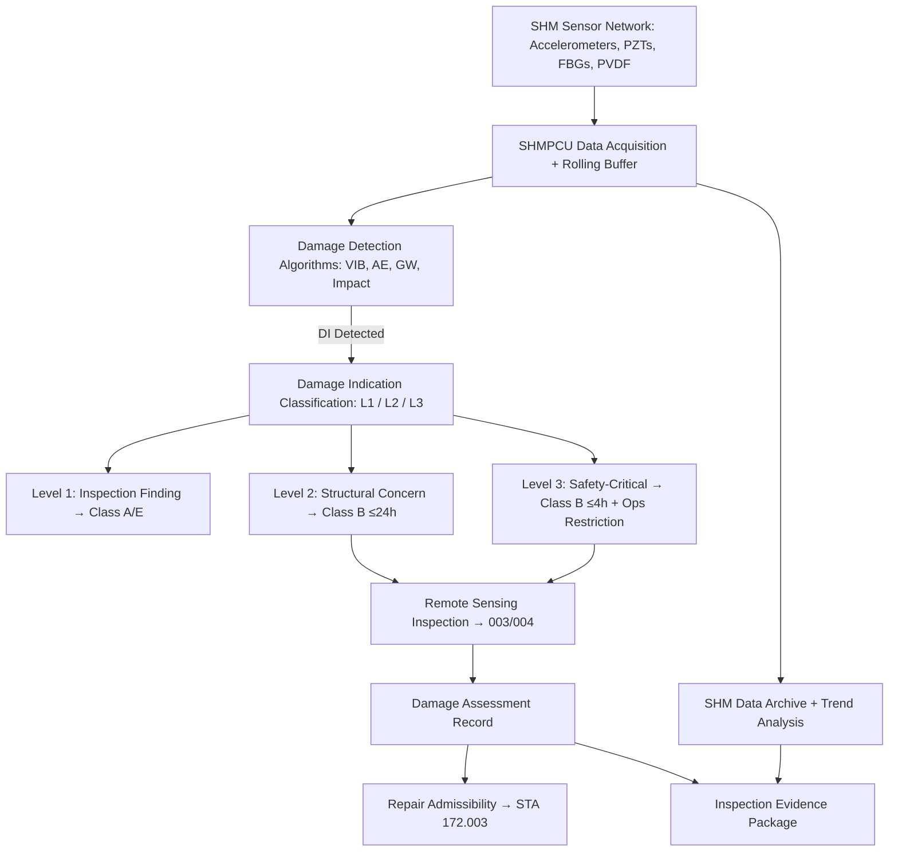

# STA 170-179 · Section 07 · Subsection 171.005 — Structural Health Monitoring and Damage Assessment

## 1. Purpose

Specifies in-situ structural health monitoring sensor systems, damage detection algorithms, impact characterization requirements, and damage assessment decision logic linked to repair trigger criteria within the Q+ATLANTIDE STA band[^baseline]. This document governs the design, data processing, and evidence requirements for SHM systems per ECSS-E-ST-32C[^ecss32c], ECSS-E-ST-10-09C[^ecss1009c], NASA-HDBK-1001[^nasahdbk1001], and ECSS-E-ST-10-03C[^ecss1003c].

## 2. Scope

- **SHM sensor system architecture:** Accelerometer networks distributed across primary structural panels for vibration-based SHM: minimum 3-axis accelerometers at each node; sampling rate ≥1 kHz for modal analysis; inter-node synchronisation accuracy ≤1 µs. Piezoelectric transducer (PZT) arrays for acoustic emission (AE) and guided wave (GW) SHM: PZT element density derived from structural attenuation map; frequency range 100 kHz–1 MHz for AE; 50–500 kHz for GW sensing. Fiber Bragg Grating (FBG) strain sensors for distributed strain field mapping: strain resolution ≤1 µε; interrogator cycle rate ≥100 Hz. Impact detection sensors: PVDF acoustic impact sensors on external surfaces with impact detection threshold calibrated to minimum detectable impactor diameter of 1 mm at 7 km/s. Onboard data acquisition: SHM central processing unit (SHMPCU) with sufficient memory for 72-hour rolling raw data buffer; anomaly-triggered high-rate capture mode preserving 30 seconds pre/post event. Power and mass budget for SHM system defined at subsystem level; SHM system shall not degrade primary structural load path.

- **Damage detection algorithms:** Vibration-based: natural frequency shift ≥2% relative to baseline indicating potential stiffness reduction ≥10%; mode shape correlation coefficient MAC < 0.95 flagging localised damage. Acoustic emission: AE event detection threshold set at 3σ above noise floor; AE event localisation using time-of-arrival triangulation: accuracy ≤50 mm in-plane; AE waveform classification using pre-trained classifier: matrix crack, fibre break, delamination, impact; classification confidence score reported. Guided wave SHM: damage index DI = 1 − (signal correlation to baseline) > 0.15 flagged as Damage Indication; spatial damage imaging via GW tomography for path-based damage probability mapping. Algorithm performance requirements: probability of detection (POD) ≥95% for damage types in design-basis threat envelope; probability of false alarm (PFA) ≤5% per monitoring period.

- **Impact detection and characterization:** Hypervelocity impact detection: PVDF/accelerometer combined trigger; sensor response time ≤1 ms. Impact location triangulation: combined acoustic and vibration sensor triangulation; location accuracy ≤100 mm for impacts ≥0.1 g impactor mass. Impact energy classification: Micro-debris: ≤0.1 g impactor at ≥7 km/s; Small debris: 0.1–1 g; Large debris: >1 g. Penetration detection: pressure sensor integration for pressurized hull breach detection — detection time ≤5 seconds; automatic safe-mode trigger for breach events. Impact event log: timestamp, location estimate (coordinates in target body frame), energy estimate class, penetration status, sensor health at time of event. All impact events of class "Small debris" or above shall trigger Class B Contingency Inspection per `002`.

- **Damage assessment decision logic:** Damage Indication classification on initial detection: Level 1 — Inspection Finding (anomaly below structural concern threshold; monitor via Class A or Class E); Level 2 — Structural Concern (anomaly exceeding trend threshold; Class B inspection required); Level 3 — Safety-Critical Finding (anomaly indicative of imminent structural hazard; immediate Class B inspection, operations restriction, and repair admissibility review). Assessment logic chain: SHM indication → remote sensing inspection (→`003` or →`004`) → damage characterisation → structural margin assessment against ECSS-E-ST-32C allowables → repair admissibility decision fed to STA 172.003. Time-to-action: Level 1: ≤next scheduled inspection; Level 2: ≤24 hours; Level 3: ≤4 hours. All Level 3 Findings require Mission Director authorization before any operational mode change.

- **SHM data management:** Onboard storage: SHMPCU non-volatile storage ≥4 TB for 1-year rolling raw data archive; processed outputs archived separately with ≤10× compression. Data compression for downlink: lossless compression for AE event waveforms; lossy compression acceptable for background vibration data with ≤5% RMS error. Anomaly-triggered high-rate data capture: pre-/post-event raw data captured at full rate; event package downlinked at earliest communication window. SHM data archive at ground: accessible for trend analysis across mission lifetime. Baseline update process: scheduled re-baselining at Class A inspection completion; event-triggered re-baselining after each repair (requires STA 172 sign-off); all baseline updates under configuration control in the inspection heritage database.

- **Structural health monitoring evidence:** Sensor self-test: automated daily self-test of all SHM nodes; failed sensor nodes flagged in system health log; degraded-mode coverage assessment for sensor loss scenarios. SHM system health report compiled monthly and included in Inspection Evidence Package for Class A inspections. SHM calibration evidence: pre-launch calibration records; in-orbit health check data for FBG interrogator wavelength accuracy; annual calibration confidence assessment. Anomaly investigation report: issued for every Level 3 Finding; peer-reviewed by structural engineering authority before closure. Traceability: all SHM findings traceable to structural design margins in ECSS-E-ST-32C safety factors; traceability matrix maintained in `010_Traceability-Evidence-and-Lifecycle-Governance.md`.

## 3. Diagram

## 4. Footprint

| Metric | Value |
|---|---|
| Architecture | `STA` — Space Technology Architecture |
| Master range | `100–199` |
| Code range | `170-179` |
| Section | `07` — Operaciones y Mantenimiento en Órbita |
| Subsection | `171` — Inspección en Órbita |
| Subsubject | `005` — Structural Health Monitoring and Damage Assessment |
| Primary Q-Division | Q-SPACE[^qdiv] |
| Support Q-Divisions | Q-DATAGOV, Q-HPC, Q-HORIZON, Q-STRUCTURES, Q-INDUSTRY |
| ORB support | ORB-LEG |
| Governance class | `baseline`[^gov] |
| Safety boundary | on-orbit inspection critical |
| Document | `005_Structural-Health-Monitoring-and-Damage-Assessment.md` (this file) |
| Parent subsection | [`README.md`](./README.md) · [`000_Overview.md`](./000_Overview.md) |

## 5. References & Citations

[^baseline]: **Q+ATLANTIDE controlled baseline (v1.0.0)** — [`organization/Q+ATLANTIDE.md`](../../../../organization/Q+ATLANTIDE.md).

[^ecss32c]: **ECSS-E-ST-32C** — *Structural general requirements* (ESA/ECSS, 2008).

[^ecss1009c]: **ECSS-E-ST-10-09C** — *Structural and thermal models* (ESA/ECSS, 2011).

[^nasahdbk1001]: **NASA-HDBK-1001** — *Structural design and test factors of safety for spaceflight hardware* (NASA, 2014).

[^ecss1003c]: **ECSS-E-ST-10-03C** — *Space engineering — Testing* (ESA/ECSS, 2012).

[^qdiv]: **Q-Division authority** — [`organization/Q-Divisions/`](../../../../organization/Q-Divisions/).

[^gov]: **Governance class** — `baseline` denotes documents under controlled change management within the Q+ATLANTIDE baseline.
