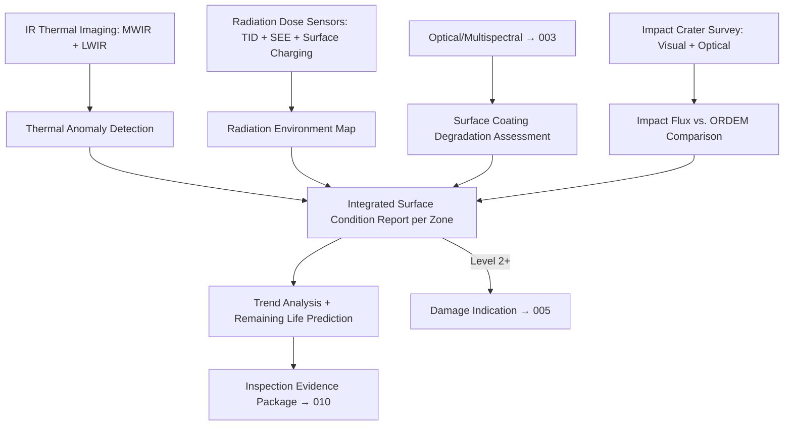

# STA 170-179 · Section 07 · Subsection 171.006 — Thermal, Radiation and Surface Degradation Inspection

## 1. Purpose

Defines infrared thermal imaging, radiation dose mapping, micrometeorite and debris impact detection, and surface coating degradation assessment requirements for on-orbit inspection within the Q+ATLANTIDE STA band[^baseline]. This document specifies sensor requirements, data quality standards, and analysis pipelines per ECSS-E-ST-31C[^ecss31c], ECSS-E-ST-10-09C[^ecss1009c], ECSS-E-ST-32C[^ecss32c], and NASA-HDBK-1001[^nasahdbk1001].

## 2. Scope

- **Infrared thermal imaging:** IR camera spectral band requirements: MWIR (3–5 µm) for hot-spot detection from electrical faults and dissipation anomalies; LWIR (8–14 µm) for thermal interface failure detection, anomalous gradients, and cold-spot identification. Spatial resolution at nominal inspection standoff (20 m): ≤10 mm/pixel IFOV. Temperature measurement accuracy: ≤2 K absolute; relative accuracy ≤0.5 K for gradient detection. Thermal calibration: onboard blackbody reference source for in-orbit radiometric calibration; pre-launch calibration traceable to NIST standards. Thermal anomaly detection criteria: hot spot defined as surface temperature exceeding local mean by ≥5 K; cold spot defined as surface temperature below local mean by ≥3 K; anomalous gradient flagged when spatial gradient exceeds thermal model prediction by ≥2σ. Interface with thermal control system assessment: thermal inspection findings cross-referenced with STA 112 thermal model data for root-cause analysis.

- **Radiation dose and environment mapping:** Total ionising dose (TID) sensor nodes distributed at representative locations on outer structure: minimum 4 nodes for orientation coverage; dose rate resolution ≤1 mGy/hr; cumulative dose tracking for component life assessment. Single-event effect (SEE) monitoring: SEU/SEFI rate tracking on selected RADHard processor nodes; anomalous rate increase (≥3σ above mission mean) triggers radiation environment review. Surface charging monitor: outer surface potential measurement capability required for GEO and high-altitude LEO missions; discharge event detection for electrostatic discharge risk management. Radiation environment data archived per orbit with solar weather correlation; data fed into component remaining life assessment models. Interface with materials and structural assessment: radiation dose map cross-referenced with STA 111 material degradation model data for polymer and composite material life prediction.

- **Surface coating degradation assessment:** Optical degradation assessment: spectrophotometric measurement or multispectral band analysis (→`003`) for solar absorptivity (α) and thermal emissivity (ε) change; threshold: Δα > 0.05 or Δε > 0.05 relative to beginning-of-life values triggers degradation finding. Atomic oxygen (AO) erosion: surface texture change quantification via optical profilometry or high-resolution imaging; erosion yield calibration using flight-heritage reference material data; AO fluence model applied for low LEO altitude missions. UV darkening/bleaching of thermal coatings: UV spectral band imaging (→`003`) for Kapton, MLI outer layer, and white paint coatings; degradation classification: acceptable, monitoring required, replacement required. Contamination detection: spectroscopic characterisation of plume deposition and outgassing deposits on optical surfaces; cleanliness requirements per ISO 14644 adapted for on-orbit. Degradation threshold management: per-coating and per-material degradation limits defined in materials database (→`111`); findings exceeding limits trigger Inspection Finding Level 2 per `005`.

- **Micrometeorite and debris impact survey:** Visual and optical inspection (→`003`) for impact craters: density mapping (craters/m²), diameter measurement (resolution ≤1 mm at ≤5 m standoff), depth estimation via stereo or shadow analysis. Impact flux comparison: measured crater density compared to orbital debris environment model (NASA ORDEM 3.2 or ESA MASTER); significant excess triggers Class B contingency review. Cumulative damage assessment for multi-layer insulation (MLI) shields and bumper shields: cumulative penetration probability calculated from crater statistics and shield design margins. Impact survey evidence compiled in Inspection Evidence Package: crater map with coordinates, diameter and depth estimates, survey coverage confirmation. Interface with structural health monitoring (→`005`) for penetration events: confirmed penetration events from pressure or SHM sensors cross-referenced with impact survey data for impact energy characterisation.

- **Surface inspection data integration:** Multi-modal data fusion: thermal image + optical image + multispectral bands + SHM data + radiation dose map registered to common target body frame coordinate system. Integrated surface condition report: per-zone assessment covering thermal state, radiation environment, surface coating condition, and impact damage density; zone classification: Nominal, Monitor, Degraded, Critical. Trend analysis: successive inspection campaign data compared for degradation rate estimation per zone; statistical trend model updated after each Class A inspection. Remaining life prediction: degradation rate extrapolation to end-of-life performance limits for each zone; flagging of zones approaching performance limits with ≥2 inspection cycles of margin. Interface with materials and thermal protection assessment nodes (→`111`, →`112`) for combined material life assessment.

- **Verification and evidence:** Sensor calibration evidence: pre-launch blackbody calibration records for IR cameras; in-orbit calibration run logs; spectrophotometer calibration history. Image data quality assessment: thermal image noise level; calibration artifact detection; saturation flag per image. Thermal anomaly assessment report: issued after each inspection campaign; all Level 2+ thermal anomalies assessed by thermal engineering authority. Surface condition report: comprehensive multi-modal assessment per zone; archived with version control. All evidence items compiled in Inspection Evidence Package per `010`.

## 3. Diagram

## 4. Footprint

| Metric | Value |
|---|---|
| Architecture | `STA` — Space Technology Architecture |
| Master range | `100–199` |
| Code range | `170-179` |
| Section | `07` — Operaciones y Mantenimiento en Órbita |
| Subsection | `171` — Inspección en Órbita |
| Subsubject | `006` — Thermal, Radiation and Surface Degradation Inspection |
| Primary Q-Division | Q-SPACE[^qdiv] |
| Support Q-Divisions | Q-DATAGOV, Q-HPC, Q-HORIZON, Q-STRUCTURES, Q-INDUSTRY |
| ORB support | ORB-LEG |
| Governance class | `baseline`[^gov] |
| Safety boundary | on-orbit inspection critical |
| Document | `006_Thermal-Radiation-and-Surface-Degradation-Inspection.md` (this file) |
| Parent subsection | [`README.md`](./README.md) · [`000_Overview.md`](./000_Overview.md) |

## 5. References & Citations

[^baseline]: **Q+ATLANTIDE controlled baseline (v1.0.0)** — [`organization/Q+ATLANTIDE.md`](../../../../organization/Q+ATLANTIDE.md).

[^ecss31c]: **ECSS-E-ST-31C** — *Space engineering — Thermal control general requirements* (ESA/ECSS, 2008).

[^ecss1009c]: **ECSS-E-ST-10-09C** — *Structural and thermal models* (ESA/ECSS, 2011).

[^ecss32c]: **ECSS-E-ST-32C** — *Structural general requirements* (ESA/ECSS, 2008).

[^nasahdbk1001]: **NASA-HDBK-1001** — *Structural design and test factors of safety for spaceflight hardware* (NASA, 2014).

[^qdiv]: **Q-Division authority** — [`organization/Q-Divisions/`](../../../../organization/Q-Divisions/).

[^gov]: **Governance class** — `baseline` denotes documents under controlled change management within the Q+ATLANTIDE baseline.
