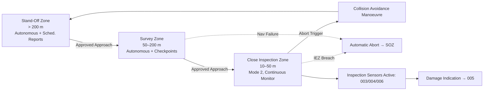

# STA 170-179 · Section 07 · Subsection 171.008 — Inspection Safety Zones and Proximity Operations

## 1. Purpose

Defines inspection approach corridors, safety zones during fly-around and close proximity inspection, abort triggers, and collision avoidance requirements for on-orbit inspection proximity operations within the Q+ATLANTIDE STA band[^baseline]. This document governs proximity operations safety design per CCSDS 520.2-G-3[^ccsds5202], ECSS-E-ST-70-11C[^ecss7011c], and ECSS-E-ST-10-04C[^ecss1004c].

## 2. Scope

- **Inspection approach corridors:** Inspection approach trajectory designed per target spacecraft geometry with explicit exclusion zone avoidance: approach corridor aligned along permitted approach vectors defined by target spacecraft Keep-Out Zone (KOZ) analysis; corridor clearance from all target protuberances (solar arrays, antennas, docking ports): ≥2× worst-case relative navigation position error (3σ) throughout approach. Standard inspection fly-around standoff altitudes: Close Inspection Zone 10–50 m for high-resolution sensor use; Survey Zone 50–200 m for overview survey and lidar mapping. Approach trajectory design documented in Mission Operations Procedure (MOP); MOP reviewed and approved by proximity operations safety authority before mission execution. Approach corridor geometry updated for each inspection campaign based on current target spacecraft configuration (attitude, deployed appendage state).

- **Inspection safety zones:** Four zones defined relative to target spacecraft centre of mass, parameterised per target geometry and inspector navigation performance. Inspection Exclusion Zone (IEZ): inner clearance boundary based on worst-case (3σ) navigation error plus target protuberance envelope plus collision avoidance manoeuvre execution margin; entry into IEZ is an automatic abort trigger. Close Inspection Zone (CIZ): 10–50 m nominal standoff; high-resolution sensor operations; requires continuous ground monitoring or Mode 2 autonomous operations; CAM authority active. Survey Zone (SZ): 50–200 m; lidar/radar survey operations; autonomous with periodic ground checkpoints ≥every 10 minutes. Stand-Off Zone (SOZ): >200 m; autonomous operations with scheduled status reports ≥every 30 minutes; no proximity hazard constraint. All zone boundaries defined per target spacecraft geometry: KOZ analysis performed per target and documented in the Safety Zone Analysis Report; zone boundaries updated when target configuration changes.

- **Collision avoidance during inspection:** Continuous relative state monitoring: relative position and velocity updated at ≥1 Hz from multi-sensor fusion (→`004`); collision probability Pc computed at ≥0.1 Hz using Gaussian covariance propagation. Pc alert thresholds: Pc > 10⁻⁴ triggers collision avoidance manoeuvre planning review; Pc > 10⁻³ triggers automatic CAM execution. Short-range inspection (≤50 m): sensor-based relative navigation only (GPS differential positioning not assumed available in all proximity scenarios); visual/lidar-based relative state with integrity monitor per `004`. CAM design requirements: CAM trajectory diverges from target with minimum ΔV ≥0.1 m/s in safe direction; CAM execution latency from trigger to thrust ≤2 seconds; CAM reserves maintained throughout proximity operations.

- **Abort triggers:** Navigation failure: loss of relative position solution (quality index < threshold per `004`) for ≥2 seconds → automatic abort to Stand-Off Zone. Target spacecraft anomaly: unexpected attitude rate > 0.5°/s or unexpected deployment event → automatic abort. Inspector fault: loss of any critical system (GNC, propulsion, communication) → automatic fault-response: safe-stow for manipulator-mounted platforms; controlled withdrawal to SOZ for free-flyer. Collision probability exceedance → automatic CAM as defined above. Inspection arc overtime: approach arc exceeds planned duration by ≥10% without ground confirmation → automatic hold at current position and status report. All abort events logged with time, cause classification, and state at abort; post-event review required before resuming proximity operations.

- **Proximity operations communication:** Monitoring telemetry during inspection: position (relative), attitude (inspector and target), sensor states, safety zone status, Pc value: downlinked at ≥1 Hz during CIZ operations, ≥0.1 Hz in SZ, scheduled reports in SOZ. Command uplink latency requirements per inspection mode: Mode 1 (teleoperated): ≤2-second round-trip required; Mode 2: ≤30-second command response latency acceptable; Mode 3/4: communication confirmation within next scheduled window. Communication window planning: inspection arcs scheduled to coincide with communication windows for supervisory mode transitions requiring ground confirmation. Emergency communication protocol: dedicated emergency uplink channel with ≥2 redundant paths for abort command; emergency uplink latency ≤5 seconds.

- **Safety zone management evidence:** Safety Zone Analysis Report: KOZ geometry, navigation error budget (3σ), zone boundary calculations, collision probability threshold justification; reviewed by safety authority. Navigation error budget: relative position (3σ) per sensor mode and standoff distance; baseline maintained current with sensor health status. Collision probability analysis: Pc computation methodology validated against reference cases; Pc computation software verified and validated per ECSS-E-ST-40C. All proximity operations safety evidence compiled in Inspection Evidence Package per `010`; safety zone analysis report under configuration control with formal re-validation required when target configuration or inspector navigation performance changes.

## 3. Diagram

## 4. Footprint

| Metric | Value |
|---|---|
| Architecture | `STA` — Space Technology Architecture |
| Master range | `100–199` |
| Code range | `170-179` |
| Section | `07` — Operaciones y Mantenimiento en Órbita |
| Subsection | `171` — Inspección en Órbita |
| Subsubject | `008` — Inspection Safety Zones and Proximity Operations |
| Primary Q-Division | Q-SPACE[^qdiv] |
| Support Q-Divisions | Q-DATAGOV, Q-HPC, Q-HORIZON, Q-STRUCTURES, Q-INDUSTRY |
| ORB support | ORB-LEG |
| Governance class | `baseline`[^gov] |
| Safety boundary | on-orbit inspection critical |
| Document | `008_Inspection-Safety-Zones-and-Proximity-Operations.md` (this file) |
| Parent subsection | [`README.md`](./README.md) · [`000_Overview.md`](./000_Overview.md) |

## 5. References & Citations

[^baseline]: **Q+ATLANTIDE controlled baseline (v1.0.0)** — [`organization/Q+ATLANTIDE.md`](../../../../organization/Q+ATLANTIDE.md).

[^ccsds5202]: **CCSDS 520.2-G-3** — *Proximity-1 Space Link Protocol* (CCSDS, 2020).

[^ecss7011c]: **ECSS-E-ST-70-11C** — *Space engineering — Space segment operability* (ESA/ECSS, 2008).

[^ecss1004c]: **ECSS-E-ST-10-04C** — *Space engineering — Hazard analysis* (ESA/ECSS, 2017).

[^qdiv]: **Q-Division authority** — [`organization/Q-Divisions/`](../../../../organization/Q-Divisions/).

[^gov]: **Governance class** — `baseline` denotes documents under controlled change management within the Q+ATLANTIDE baseline.
