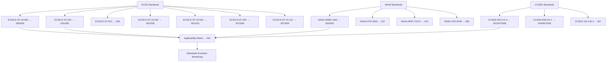

# STA 170-179 · Section 07 · Subsection 171.009 — ECSS-NASA-CCSDS On-Orbit Inspection Standards Mapping

## 1. Purpose

Maps the applicable ECSS, NASA, and CCSDS standards to on-orbit inspection functional areas within STA `171`[^baseline], establishing a standards hierarchy, applicability matrix, and standards evolution monitoring process. This document provides the normative traceability from external standards to STA 171 subsubject requirements, supporting verification planning and compliance demonstration.

## 2. Scope

- **ECSS standards applicable to STA 171:** ECSS-E-ST-10-09C (*Structural and Thermal Models*, 2011): governs model-based inspection acceptance criteria and thermal model validation applied in `006`; ECSS-E-ST-32C (*Structural General Requirements*, 2008): provides structural integrity thresholds underpinning damage assessment decision logic in `005`; ECSS-E-ST-31C (*Thermal Control General Requirements*, 2008): governs thermal inspection criteria and thermal anomaly detection in `006`; ECSS-E-ST-10-04C (*Hazard Analysis*, 2017): governs proximity operation safety analysis and KOZ definition in `008`; ECSS-E-ST-10-03C (*Testing*, 2012): governs inspection evidence requirements and verification approach across `001`–`010`; ECSS-E-ST-40C (*Software*, 2009): governs onboard inspection software qualification per `007` and collision probability computation software in `008`; ECSS-E-ST-70-11C (*Space Segment Operability*, 2008): governs autonomous inspection mode design and mode transition authorization in `007`.

- **NASA standards applicable to STA 171:** NASA-HDBK-1001 (*Structural Design and Test Factors of Safety for Spaceflight Hardware*, 2014): provides safety factor methodology underlying damage assessment margins in `005`; NASA-STD-3000 (*Human Integration Design Handbook*): applicable to crewed inspection scenarios and human expert review interface design per `007`; NASA-NPR-7120.5 (*NASA Space Flight Program and Project Management Requirements*): governs lifecycle review gates applicable to inspection evidence gate planning in `010`; NASA-STD-5009 (*Fracture Control Requirements for Spaceflight Hardware*, 2018): fracture mechanics criteria relevant to structural damage assessment in `005`, particularly for crack propagation assessment from visual inspection data in `003`.

- **CCSDS standards applicable to STA 171:** CCSDS 520.2-G-3 (*Proximity-1 Space Link Protocol — Rationale, Architecture, and Overview*, 2020): governs proximity operations data link, communication architecture, and safety protocol applicable to `008` and `007`; CCSDS 508.0-B-1 (*Position Data — External Reference Frame*, 2019): governs relative state reference frame definitions used in inspection coordinate systems across `004`, `007`, `008`; CCSDS 131.0-B-3 (*TM Synchronization and Channel Coding*, 2017): governs inspection data telemetry channel coding and downlink data quality assurance per `007`.

- **Standards applicability matrix:** Each standard is mapped to the STA 171 subsubjects where normative requirements derive from it. The applicability matrix is maintained as a controlled document within the Inspection Evidence Package framework (→`010`) and updated when new editions of standards are released or new subsubjects are added under `011`–`099`. Applicability entries include: standard identifier, edition, applicable STA 171 subsubject(s), nature of applicability (normative/informative), key requirement clause references, and any tailoring notes for the STA 171 context. Tailoring decisions require formal justification and approval by the standards authority (primary Q-SPACE authority).

- **Standards evolution monitoring:** A standards watchlist is maintained covering all standards listed in this document and their issuing bodies (ESA/ECSS, NASA, CCSDS). New editions or amendments are reviewed within 6 months of publication; impact assessment performed against all affected STA 171 subsubjects; approved impacts propagated via controlled baseline change per `010`. Heritage gaps: where STA 171 requirements address functionality not covered by existing standards (e.g., multi-modal sensor fusion for inspection, autonomous inspection mode governance), STA 171 documents serve as the authoritative requirement source with justification referencing the nearest applicable standard provisions; heritage gap register maintained within `010`.

## 3. Diagram

## 4. Footprint

| Metric | Value |
|---|---|
| Architecture | `STA` — Space Technology Architecture |
| Master range | `100–199` |
| Code range | `170-179` |
| Section | `07` — Operaciones y Mantenimiento en Órbita |
| Subsection | `171` — Inspección en Órbita |
| Subsubject | `009` — ECSS-NASA-CCSDS On-Orbit Inspection Standards Mapping |
| Primary Q-Division | Q-SPACE[^qdiv] |
| Support Q-Divisions | Q-DATAGOV, Q-HPC, Q-HORIZON, Q-STRUCTURES, Q-INDUSTRY |
| ORB support | ORB-LEG |
| Governance class | `baseline`[^gov] |
| Safety boundary | on-orbit inspection critical |
| Document | `009_ECSS-NASA-CCSDS-On-Orbit-Inspection-Standards-Mapping.md` (this file) |
| Parent subsection | [`README.md`](./README.md) · [`000_Overview.md`](./000_Overview.md) |

## 5. References & Citations

[^baseline]: **Q+ATLANTIDE controlled baseline (v1.0.0)** — [`organization/Q+ATLANTIDE.md`](../../../../organization/Q+ATLANTIDE.md).

[^ecss1009c]: **ECSS-E-ST-10-09C** — *Structural and thermal models* (ESA/ECSS, 2011).

[^ecss32c]: **ECSS-E-ST-32C** — *Structural general requirements* (ESA/ECSS, 2008).

[^ecss31c]: **ECSS-E-ST-31C** — *Thermal control general requirements* (ESA/ECSS, 2008).

[^ecss1004c]: **ECSS-E-ST-10-04C** — *Hazard analysis* (ESA/ECSS, 2017).

[^ecss1003c]: **ECSS-E-ST-10-03C** — *Space engineering — Testing* (ESA/ECSS, 2012).

[^ecss40c]: **ECSS-E-ST-40C** — *Space engineering — Software* (ESA/ECSS, 2009).

[^ecss7011c]: **ECSS-E-ST-70-11C** — *Space segment operability* (ESA/ECSS, 2008).

[^nasahdbk1001]: **NASA-HDBK-1001** — *Structural design and test factors of safety for spaceflight hardware* (NASA, 2014).

[^nasastd3000]: **NASA-STD-3000** — *Human Integration Design Handbook* (NASA).

[^nasanpr71205]: **NASA-NPR-7120.5** — *NASA Space Flight Program and Project Management Requirements* (NASA).

[^nasastd5009]: **NASA-STD-5009** — *Fracture Control Requirements for Spaceflight Hardware* (NASA, 2018).

[^ccsds5202]: **CCSDS 520.2-G-3** — *Proximity-1 Space Link Protocol* (CCSDS, 2020).

[^ccsds5080b1]: **CCSDS 508.0-B-1** — *Position Data — External Reference Frame* (CCSDS, 2019).

[^ccsds1310b3]: **CCSDS 131.0-B-3** — *TM Synchronization and Channel Coding* (CCSDS, 2017).

[^qdiv]: **Q-Division authority** — [`organization/Q-Divisions/`](../../../../organization/Q-Divisions/).

[^gov]: **Governance class** — `baseline` denotes documents under controlled change management within the Q+ATLANTIDE baseline.
