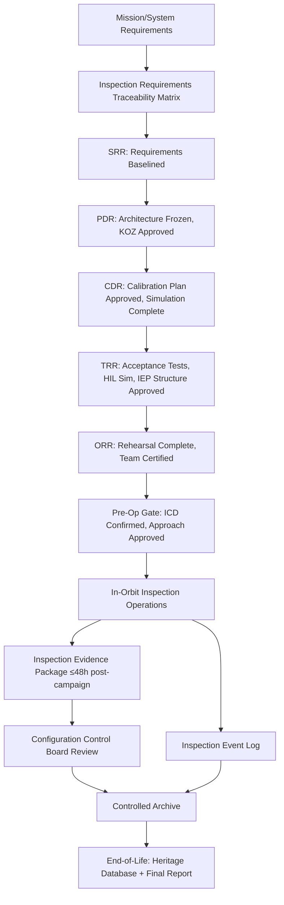

# STA 170-179 · Section 07 · Subsection 171.010 — Traceability, Evidence and Lifecycle Governance

## 1. Purpose

Establishes inspection requirements traceability, evidence gates at lifecycle milestones, in-orbit inspection monitoring, and lifecycle configuration control for on-orbit inspection missions within the Q+ATLANTIDE STA band[^baseline]. This document governs the complete lifecycle governance of STA 171 per ECSS-E-ST-10-02C[^ecss1002c], ECSS-E-ST-10-03C[^ecss1003c], ECSS-E-ST-32C[^ecss32c], ECSS-Q-ST-80C[^ecssq80c], and CCSDS 520.2-G-3[^ccsds5202].

## 2. Scope

- **Requirements traceability:** Bidirectional traceability established from mission-level and system-level inspection requirements (source: Mission Requirements Document, System Requirements Document) through: functional inspection requirements → sensor design requirements (`003`–`006`) → data processing pipeline requirements (`003`–`007`) → test cases and inspection rehearsal evidence → Inspection Evidence Package artefacts. Each requirement allocated to one or more STA 171 subsubjects, with traceability linkage documented in the Inspection Requirements Traceability Matrix (IRTM). Deviations from requirements formally registered in the deviation register: each deviation carries justification, risk assessment, and approval authority sign-off. IRTM linked to Inspection Evidence Package: all evidence artefacts tagged with the requirements they satisfy; gaps in coverage flagged at each lifecycle gate. Standards applicability matrix (→`009`) cross-referenced in IRTM to provide standards-to-requirement-to-evidence chain.

- **Evidence gates at lifecycle milestones:** System Requirements Review (SRR): inspection requirements baselined in IRTM; sensor trade study results justifying sensor selection; proximity operations safety approach confirmed; STA 171 applicability confirmed against mission class per `002`. Preliminary Design Review (PDR): inspection sensor architecture frozen; proximity operations design with KOZ analysis approved (→`008`); inspection trajectory simulation approach confirmed (→`007`); data quality requirements verified against sensor design. Critical Design Review (CDR): sensor calibration plan approved (pre-launch and in-orbit); inspection trajectory Monte Carlo simulation complete with coverage and clearance evidence (→`007`); data quality requirements verified by analysis; SHM sensor network design verified (→`005`); all Level 3 design requirements closed. Test Readiness Review (TRR): sensor acceptance test data reviewed and compliant; hardware-in-the-loop (HIL) proximity operations simulation complete with abort trigger verification (→`008`); inspection evidence package structure approved; data management architecture verified. Operational Readiness Review (ORR): full inspection rehearsal completed (Mode 2 or Mode 4 simulation); inspection team certification; ground processing pipeline qualified; all pre-operation inspection prerequisites confirmed per mission class. Pre-operation gate: target spacecraft inspection ICD confirmed current; approach trajectory approved by proximity operations safety authority; last-opportunity abort criteria review completed.

- **In-orbit monitoring:** Inspection event log: all inspection arcs logged with: arc identifier, start/end time, mode, sensors activated, coverage achieved, Damage Indications detected (count and classification); log archived per mission year. Data quality telemetry: sensor health flags, calibration status, data quality index downlinked per inspection campaign; anomalies flagged for ground review within defined latency. Anomaly-triggered inspection review: all SHM Level 2 or Level 3 findings trigger inspection campaign review meeting within time-to-action limits (→`005`); review outcome documented. Inspection Evidence Package (IEP) compiled within 48 hours post-campaign for Class A and D; within 24 hours for Class B; IEP content: calibrated sensor data, coverage map, DI log, DAR(s), data quality report, system health report, IRTM update, anomaly investigation reports (if any). IEP under configuration control: each IEP issued with version identifier; superseded IEPs retained in archive.

- **Lifecycle configuration control:** Controlled items under inspection configuration management: (1) inspection procedures and Mission Operations Procedures (MOPs); (2) sensor calibration records (pre-launch and in-orbit); (3) Damage Assessment Records; (4) Inspection Evidence Packages; (5) IRTM; (6) Standards Applicability Matrix; (7) Safety Zone Analysis Report; (8) SHM baseline data. Change Control Board (CCB) process: all changes to controlled items require CCB approval; CCB membership includes Q-SPACE authority, mission operations director, structural authority, and data governance authority (Q-DATAGOV). In-orbit calibration update process: sensor calibration record updated after each scheduled in-orbit calibration event; calibration update subject to data quality review and CCB notification; calibration drift outside threshold triggers mandatory recalibration plan. End-of-life governance: inspection data archive retained for ≥15 years post-mission for heritage database contribution; final inspection campaign (Class A or Class D) completed before mission decommissioning; end-of-life inspection report issued and archived; heritage findings contributed to lessons-learned database.

## 3. Diagram

## 4. Footprint

| Metric | Value |
|---|---|
| Architecture | `STA` — Space Technology Architecture |
| Master range | `100–199` |
| Code range | `170-179` |
| Section | `07` — Operaciones y Mantenimiento en Órbita |
| Subsection | `171` — Inspección en Órbita |
| Subsubject | `010` — Traceability, Evidence and Lifecycle Governance |
| Primary Q-Division | Q-SPACE[^qdiv] |
| Support Q-Divisions | Q-DATAGOV, Q-HPC, Q-HORIZON, Q-STRUCTURES, Q-INDUSTRY |
| ORB support | ORB-LEG |
| Governance class | `baseline`[^gov] |
| Safety boundary | on-orbit inspection critical |
| Document | `010_Traceability-Evidence-and-Lifecycle-Governance.md` (this file) |
| Parent subsection | [`README.md`](./README.md) · [`000_Overview.md`](./000_Overview.md) |

## 5. References & Citations

[^baseline]: **Q+ATLANTIDE controlled baseline (v1.0.0)** — [`organization/Q+ATLANTIDE.md`](../../../../organization/Q+ATLANTIDE.md).

[^ecss1002c]: **ECSS-E-ST-10-02C** — *Space engineering — Verification* (ESA/ECSS, 2009).

[^ecss1003c]: **ECSS-E-ST-10-03C** — *Space engineering — Testing* (ESA/ECSS, 2012).

[^ecss32c]: **ECSS-E-ST-32C** — *Structural general requirements* (ESA/ECSS, 2008).

[^ecssq80c]: **ECSS-Q-ST-80C** — *Space product assurance — Software product assurance* (ESA/ECSS, 2009).

[^ccsds5202]: **CCSDS 520.2-G-3** — *Proximity-1 Space Link Protocol* (CCSDS, 2020).

[^qdiv]: **Q-Division authority** — [`organization/Q-Divisions/`](../../../../organization/Q-Divisions/).

[^gov]: **Governance class** — `baseline` denotes documents under controlled change management within the Q+ATLANTIDE baseline.
