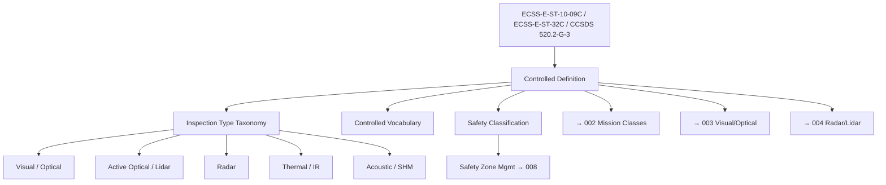

# STA 170-179 · 171-010 — On Orbit Inspection Controlled Definition

## 1. Purpose

Establishes the normative definition and controlled scope of On-Orbit Inspection within the Q+ATLANTIDE STA band[^baseline], per ECSS-E-ST-10-09C[^ecss1009c], ECSS-E-ST-32C[^ecss32c], and CCSDS 520.2-G-3[^ccsds5202]. This document provides the authoritative controlled vocabulary, inspection type taxonomy, applicability boundaries, and safety classification from which all subsubjects `002`–`010` derive their definitional basis.

## 2. Scope

- **Controlled definition:** On-Orbit Inspection encompasses all remote or contact sensing operations performed on a spacecraft in orbit to assess structural integrity, surface condition, thermal state, radiation environment, and operational readiness, without necessarily involving physical contact with movable interfaces. Inspection is defined as the systematic acquisition and analysis of sensor data to characterise the state of an on-orbit asset against defined acceptance criteria; it is distinct from servicing, repair, or assembly operations.

- **Applicability boundary:** STA 171 covers inspection mission architecture and sensor systems. It explicitly excludes repair operations (→ `172_Reparacion-en-Orbita`), assembly operations (→ `173_Ensamblaje-en-Orbita`), and ground-based testing and structural analysis. Where inspection findings trigger repair or assembly activities, the interface is documented in the Damage Assessment Record exchanged between STA 171 and STA 172.

- **Inspection type taxonomy:** Five primary inspection types are defined with distinct applicability, resolution requirements, and data quality standards: (1) Visual/Optical — passive imaging with visible-spectrum cameras; (2) Active Optical — lidar, structured-light, and laser ranging; (3) Radar — reflectometry, synthetic aperture radar (SAR), and millimeter-wave sensing for sub-surface assessment; (4) Thermal — infrared imaging across MWIR and LWIR bands; (5) Acoustic/Ultrasonic — contact-based structural health monitoring via piezoelectric transducers and acoustic emission sensors. Each type is governed by minimum spatial resolution, data quality, and calibration requirements detailed in subsubjects `003`–`006`.

- **Controlled vocabulary:** The following terms are normatively defined within STA 171: *Inspector Spacecraft* — the platform carrying inspection sensors; *Target Spacecraft* — the spacecraft being inspected; *Inspection Fly-Around* — a systematic trajectory arc around the target for sensor data acquisition; *Inspection Arc* — a defined segment of the fly-around trajectory associated with a coverage zone; *Standoff Distance* — the nominal range between inspector and target surface during inspection; *Damage Indication* — a sensor data feature that meets the anomaly detection threshold and requires human expert assessment; *Damage Assessment Record* — the formal output of human expert review of a Damage Indication; *Inspection Evidence Package* — the complete set of calibrated sensor data, quality reports, and assessment records produced by an inspection campaign.

- **Safety classification:** On-orbit inspection is classified as **on-orbit inspection critical** within the Q+ATLANTIDE STA safety boundary framework. Proximity operations during fly-around and close approach require safety zone management per subsubject `008`, relative navigation monitoring with defined abort triggers, and explicit abort authority at all mission phases. Sensor activation near the target spacecraft requires plume impingement analysis (for active thrusters), electromagnetic compatibility analysis between inspection sensors and target spacecraft systems, and laser eye-safety compliance for all lidar and active optical sensors.

- **Standards hierarchy:** The normative order of precedence for on-orbit inspection within STA 171 is: (1) ECSS-E-ST-10-04C hazard analysis[^ecss1004c] for proximity operation safety; (2) ECSS-E-ST-32C structural requirements[^ecss32c] for damage assessment criteria; (3) ECSS-E-ST-10-09C structural and thermal models[^ecss1009c] for inspection acceptance criteria; (4) CCSDS 520.2-G-3[^ccsds5202] for proximity operations and safety; (5) ECSS-E-ST-10-03C verification[^ecss1003c] for inspection evidence requirements. National agency supplements (NASA, JAXA, ESA) may be applied where contractually mandated.

## 3. Diagram

## 4. Footprint

| Metric | Value |
|---|---|
| Architecture | `STA` — Space Technology Architecture |
| Master range | `100–199` |
| Code range | `170-179` |
| Section | `07` — Operaciones y Mantenimiento en Órbita |
| Subsection | `171` — Inspección en Órbita |
| Subsubject | `001` — On-Orbit Inspection Controlled Definition |
| Primary Q-Division | Q-SPACE[^qdiv] |
| Support Q-Divisions | Q-DATAGOV, Q-HPC, Q-HORIZON, Q-STRUCTURES, Q-INDUSTRY |
| ORB support | ORB-LEG |
| Governance class | `baseline`[^gov] |
| Safety boundary | on-orbit inspection critical |
| Document | `171-010-On-Orbit-Inspection-Controlled-Definition.md` (this file) |
| Parent subsection | [`README.md`](./README.md) · [`171-000-General.md`](./171-000-General.md) |

## 5. References & Citations

[^baseline]: **Q+ATLANTIDE controlled baseline (v1.0.0)** — [`organization/Q+ATLANTIDE.md`](../../../../organization/Q+ATLANTIDE.md).

[^ecss1009c]: **ECSS-E-ST-10-09C** — *Structural and thermal models* (ESA/ECSS, 2011). Governs model-based inspection acceptance criteria.

[^ecss32c]: **ECSS-E-ST-32C** — *Structural general requirements* (ESA/ECSS, 2008). Provides structural integrity thresholds underpinning damage assessment.

[^ccsds5202]: **CCSDS 520.2-G-3** — *Proximity-1 Space Link Protocol — Rationale, Architecture, and Overview* (CCSDS, 2020). Governs proximity operations data link.

[^ecss1004c]: **ECSS-E-ST-10-04C** — *Space engineering — Hazard analysis* (ESA/ECSS, 2017). Governs proximity operation safety.

[^ecss1003c]: **ECSS-E-ST-10-03C** — *Space engineering — Testing* (ESA/ECSS, 2012). Governs inspection evidence and verification.

[^qdiv]: **Q-Division authority** — [`organization/Q-Divisions/`](../../../../organization/Q-Divisions/).

[^gov]: **Governance class** — `baseline` denotes documents under controlled change management within the Q+ATLANTIDE baseline.
