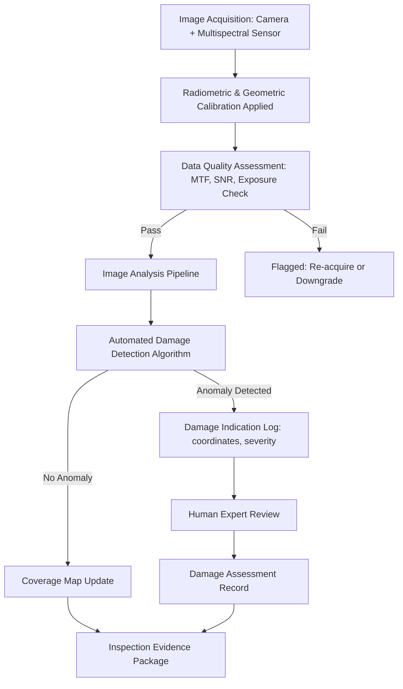

# STA 170-179 · 171-030 — Visual Optical and Multispectral Inspection

## 1. Purpose

Specifies visible-spectrum camera systems, optical inspection techniques, and multispectral imaging requirements for on-orbit surface inspection within the Q+ATLANTIDE STA band[^baseline], per ECSS-E-ST-10-09C[^ecss1009c], ECSS-E-ST-10-03C[^ecss1003c], NASA-HDBK-1001[^nasahdbk1001], and ECSS-E-ST-32C[^ecss32c]. This document defines sensor specifications, data quality requirements, image analysis requirements, and illumination management for optical inspection campaigns.

## 2. Scope

- **Visible-spectrum camera requirements:** Cameras used for on-orbit inspection shall meet minimum spatial resolution requirements derived from the damage feature size to be detected (e.g., ≤2 mm/pixel GSD at nominal standoff distance for microcrack detection). Key parameters: focal length sized for standoff distance and field-of-view tradeoff; frame rate ≥1 Hz during active fly-around; SNR ≥40 dB at target illumination levels; dynamic range sufficient to handle simultaneous sunlit and shadowed zones; lens cleanliness requirements: contamination transmission loss < 5% degradation relative to pre-launch baseline; in-flight contamination monitoring via reference light source; pre-launch radiometric and geometric calibration with in-flight validation using reference target features.

- **Optical inspection techniques:** Inspection imaging geometry shall be planned to achieve: nadir-pointing coverage at ≤5 m standoff for close inspection zones; off-nadir viewing at ≤45° for geometry reconstruction; stereo imaging from ≥two viewpoints separated by ≥5° for 3D reconstruction of surface features; photogrammetric measurement capability for protuberance dimensions with ≤1% accuracy; image mosaicking pipeline for full target surface coverage map; ground-truth feature matching using pre-loaded CAD-based reference features for autonomous inspection alignment.

- **Multispectral imaging:** Multispectral bands are defined for specific surface condition assessments: UV band (300–400 nm) for polymer coating photodegradation and yellowing; NIR band (750–1000 nm) for metallic oxide formation and oxidation detection; SWIR band (1000–2500 nm) for moisture ingress, thermal blanket degradation, and adhesive changes. Band-specific radiometric calibration requirements: ≤3% absolute radiometric error per band; solar illumination model applied for reflectance normalisation; artificial illumination options (LED panels or laser illumination) required for bands with low solar flux in shadowed areas; calibration panel reference target on inspector spacecraft for in-orbit band calibration.

- **Data quality requirements:** Inspection image data quality shall be assessed via the following metrics: Modulation Transfer Function (MTF) at Nyquist frequency ≥0.3 (post-launch); SNR ≥30 dB for all operational imaging; radiometric calibration conformance ≤5% error relative to pre-launch baseline; automated data quality assessment pipeline shall flag: under-exposed images (mean DN < 10% of saturation), over-exposed images (mean DN > 90% of saturation), blurred images (MTF < threshold), images with geometric distortion exceeding limits; coverage completeness verification: all target zones assigned to an inspection arc shall have ≥1 accepted image meeting quality thresholds.

- **Image analysis and damage detection:** Onboard real-time image processing shall perform: automated anomaly detection using pre-trained feature detection algorithms (crack detection sensitivity: detect features ≥5 mm diameter at nominal standoff; false positive rate ≤5%); Damage Indication log generation with coordinates, image timestamp, and severity estimate; all Damage Indications shall require human expert review before entry into the Damage Assessment Record; ground-based post-processing pipeline for high-resolution stereo reconstruction, mosaicking, and change detection from successive campaigns; image archive management with version control and baseline image set.

- **Lighting and illumination constraints:** Solar illumination angle requirements: ≥15° solar elevation above target surface plane for visible inspection; illumination planning integrated into inspection trajectory design. For shadowed areas: LED spotlight arrays (5000–6500 K colour temperature, adjustable intensity) or laser-line illumination for structured-light applications. Solar panel glare management: inspection arcs shall avoid specular reflection angles from solar panels; glare mask applied in image analysis pipeline. Thermal effects: extended LED illumination exposure on target surface limited to ≤30 minutes per zone to avoid thermal perturbation of target thermal control.

## 3. Diagram

## 4. Footprint

| Metric | Value |
|---|---|
| Architecture | `STA` — Space Technology Architecture |
| Master range | `100–199` |
| Code range | `170-179` |
| Section | `07` — Operaciones y Mantenimiento en Órbita |
| Subsection | `171` — Inspección en Órbita |
| Subsubject | `003` — Visual, Optical and Multispectral Inspection |
| Primary Q-Division | Q-SPACE[^qdiv] |
| Support Q-Divisions | Q-DATAGOV, Q-HPC, Q-HORIZON, Q-STRUCTURES, Q-INDUSTRY |
| ORB support | ORB-LEG |
| Governance class | `baseline`[^gov] |
| Safety boundary | on-orbit inspection critical |
| Document | `171-030-Visual-Optical-and-Multispectral-Inspection.md` (this file) |
| Parent subsection | [`README.md`](./README.md) · [`171-000-General.md`](./171-000-General.md) |

## 5. References & Citations

[^baseline]: **Q+ATLANTIDE controlled baseline (v1.0.0)** — [`organization/Q+ATLANTIDE.md`](../../../../organization/Q+ATLANTIDE.md).

[^ecss1009c]: **ECSS-E-ST-10-09C** — *Structural and thermal models* (ESA/ECSS, 2011).

[^ecss1003c]: **ECSS-E-ST-10-03C** — *Space engineering — Testing* (ESA/ECSS, 2012).

[^nasahdbk1001]: **NASA-HDBK-1001** — *Structural design and test factors of safety for spaceflight hardware* (NASA, 2014).

[^ecss32c]: **ECSS-E-ST-32C** — *Structural general requirements* (ESA/ECSS, 2008).

[^qdiv]: **Q-Division authority** — [`organization/Q-Divisions/`](../../../../organization/Q-Divisions/).

[^gov]: **Governance class** — `baseline` denotes documents under controlled change management within the Q+ATLANTIDE baseline.
