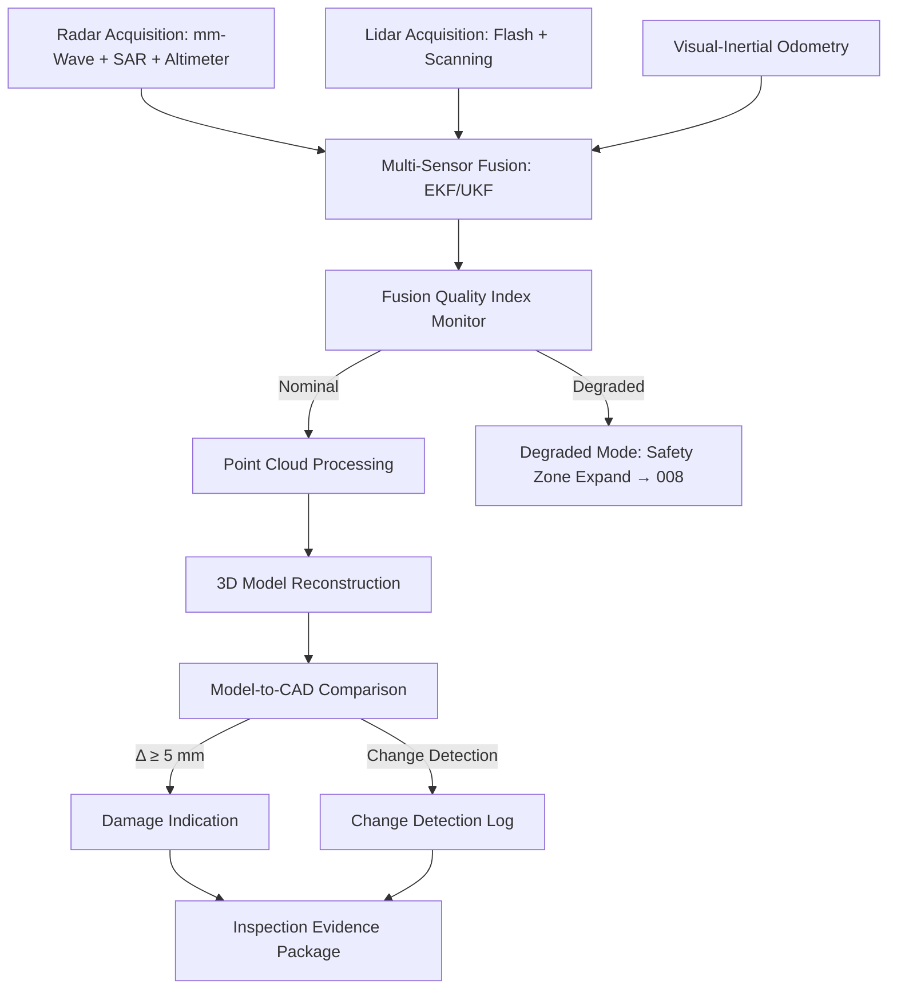

# STA 170-179 · 171-040 — Radar Lidar and Proximity Sensing Inspection

## 1. Purpose

Defines radar, lidar, and proximity sensing system requirements for on-orbit inspection within the Q+ATLANTIDE STA band[^baseline], providing active sensing capabilities beyond visible-spectrum imaging. This document specifies sensor architectures, data quality standards, fusion requirements, and compatibility constraints per ECSS-E-ST-10-09C[^ecss1009c], CCSDS 520.2-G-3[^ccsds5202], ECSS-E-ST-32C[^ecss32c], and NASA-HDBK-1001[^nasahdbk1001].

## 2. Scope

- **Radar inspection systems:** Millimeter-wave radar (76–81 GHz band) for detection of subsurface disbonds, delaminations, and moisture ingress behind surface layers, with minimum range resolution ≤5 mm for close-range inspection. Synthetic Aperture Radar (SAR) mode for high-resolution surface mapping at extended standoff: cross-range resolution ≤50 mm at 50 m standoff; SAR processing onboard for real-time Damage Indication generation. Radar altimeter channel integrated for precise standoff distance measurement: accuracy ≤10 mm, update rate ≥10 Hz, for use by GNC during close proximity inspection. Antenna pointing control: boresight accuracy ≤0.1° for SAR mode. Electromagnetic compatibility analysis required: radar transmission frequencies shall not produce harmful interference with target spacecraft TT&C, navigation, or pyrotechnic systems; minimum separation frequencies and duty cycles defined in EMC analysis report.

- **Lidar-based 3D mapping:** Flash lidar for rapid full-frame 3D point cloud acquisition: range ≤200 m, range accuracy ≤50 mm, frame rate ≥1 Hz; used for wide-area survey and proximity navigation integration. Scanning lidar for high-resolution surface mapping: angular resolution ≤0.1°, range accuracy ≤5 mm at 20 m standoff; used for close inspection arcs. Point cloud density requirements: ≥100 points/m² for structural assessment; ≥500 points/m² for damage characterisation zones. Lidar data fusion with visual imagery: co-registration of lidar point cloud with RGB image texture for enhanced damage assessment; co-registration accuracy ≤5 mm. All active lidar systems shall comply with laser eye-safety requirements per IEC 60825-1 Class 1M for human proximity scenarios; Class 3B safety protocols required during robotic-only operations.

- **Proximity sensor fusion:** Multi-sensor fusion architecture integrating lidar, radar, and visual-inertial odometry data for relative state estimation during inspection proximity operations. Extended Kalman Filter (EKF) or Unscented Kalman Filter (UKF) for fused relative position and attitude estimate: position accuracy ≤0.1 m at ≤50 m standoff; attitude accuracy ≤0.5°. Sensor data quality monitoring: individual sensor health flags propagated into fusion quality index; fusion integrity monitor with alert threshold triggering to GNC supervisor when quality index falls below minimum. Degraded mode: single-sensor fallback operational with increased safety zone margins per `008`.

- **Data quality and calibration:** Pre-launch calibration requirements: lidar range calibration using NIST-traceable reference targets; radar range calibration using corner reflectors; all calibration data archived in spacecraft calibration database. In-orbit calibration: lidar range bias estimation using cooperative target on inspector spacecraft; radar using on-orbit corner reflector deployment (if mission architecture includes calibration target). Data quality metrics for lidar: range noise σ ≤5 mm, angular accuracy ≤0.05°, spurious return rate ≤0.1%. Data quality metrics for radar: range resolution conformance ≤10% of spec, cross-range resolution conformance ≤15% of spec, spurious sidelobe level ≤−25 dB. All calibration evidence documented in Inspection Evidence Package.

- **Active sensing and proximity operations compatibility:** Sensor activation sequence during proximity approach: lidar activated at ≤200 m range, radar activated at ≤100 m range for EMC margin compliance; activation subject to GNC supervisor confirmation of target state. Radar power levels during close proximity (≤20 m): duty cycle limited to ≤5% to maintain EMC compliance margins. Sensor scheduling coordinated with GNC navigation sensor operations to prevent interference between inspection lidar and GNC flash lidar (if different units): time-division multiplexing or frequency separation required. Interference management: cross-sensor interference risk matrix reviewed per inspection campaign; identified conflicts resolved in Inspection Operations Procedure.

- **3D reconstruction and change detection:** Point cloud processing pipeline: ground-based or onboard 3D model reconstruction from merged scan data; model resolution ≥10 mm; model-to-CAD comparison for geometric deformation detection with deformation threshold ≤5 mm flagged as Damage Indication. Change detection between successive inspection campaign models: surface change magnitude ≥3 mm flagged; temporal change rate estimation for degradation progression. 3D model archive managed under configuration control: baseline model at commissioning, updated model after each Class A or Class D inspection campaign; version history retained for lifecycle traceability.

## 3. Diagram

## 4. Footprint

| Metric | Value |
|---|---|
| Architecture | `STA` — Space Technology Architecture |
| Master range | `100–199` |
| Code range | `170-179` |
| Section | `07` — Operaciones y Mantenimiento en Órbita |
| Subsection | `171` — Inspección en Órbita |
| Subsubject | `004` — Radar, Lidar and Proximity Sensing Inspection |
| Primary Q-Division | Q-SPACE[^qdiv] |
| Support Q-Divisions | Q-DATAGOV, Q-HPC, Q-HORIZON, Q-STRUCTURES, Q-INDUSTRY |
| ORB support | ORB-LEG |
| Governance class | `baseline`[^gov] |
| Safety boundary | on-orbit inspection critical |
| Document | `171-040-Radar-Lidar-and-Proximity-Sensing-Inspection.md` (this file) |
| Parent subsection | [`README.md`](./README.md) · [`171-000-General.md`](./171-000-General.md) |

## 5. References & Citations

[^baseline]: **Q+ATLANTIDE controlled baseline (v1.0.0)** — [`organization/Q+ATLANTIDE.md`](../../../../organization/Q+ATLANTIDE.md).

[^ecss1009c]: **ECSS-E-ST-10-09C** — *Structural and thermal models* (ESA/ECSS, 2011).

[^ccsds5202]: **CCSDS 520.2-G-3** — *Proximity-1 Space Link Protocol* (CCSDS, 2020).

[^ecss32c]: **ECSS-E-ST-32C** — *Structural general requirements* (ESA/ECSS, 2008).

[^nasahdbk1001]: **NASA-HDBK-1001** — *Structural design and test factors of safety for spaceflight hardware* (NASA, 2014).

[^qdiv]: **Q-Division authority** — [`organization/Q-Divisions/`](../../../../organization/Q-Divisions/).

[^gov]: **Governance class** — `baseline` denotes documents under controlled change management within the Q+ATLANTIDE baseline.
