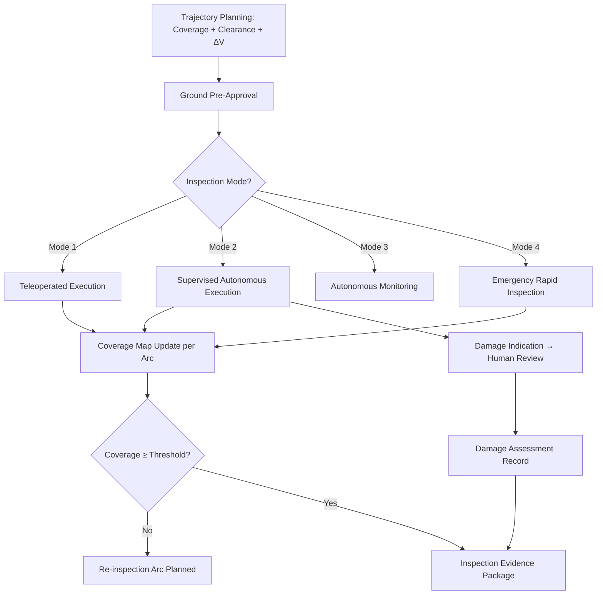

# STA 170-179 · 171-070 — Autonomous Inspection and Robotic Inspection Modes

## 1. Purpose

Specifies autonomous inspection trajectory planning, robotic inspection platform requirements, human-in-the-loop mode boundaries, and inspection coverage verification for on-orbit autonomous inspection within the Q+ATLANTIDE STA band[^baseline]. This document governs autonomy design and operational authorization per ECSS-E-ST-70-11C[^ecss7011c], CCSDS 520.2-G-3[^ccsds5202], ECSS-E-ST-10-09C[^ecss1009c], and ECSS-E-ST-40C[^ecss40c].

## 2. Scope

- **Autonomous inspection trajectory planning:** Inspection fly-around trajectory designed to achieve: full coverage of defined target zones at required standoff distance (±5 m tolerance); collision avoidance clearance from all target protuberances ≥2× worst-case navigation error (3σ); minimum ΔV budget consumption. Onboard trajectory planner requirements: trajectory optimisation computed within available OBC budget (≤50% OBC load during planning); re-planning capability for coverage gaps or navigation errors; update cycle ≤10 seconds. Sensor pointing optimisation: inspection sensor boresight command generated continuously along trajectory for maximum dwell time on defined inspection zones. Illumination-aware trajectory adaptation: real-time solar angle computation; trajectory segment re-ordering or inspection arc delay if solar angle falls below minimum (15° visible, orbit-aware); trajectory updates subject to ground pre-approval in Mode 2 and Mode 3. Monte Carlo simulation validation: ≥1000 trajectory runs with navigation error injection confirming clearance compliance; simulation evidence in Inspection Evidence Package.

- **Robotic inspection platform integration:** Inspector spacecraft as dedicated free-flyer: GNC requirements per `008` (proximity operations safety zones); propulsion budget for full fly-around plus ≥1 abort manoeuvre reserve; docking or berthing return capability required for Class A/C/D missions. Manipulator-mounted inspection (robotic arm on servicer spacecraft): workspace coverage analysis confirming target zone accessibility; base disturbance budget for inspection sensor pointing accuracy during arm motion; inspection sensor accommodation at end-effector with calibrated mounting; manipulator kinematics simulation for collision-free path planning around target protuberances. Platform selection criteria: free-flyer preferred for uninstrumented targets without docking interface; manipulator-mounted preferred for close structural assessment (≤1 m standoff) of specific zones.

- **Autonomous inspection mode taxonomy:** Four operational modes defined within the STA 144 autonomy framework (→`144`): Mode 1 — Fully Teleoperated: ground operator issues all pointing and movement commands; onboard executes without prediction or planning; used for novel target inspection or contingency; Mode 2 — Supervised Autonomous: onboard executes ground-pre-approved inspection trajectory; ground monitors telemetry at ≥1 Hz; ground can abort at any time; onboard abort authority active; used for standard Class A and Class C operations; Mode 3 — Autonomous Monitoring: onboard executes continuous Class E SHM monitoring without ground intervention between scheduled status reports; anomaly detection triggers alert and data capture; used for persistent monitoring; Mode 4 — Emergency Inspection: autonomous rapid assessment trajectory triggered by SHM Level 2 or Level 3 finding; pre-approved emergency trajectory executed; human review of data within time-to-action limits per `005`. All mode transitions require explicit authorization per STA 144 autonomy governance: Mode 1 → Mode 2 requires ground upload of approved trajectory; Mode 2 → Mode 3 requires mission director authorization; Mode 4 entry requires automated trigger authorization recorded in anomaly log.

- **Human-in-the-loop boundaries:** All Damage Indications require human expert review before entry into the Damage Assessment Record; no autonomous system may classify a Damage Indication as Level 3 Safety-Critical without human confirmation unless time-to-action constraint is violated, in which case automatic safe-mode is engaged and human review required before resuming operations. Autonomous mode boundary: repair authorization (→`172`) is never issued from autonomous inspection alone; human confirmation is required for all Safety-Critical Findings before operational restrictions are modified. Inspection data downlink latency: data for human review available within: Level 2 finding — ≤6 hours of detection; Level 3 finding — ≤2 hours of detection or next communication window, whichever is shorter.

- **Inspection coverage verification:** Coverage map generation: 3D target model (from pre-mission CAD or prior inspection) overlaid with inspection arc coverage coloring per sensor type and resolution zone; generated onboard in real-time and updated per arc completion. Coverage completeness metric: percentage of defined inspection surface area covered at or better than required resolution threshold; minimum acceptable: ≥95% for Class A, ≥90% for Class B anomaly zone, 100% of access zones for Class C/D. Gap analysis: automated identification of uninspected zones; re-inspection arc planned and pre-approved before leaving proximity operations zone. Coverage evidence: coverage map and completeness metric archived in Inspection Evidence Package; discrepancies between planned and achieved coverage formally documented.

- **Inspection data management and downlink:** Onboard data storage: raw sensor data for ≥72 hours; processed outputs (DI log, coverage map, point cloud) for ≥1 year with compression. Prioritisation for downlink: Safety-Critical Findings and associated sensor data transmitted at earliest communication window with highest priority; Level 2 findings within 6 hours; Level 1 data per standard telemetry schedule. Onboard compression: lossless for DI-associated data; lossy acceptable for background data with ≤5% RMS error. Ground processing pipeline: data ingestion → calibration application → analysis tool chain → expert review interface → Damage Assessment Record generation; pipeline configuration under software change control per ECSS-E-ST-40C. Data quality report generated per inspection campaign and archived with Inspection Evidence Package.

## 3. Diagram

## 4. Footprint

| Metric | Value |
|---|---|
| Architecture | `STA` — Space Technology Architecture |
| Master range | `100–199` |
| Code range | `170-179` |
| Section | `07` — Operaciones y Mantenimiento en Órbita |
| Subsection | `171` — Inspección en Órbita |
| Subsubject | `007` — Autonomous Inspection and Robotic Inspection Modes |
| Primary Q-Division | Q-SPACE[^qdiv] |
| Support Q-Divisions | Q-DATAGOV, Q-HPC, Q-HORIZON, Q-STRUCTURES, Q-INDUSTRY |
| ORB support | ORB-LEG |
| Governance class | `baseline`[^gov] |
| Safety boundary | on-orbit inspection critical |
| Document | `171-070-Autonomous-Inspection-and-Robotic-Inspection-Modes.md` (this file) |
| Parent subsection | [`README.md`](./README.md) · [`171-000-General.md`](./171-000-General.md) |

## 5. References & Citations

[^baseline]: **Q+ATLANTIDE controlled baseline (v1.0.0)** — [`organization/Q+ATLANTIDE.md`](../../../../organization/Q+ATLANTIDE.md).

[^ecss7011c]: **ECSS-E-ST-70-11C** — *Space engineering — Space segment operability* (ESA/ECSS, 2008).

[^ccsds5202]: **CCSDS 520.2-G-3** — *Proximity-1 Space Link Protocol* (CCSDS, 2020).

[^ecss1009c]: **ECSS-E-ST-10-09C** — *Structural and thermal models* (ESA/ECSS, 2011).

[^ecss40c]: **ECSS-E-ST-40C** — *Space engineering — Software* (ESA/ECSS, 2009).

[^qdiv]: **Q-Division authority** — [`organization/Q-Divisions/`](../../../../organization/Q-Divisions/).

[^gov]: **Governance class** — `baseline` denotes documents under controlled change management within the Q+ATLANTIDE baseline.
