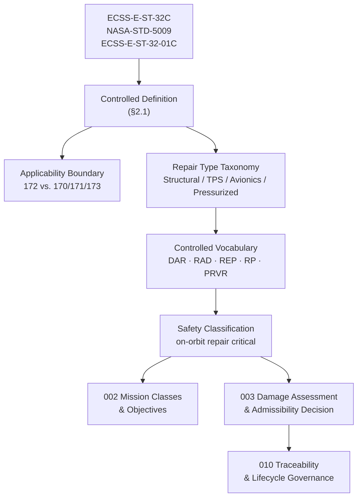

# STA 170-179 · Section 07 · Subsection 172 — Reparación en Órbita

## 1. Purpose

This document establishes the normative definition and controlled scope of *On-Orbit Repair* within the Q+ATLANTIDE STA band, subsection `172`. The controlled definition provides the authoritative basis for all subsequent subsubjects (`002`–`010`) and is aligned with ECSS-E-ST-32C (Structural general requirements), ECSS-E-ST-32-01C (Fracture control), and NASA-STD-5009 (Fracture Control Requirements for Spaceflight Hardware)[^ecss32c][^ecss3201c][^nastd5009].

This subsection is part of the **ATLAS-1000** register under the controlled **Q+ATLANTIDE** baseline[^baseline][^n001] and is designated **on-orbit repair critical**.

## 2. Scope

- **Controlled definition**: On-orbit repair is defined within this subsection as all operations that restore a damaged or degraded orbital asset to a state meeting mission performance requirements, using repair materials, tools, and/or robotic systems delivered by a servicer spacecraft or pre-stowed on the target spacecraft. This definition encompasses physical repair actions (bonding, patching, sealing, fastening), module-level replacement of failed units, and restoration of electrical, structural, thermal, and pressurized-system functions. The definition excludes activities addressed in adjacent subsections (see applicability boundary below).

- **Applicability boundary**: STA `172` covers repair operations exclusively. The following are explicitly out of scope for this subsection: inspection and damage detection activities covered by `171_Inspeccion-en-Orbita`; assembly of new structures or installation of new modules that were planned from mission outset, covered by `173_Ensamblaje-en-Orbita`; and preventive or scheduled servicing operations not triggered by detected damage or performance degradation, covered by `170_Servicing-Orbital`. Any activity at the boundary between these subsections requires explicit classification via the admissibility decision process in `003`.

- **Repair type taxonomy**: Four primary repair types are defined within this subsection, each with distinct admissibility criteria and evidence requirements: (1) *Structural repair* — addresses mechanical damage including hypervelocity impact penetrations, fatigue cracks, and composite delamination; governed by fracture mechanics and residual strength analysis per ECSS-E-ST-32-01C and NASA-STD-5009; (2) *Thermal protection repair* — addresses degradation of multi-layer insulation (MLI), optical coatings, and ablative materials; governed by thermal performance analysis and material qualification per ECSS-Q-ST-70C[^ecssq70c]; (3) *Avionics/electrical repair* — addresses connector failure, printed circuit board degradation, and harness damage; primarily executed via LRU-level exchange per `005`; (4) *Pressurized system repair* — addresses pressure vessel seal degradation and pipe/duct breaches; subject to the most stringent admissibility criteria including mandatory proof testing of repaired pressure boundary.

- **Controlled vocabulary**: The following terms are normative throughout subsection `172` and shall be used consistently in all controlled documents: *Damage Assessment Record (DAR)* — the formal output of the damage assessment process (`003`) documenting damage type, location, dimensions, severity classification, and structural analysis results; *Repair Admissibility Decision (RAD)* — the formal engineering authorization determining whether a repair operation meets admissibility criteria; *Repair Evidence Package (REP)* — the complete, traceable record of repair execution including procedure, material lot data, cure log, functional test data, and post-repair verification results; *Repair Procedure (RP)* — the controlled, approved document specifying step-by-step repair execution including tool requirements, material quantities, torque values, and quality gates; *Post-Repair Verification Report (PRVR)* — the document confirming that the repaired asset meets the post-repair performance requirements via specified verification methods.

- **Safety classification**: On-orbit repair is classified as safety-critical within the Q+ATLANTIDE STA band. Physical contact with damaged structural elements requires containment of any released material (particles, debris, outgassing products) per the hazardous material containment requirements in `008`. Pressure boundary repair requires proof-test evidence at a minimum of 1.5× MEOP before the pressure system is returned to service per ECSS-E-ST-31C requirements. Any Repair Admissibility Decision for structural or pressure-boundary repairs requires formal engineering authorization from the responsible structures or pressure systems authority, and cannot be delegated to mission operations alone.

## 3. Diagram

## 4. Footprint

| Metric | Value |
|---|---|
| Architecture | `STA` — Space Technology Architecture |
| Master range | `100–199` |
| Code range | `170-179` |
| Section | `07` — Operaciones y Mantenimiento en Órbita |
| Subsection | `172` — Reparación en Órbita |
| Subsubject | `001` — On-Orbit Repair Controlled Definition |
| Primary Q-Division | Q-SPACE[^qdiv] |
| Support Q-Divisions | Q-DATAGOV, Q-HPC, Q-HORIZON, Q-STRUCTURES, Q-INDUSTRY, Q-GREENTECH |
| ORB support | ORB-LEG |
| Governance class | `baseline`[^gov] |
| Safety boundary | on-orbit repair critical |
| Folder path | `Q+ATLANTIDE/100-199_STA/170-179_Operaciones-y-Mantenimiento-en-Orbita/172_Reparacion-en-Orbita/` |
| Document | `001_On-Orbit-Repair-Controlled-Definition.md` (this file) |
| Parent subsection | [`README.md`](./README.md) · [`000_Overview.md`](./000_Overview.md) |
| Parent section | [`../README.md`](../README.md) |
| Parent architecture | [`../../README.md`](../../README.md) |
| Parent baseline | [`organization/Q+ATLANTIDE.md`](../../../../organization/Q+ATLANTIDE.md) |

## 5. References & Citations

[^baseline]: **Q+ATLANTIDE controlled baseline (v1.0.0)** — [`organization/Q+ATLANTIDE.md`](../../../../organization/Q+ATLANTIDE.md).

[^qdiv]: **Q-Division authority** — [`organization/Q-Divisions/`](../../../../organization/Q-Divisions/).

[^gov]: **Governance class** — `baseline` denotes documents under controlled change management within the Q+ATLANTIDE baseline.

[^n001]: **Note N-001** — Q+ATLANTIDE (with its ATLAS-1000 register subpart) is a taxonomy and traceability ecosystem, not an organization chart. See [`organization/Q+ATLANTIDE.md` §4](../../../../organization/Q+ATLANTIDE.md#4-notes).

[^ecss32c]: **ECSS-E-ST-32C** — *Space Engineering — Structural general requirements*, ESA/ESTEC, 2008.

[^ecss3201c]: **ECSS-E-ST-32-01C** — *Space Engineering — Fracture control*, ESA/ESTEC, 2009.

[^nastd5009]: **NASA-STD-5009** — *Fracture Control Requirements for Spaceflight Hardware*, NASA, 2008.

[^ecssq70c]: **ECSS-Q-ST-70C** — *Space Product Assurance — Materials, mechanical parts and processes*, ESA/ESTEC, 2008.
