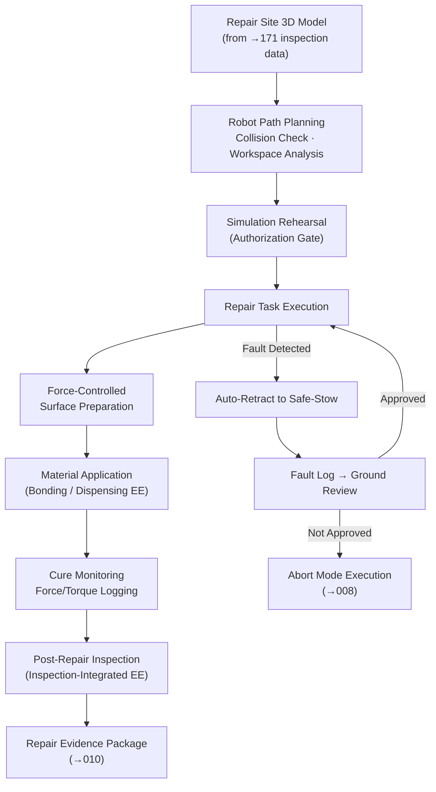

# STA 170-179 · Section 07 · Subsection 172 — Reparación en Órbita

## 1. Purpose

This document specifies the robotic repair architecture, manipulator requirements for repair operations, end-effector taxonomy, force-controlled manipulation requirements, and teleoperation/autonomous mode boundaries for on-orbit repair within subsection `172`. Requirements are derived from ECSS-E-ST-70-11C (Robotic systems), ECSS-E-ST-32C (Structural general requirements), and NASA-STD-3000 (Human Integration Design Handbook)[^ecss7011c][^ecss32c][^nastd3000][^baseline][^n001].

## 2. Scope

- **Robotic repair architecture**: The baseline manipulator configuration for repair operations shall provide a minimum of seven degrees of freedom (7-DOF) to enable dexterous access to repair sites in geometrically constrained locations on the target spacecraft structure. Force/torque sensing at the wrist is required for all contact repair operations; minimum sensing range: ±200 N / ±20 Nm with resolution ≤ 0.5 N / 0.05 Nm. Compliant control modes — impedance control and force control — shall be selectable per repair operation phase to enable safe contact with potentially fragile or damaged substrate. Workspace analysis for each repair site shall be performed during repair planning, confirming that the full repair motion sequence (approach, surface preparation, material application, cure monitoring, retraction) lies within the reachable workspace without singularities. Base mounting stability requirements during repair contact forces shall be verified: the servicer structural interface shall support reaction forces up to the maximum repair contact force with a factor of safety of 2.0.

- **End-effector taxonomy for repair**: The following end-effector types are defined within this subsection, each requiring qualification for the space environment including thermal cycling from -170°C to +150°C and vacuum outgassing per ECSS-Q-ST-70C[^ecssq70c]: (1) *Precision manipulation end-effector* — for LRU removal and installation; includes grasping jaw, alignment features, and electrical mating pin protection; force-limited to connector mating force envelope per connector specification; (2) *Bonding/dispensing end-effector* — for adhesive and sealant application; metered dispensing with quantity monitoring; compatible with RTV and structural adhesive chemistries; (3) *Cutting/grinding tool* — for surface preparation including contamination removal and mechanical abrasion to specified roughness; particle containment integral to tool design; (4) *Torque tool* — for fastener installation to specified torque; calibrated torque output with logged torque-angle data per fastener; (5) *Inspection-integrated end-effector* — combining vision sensor (close-range imaging, ≥ 1 mm/pixel at 100 mm working distance) and manipulation capability for real-time repair quality monitoring.

- **Force-controlled manipulation requirements**: Force/torque control requirements for repair contact operations are defined per operation type: surface preparation contact force 5–20 N normal to surface, controlled to ± 2 N; bonding agent application force 2–10 N, controlled to ± 1 N; LRU mating force per connector specification, not to exceed rated mating force × 1.2; fastener torque per torque specification ± 5% of target. Contact force monitoring with automatic retraction shall be active during all contact phases: if contact force exceeds the defined retraction threshold, the manipulator shall retract to a pre-defined safe position within 100 ms. Compliance control parameters for surface-following shall accommodate surface irregularities up to ± 3 mm normal to the nominal repair plane. Vibration isolation during precision repair shall be evaluated if the servicer attitude control system introduces disturbance forces above the repair force control bandwidth. Force/torque data from all repair contact phases shall be logged at ≥ 10 Hz and included as part of the Repair Evidence Package per `010`.

- **Teleoperation and autonomous mode boundaries**: Repair operations default to teleoperation with high-quality video feedback (minimum two camera views: overview and close-range; latency ≤ 250 ms effective round-trip for LEO). Supervised autonomy may be used for routine LRU exchange operations (Class R3 per `002`) only, provided the autonomy function has been validated for the specific LROU type and the operator maintains abort authority at all times. Fully autonomous repair execution (without ground approval per step) is not permitted for any repair class. Force feedback shall be provided to the teleoperator via either haptic display or calibrated numerical display with colour coding relative to force limits. Time-delay management for relay-satellite or deep-space operations shall be governed by the time-delay operational procedures referenced in the mission-specific Repair Procedure.

- **Repair workspace management**: A 3D model of the repair area shall be generated from inspection data provided by `171_Inspeccion-en-Orbita` and updated before repair planning. Robot path planning for each repair phase shall be verified collision-free against the updated 3D model, with a minimum clearance of 50 mm from all structural surfaces not part of the repair site. Collision avoidance monitoring shall remain active during execution with real-time joint-limit and workspace-limit monitoring. The approach path shall be optimized for maximum tool accessibility and minimum manipulator singularity proximity. All repair task sequences shall be rehearsed in a high-fidelity 3D simulation environment before execution authorization is granted; simulation evidence shall be included in the Repair Authorization Record per `002`.

- **Fault management during repair**: Fault management during repair operations shall address mid-repair faults without compromising either the partially repaired structure or the safety of adjacent systems. For each repair phase (approach, surface preparation, material application, cure monitoring, retraction), a defined safe-stow position shall be pre-computed and validated before repair commencement. If a partial repair state is reached (e.g., adhesive applied but patch not yet installed), the safe stabilization protocol shall be executed: maintain temperature within adhesive storage range, prevent contamination, and document partial-repair state. Fault logs with timestamps shall be generated automatically at each fault event. No repair resumption after a significant fault shall proceed without ground review of the fault log and confirmation that the partial-repair state is acceptable as a starting point.

## 3. Diagram

## 4. Footprint

| Metric | Value |
|---|---|
| Architecture | `STA` — Space Technology Architecture |
| Master range | `100–199` |
| Code range | `170-179` |
| Section | `07` — Operaciones y Mantenimiento en Órbita |
| Subsection | `172` — Reparación en Órbita |
| Subsubject | `004` — Robotic Repair and Manipulation Functions |
| Primary Q-Division | Q-SPACE[^qdiv] |
| Support Q-Divisions | Q-DATAGOV, Q-HPC, Q-HORIZON, Q-STRUCTURES, Q-INDUSTRY, Q-GREENTECH |
| ORB support | ORB-LEG |
| Governance class | `baseline`[^gov] |
| Safety boundary | on-orbit repair critical |
| Folder path | `Q+ATLANTIDE/100-199_STA/170-179_Operaciones-y-Mantenimiento-en-Orbita/172_Reparacion-en-Orbita/` |
| Document | `004_Robotic-Repair-and-Manipulation-Functions.md` (this file) |
| Parent subsection | [`README.md`](./README.md) · [`000_Overview.md`](./000_Overview.md) |
| Parent section | [`../README.md`](../README.md) |
| Parent architecture | [`../../README.md`](../../README.md) |
| Parent baseline | [`organization/Q+ATLANTIDE.md`](../../../../organization/Q+ATLANTIDE.md) |

## 5. References & Citations

[^baseline]: **Q+ATLANTIDE controlled baseline (v1.0.0)** — [`organization/Q+ATLANTIDE.md`](../../../../organization/Q+ATLANTIDE.md).

[^qdiv]: **Q-Division authority** — [`organization/Q-Divisions/`](../../../../organization/Q-Divisions/).

[^gov]: **Governance class** — `baseline` denotes documents under controlled change management within the Q+ATLANTIDE baseline.

[^n001]: **Note N-001** — Q+ATLANTIDE (with its ATLAS-1000 register subpart) is a taxonomy and traceability ecosystem, not an organization chart. See [`organization/Q+ATLANTIDE.md` §4](../../../../organization/Q+ATLANTIDE.md#4-notes).

[^ecss7011c]: **ECSS-E-ST-70-11C** — *Space Engineering — Space robotics technologies*, ESA/ESTEC, 2008.

[^ecss32c]: **ECSS-E-ST-32C** — *Space Engineering — Structural general requirements*, ESA/ESTEC, 2008.

[^nastd3000]: **NASA-STD-3000** — *Man-Systems Integration Standards*, NASA, 1995.

[^ecssq70c]: **ECSS-Q-ST-70C** — *Space Product Assurance — Materials, mechanical parts and processes*, ESA/ESTEC, 2008.
