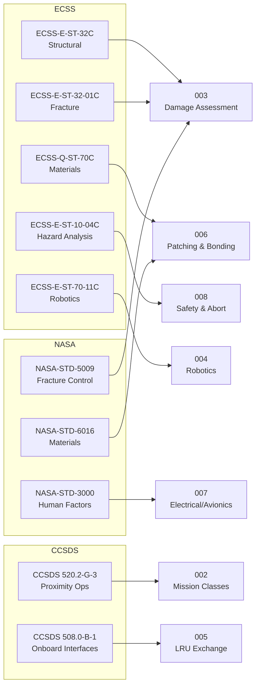

# STA 170-179 · Section 07 · Subsection 172 — Reparación en Órbita

## 1. Purpose

This document maps applicable ECSS, NASA, and CCSDS standards to on-orbit repair functional areas within STA subsection `172`. The mapping provides a single-source standards traceability reference for all controlled documents in this subsection and enables identification of standards gaps and evolution monitoring needs. The standards listed here are the normative basis for requirements across subsubjects `001`–`010`[^baseline][^n001].

## 2. Scope

- **ECSS standards applicable to on-orbit repair**: The following ECSS standards are mapped to functional repair areas within this subsection. *ECSS-E-ST-32C (Structural general requirements)* — primary structural repair standard; governs structural analysis, material allowables, margin-of-safety computation for repair admissibility (→003) and structural patch design (→006); referenced in `001`, `002`, `003`, `004`, `006`, `008`. *ECSS-E-ST-32-01C (Fracture control)* — fracture mechanics basis for repair admissibility analysis (→003); provides crack growth and fracture toughness analysis methodology; required for Class R1 (Emergency Structural Repair); referenced in `001`, `002`, `003`, `006`. *ECSS-Q-ST-70C (Materials, mechanical parts and processes)* — repair material qualification basis; governs outgassing requirements (TML < 1.0%, CVCM < 0.1%), thermal cycling performance, radiation resistance, and surface preparation qualification for bonding agents (→006); also governs qualification of sealing compounds and ESD-safe materials (→007); referenced in `001`, `002`, `003`, `006`, `007`. *ECSS-E-ST-10-04C (Hazard analysis)* — safety analysis methodology for repair operations (→008); applied to identify hazards from repair tools, materials, and partial-repair states; referenced in `008`. *ECSS-E-ST-10-03C (Testing)* — V&V methodology for repair verification; governs post-repair functional test plans and proof test evidence (→010); referenced in `009`, `010`. *ECSS-E-ST-70-11C (Space robotics technologies)* — robotic repair architecture requirements (→004); governs force/torque sensing, compliant control, end-effector qualification, and fault management; referenced in `004`, `005`, `008`. *ECSS-E-ST-31C (Thermal control general requirements)* — thermal performance requirements for Class R2 (TPS repair); thermal analysis basis for repair success criteria; referenced in `002`, `006`. *ECSS-E-ST-20-06C (Spacecraft charging)* — ESD control requirements for electrical and avionics repair (→007); referenced in `007`. *ECSS-E-ST-10-09C (Structural finite element models)* — FEA model update methodology for repair admissibility analysis (→003); referenced in `003`. *ECSS-Q-ST-80C (Software product assurance)* — software verification requirements for avionics LROU replacement (→005, →007); referenced in `005`, `007`.

- **NASA standards applicable to on-orbit repair**: The following NASA standards are mapped to repair functional areas. *NASA-STD-5009 (Fracture Control Requirements for Spaceflight Hardware)* — fracture control requirements that are co-applicable with ECSS-E-ST-32-01C for structural repair admissibility; provides US fracture control methodology and flaw screening criteria for metallic structures; referenced in `001`, `002`, `003`, `006`, `008`. *NASA-STD-3000 (Man-Systems Integration Standards, Human Integration Design Handbook)* — human factors and crewed EVA interface requirements applicable to repair operations involving EVA crew members; workspace dimensions, force limits, tool design constraints, and suit ESD properties; referenced in `004`, `005`, `007`. *NASA-HDBK-1001 (Structural Design and Test Factors of Safety for Spaceflight Hardware)* — structural design requirements and factors of safety applicable to the structural analysis basis for repair admissibility (→003) and patch design (→006); referenced in `003`, `006`. *NASA-STD-6016 (Requirements for Materials, Processes, and Parts for Spaceflight Hardware)* — materials requirements for spaceflight hardware including adhesives, sealants, and repair materials; supplements ECSS-Q-ST-70C for NASA-programme missions; referenced in `006`.

- **CCSDS standards applicable to on-orbit repair**: The following CCSDS standards are mapped to repair proximity operations and data management. *CCSDS 520.2-G-3 (Rendezvous and Proximity Operations)* — proximity operations guidelines for the servicer approach and station-keeping during repair operations; informs repair window planning constraints in `002` and abort mode return distances in `008`; referenced in `002`, `008`. *CCSDS 508.0-B-1 (Spacecraft Onboard Interface Services)* — onboard interface services relevant to LROU exchange and post-repair functional test data handling (→005, →007); referenced in `005`, `007`. *CCSDS 131.0-B-3 (TM Synchronization and Channel Coding)* — telemetry channel reliability requirements relevant to communication window planning for teleoperated repair (→004) and repair event logging (→010); referenced in `004`, `010`.

- **Standards applicability matrix**: The following table maps each standard to the subsubjects within `172` where it is normatively referenced.

| Standard | 001 | 002 | 003 | 004 | 005 | 006 | 007 | 008 | 009 | 010 |
|---|:---:|:---:|:---:|:---:|:---:|:---:|:---:|:---:|:---:|:---:|
| ECSS-E-ST-32C | ✓ | ✓ | ✓ | ✓ | — | ✓ | — | ✓ | ✓ | — |
| ECSS-E-ST-32-01C | ✓ | ✓ | ✓ | — | — | ✓ | — | — | ✓ | — |
| ECSS-Q-ST-70C | ✓ | ✓ | ✓ | ✓ | ✓ | ✓ | ✓ | — | ✓ | — |
| ECSS-E-ST-10-04C | — | — | — | — | — | — | — | ✓ | ✓ | — |
| ECSS-E-ST-10-03C | — | — | — | — | — | — | — | — | ✓ | ✓ |
| ECSS-E-ST-70-11C | — | — | — | ✓ | ✓ | — | — | ✓ | ✓ | — |
| ECSS-E-ST-31C | — | ✓ | — | — | — | ✓ | — | — | ✓ | — |
| ECSS-E-ST-20-06C | — | — | — | — | — | — | ✓ | — | ✓ | — |
| ECSS-E-ST-10-09C | — | — | ✓ | — | — | — | — | — | ✓ | — |
| ECSS-Q-ST-80C | — | — | — | — | ✓ | — | ✓ | — | ✓ | — |
| NASA-STD-5009 | ✓ | ✓ | ✓ | — | — | ✓ | — | ✓ | ✓ | ✓ |
| NASA-STD-3000 | — | — | — | ✓ | ✓ | — | ✓ | — | ✓ | — |
| NASA-HDBK-1001 | — | — | ✓ | — | — | ✓ | — | — | ✓ | — |
| NASA-STD-6016 | — | — | — | — | — | ✓ | — | — | ✓ | — |
| CCSDS 520.2-G-3 | — | ✓ | — | — | — | — | — | ✓ | ✓ | — |
| CCSDS 508.0-B-1 | — | — | — | — | ✓ | — | ✓ | — | ✓ | — |
| CCSDS 131.0-B-3 | — | — | — | ✓ | — | — | — | — | ✓ | ✓ |

- **Standards evolution monitoring**: Standards listed in this document shall be reviewed for revision status annually, or when triggered by a new issue of a directly referenced standard. The following monitoring responsibilities apply: ECSS standards — Q-SPACE monitors ESA/ESTEC publication database; NASA standards — Q-SPACE monitors the NASA Technical Standards System (NTSS); CCSDS standards — Q-DATAGOV monitors the CCSDS Secretariat publication register. Any new issue of a referenced standard shall be assessed for impact on requirements within `172`, and a baseline change request raised if impact is identified.

## 3. Diagram

## 4. Footprint

| Metric | Value |
|---|---|
| Architecture | `STA` — Space Technology Architecture |
| Master range | `100–199` |
| Code range | `170-179` |
| Section | `07` — Operaciones y Mantenimiento en Órbita |
| Subsection | `172` — Reparación en Órbita |
| Subsubject | `009` — ECSS-NASA-CCSDS On-Orbit Repair Standards Mapping |
| Primary Q-Division | Q-SPACE[^qdiv] |
| Support Q-Divisions | Q-DATAGOV, Q-HPC, Q-HORIZON, Q-STRUCTURES, Q-INDUSTRY, Q-GREENTECH |
| ORB support | ORB-LEG |
| Governance class | `baseline`[^gov] |
| Safety boundary | on-orbit repair critical |
| Folder path | `Q+ATLANTIDE/100-199_STA/170-179_Operaciones-y-Mantenimiento-en-Orbita/172_Reparacion-en-Orbita/` |
| Document | `009_ECSS-NASA-CCSDS-On-Orbit-Repair-Standards-Mapping.md` (this file) |
| Parent subsection | [`README.md`](./README.md) · [`000_Overview.md`](./000_Overview.md) |
| Parent section | [`../README.md`](../README.md) |
| Parent architecture | [`../../README.md`](../../README.md) |
| Parent baseline | [`organization/Q+ATLANTIDE.md`](../../../../organization/Q+ATLANTIDE.md) |

## 5. References & Citations

[^baseline]: **Q+ATLANTIDE controlled baseline (v1.0.0)** — [`organization/Q+ATLANTIDE.md`](../../../../organization/Q+ATLANTIDE.md).

[^qdiv]: **Q-Division authority** — [`organization/Q-Divisions/`](../../../../organization/Q-Divisions/).

[^gov]: **Governance class** — `baseline` denotes documents under controlled change management within the Q+ATLANTIDE baseline.

[^n001]: **Note N-001** — Q+ATLANTIDE (with its ATLAS-1000 register subpart) is a taxonomy and traceability ecosystem, not an organization chart. See [`organization/Q+ATLANTIDE.md` §4](../../../../organization/Q+ATLANTIDE.md#4-notes).

[^ecss32c]: **ECSS-E-ST-32C** — *Space Engineering — Structural general requirements*, ESA/ESTEC, 2008.

[^ecss3201c]: **ECSS-E-ST-32-01C** — *Space Engineering — Fracture control*, ESA/ESTEC, 2009.

[^ecssq70c]: **ECSS-Q-ST-70C** — *Space Product Assurance — Materials, mechanical parts and processes*, ESA/ESTEC, 2008.

[^ecss1004c]: **ECSS-E-ST-10-04C** — *Space Engineering — Space environment*, ESA/ESTEC, 2008.

[^ecss1003c]: **ECSS-E-ST-10-03C** — *Space Engineering — Testing*, ESA/ESTEC, 2012.

[^ecss7011c]: **ECSS-E-ST-70-11C** — *Space Engineering — Space robotics technologies*, ESA/ESTEC, 2008.

[^ecss31c]: **ECSS-E-ST-31C** — *Space Engineering — Thermal control general requirements*, ESA/ESTEC, 2008.

[^ecss2006c]: **ECSS-E-ST-20-06C** — *Space Engineering — Spacecraft charging*, ESA/ESTEC, 2008.

[^ecss1009c]: **ECSS-E-ST-10-09C** — *Space Engineering — Structural finite element models*, ESA/ESTEC, 2011.

[^ecssq80c]: **ECSS-Q-ST-80C** — *Space Product Assurance — Software product assurance*, ESA/ESTEC, 2009.

[^nastd5009]: **NASA-STD-5009** — *Fracture Control Requirements for Spaceflight Hardware*, NASA, 2008.

[^nastd3000]: **NASA-STD-3000** — *Man-Systems Integration Standards*, NASA, 1995.

[^nastdhdbk1001]: **NASA-HDBK-1001** — *Structural Design and Test Factors of Safety for Spaceflight Hardware*, NASA, 1996.

[^nastd6016]: **NASA-STD-6016** — *Requirements for Materials, Processes, and Parts for Spaceflight Hardware*, NASA, 2016.

[^ccsds520]: **CCSDS 520.2-G-3** — *Rendezvous and Proximity Operations*, CCSDS, 2014.

[^ccsds508]: **CCSDS 508.0-B-1** — *Spacecraft Onboard Interface Services*, CCSDS, 2012.

[^ccsds131]: **CCSDS 131.0-B-3** — *TM Synchronization and Channel Coding*, CCSDS, 2017.
