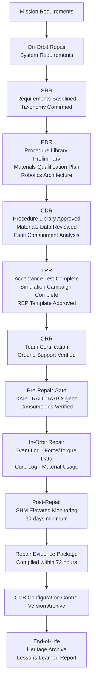

# STA 170-179 · Section 07 · Subsection 172 — Reparación en Órbita

## 1. Purpose

This document establishes repair requirements traceability, evidence gates at lifecycle milestones, in-orbit repair event logging and monitoring, and lifecycle configuration control for on-orbit repair missions within subsection `172`. It is the governance anchor for all controlled documents within this subsection and defines the Repair Evidence Package (REP) as the primary controlled artefact. Requirements are derived from ECSS-E-ST-10-02C (Verification), ECSS-E-ST-10-03C (Testing), ECSS-E-ST-32C, ECSS-Q-ST-80C, and NASA-STD-5009[^ecss1002c][^ecss1003c][^ecss32c][^ecssq80c][^nastd5009][^baseline][^n001].

## 2. Scope

- **Requirements traceability**: Bidirectional requirements traceability shall be maintained for all controlled repair documents from mission-level, system-level, safety, and structural requirements through repair functions, repair procedure design, materials qualification, test cases, and evidence artefacts. The primary traceability chain is: *Mission Requirements* → *On-Orbit Repair System Requirements* → *Repair Type Taxonomy* (`001`) → *Mission Class Objectives* (`002`) → *Damage Assessment and Admissibility Criteria* (`003`) → *Repair Function Specifications* (`004`, `005`, `006`, `007`) → *Safety Requirements* (`008`) → *Standards Compliance* (`009`) → *Evidence Artefacts*. Within each repair operation, the operational traceability chain is: *Damage Assessment Record (DAR)* → *Repair Admissibility Decision (RAD)* → *Repair Procedure (RP)* → *Repair Authorization Record (RAR)* → *Repair Execution Records* → *Post-Repair Verification Report (PRVR)* → *Repair Evidence Package (REP)*. All traceability links shall be bidirectional: forward traceability enables verification coverage analysis; reverse traceability enables impact assessment of requirement changes. Deviations from any planned requirement or procedure shall be formally registered in a deviation record with justification, compensating measures, and the approving authority signature. All deviation records shall be included in the Repair Evidence Package.

- **Evidence gates at lifecycle milestones**: Formal evidence gates are defined at the following programme lifecycle milestones for on-orbit repair capability. *System Requirements Review (SRR)* — required evidence: on-orbit repair capability requirements baselined including repair type taxonomy, mission class definitions, and safety boundary statement; standards applicability list confirmed per `009`. *Preliminary Design Review (PDR)* — required evidence: preliminary repair procedure library covering all five mission classes (R1–R5); materials qualification plan including outgassing, thermal cycling, and radiation test plan per `006`; robotic repair architecture preliminary design including manipulator configuration, end-effector set, and force control architecture per `004`. *Critical Design Review (CDR)* — required evidence: approved repair procedure library with all procedures reviewed against admissibility criteria; materials qualification test data for all repair materials reviewed; robotic repair system acceptance test plan approved; fault containment analysis for robotic system completed per `008`. *Test Readiness Review (TRR)* — required evidence: robotic repair system acceptance test complete with all requirements verified; repair simulation campaign complete with all five mission classes demonstrated; Repair Evidence Package structure and template approved; post-repair verification procedures validated. *Operational Readiness Review (ORR)* — required evidence: repair team operational certification including simulation campaign evidence; ground support system for teleoperated repair verified; communication system qualified for repair teleoperation link. *Pre-repair gate (per repair event)* — required evidence: Damage Assessment Record complete and reviewed; Repair Admissibility Decision signed by competent authority; Repair Procedure version confirmed; consumables availability verified against procedure requirements; Repair Authorization Record signed by mission director.

- **In-orbit monitoring and repair event logging**: All on-orbit repair activities shall be logged in real time by an automated repair event log system. The log shall capture: each repair phase transition with timestamp and executed command; tool usage events (end-effector attachment/detachment, torque events, dispensing events); material application quantities from dispenser sensors; force/torque data summary from `004` sensors (peak values and time-series data archive); any fault events with timestamp and fault code; abort mode activation and mode selected; cure environment monitoring data (temperature, time); communication blackout periods during repair. The repair event log is automatically included in the Repair Evidence Package at repair completion. Post-repair SHM monitoring: following any repair to a structural element or pressure boundary, the structural health monitoring system shall apply an elevated monitoring rate (minimum twice the nominal monitoring frequency) for a minimum of 30 days post-repair; SHM data from this elevated monitoring period shall be archived in the post-repair monitoring record within the REP. Anomaly-triggered repair review: any SHM indication or measured performance change at the repair site that exceeds the defined threshold during the post-repair monitoring period shall automatically trigger a review by the structures or systems authority within 48 hours; review outcome shall be documented and archived. The complete Repair Evidence Package shall be compiled and formally closed within 72 hours of repair completion.

- **Lifecycle configuration control**: The following controlled items within subsection `172` are subject to formal configuration management under the Q+ATLANTIDE baseline: Damage Assessment Records (DARs), Repair Admissibility Decisions (RADs), Repair Authorization Records (RARs), Repair Procedures (RPs), Repair Evidence Packages (REPs), and the repair procedure library. The Change Control Board (CCB) process applies: any change to a controlled item after its baseline date requires a Change Request (CR); the CR shall document the change, rationale, impact assessment, and required re-verification; the CCB review includes structures, safety, and mission operations representatives. In-orbit repair procedure update process: if a Repair Procedure must be updated during the mission (due to a previously unforeseen damage type or access constraint), the update process shall follow: simulation validation of the updated procedure in the on-ground 3D simulation environment → ground engineering review and approval → mission director authorization → uplink of the updated procedure with version control. End-of-life governance: at mission end, the complete repair history archive (all DARs, RADs, RARs, REPs) shall be preserved in the programme heritage database; heritage data from on-orbit repairs shall be contributed to the ESA/NASA repair lessons-learned system; a lessons-learned report summarizing repair effectiveness, deviations, and recommendations shall be published within 6 months of mission end.

## 3. Diagram

## 4. Footprint

| Metric | Value |
|---|---|
| Architecture | `STA` — Space Technology Architecture |
| Master range | `100–199` |
| Code range | `170-179` |
| Section | `07` — Operaciones y Mantenimiento en Órbita |
| Subsection | `172` — Reparación en Órbita |
| Subsubject | `010` — Traceability, Evidence and Lifecycle Governance |
| Primary Q-Division | Q-SPACE[^qdiv] |
| Support Q-Divisions | Q-DATAGOV, Q-HPC, Q-HORIZON, Q-STRUCTURES, Q-INDUSTRY, Q-GREENTECH |
| ORB support | ORB-LEG |
| Governance class | `baseline`[^gov] |
| Safety boundary | on-orbit repair critical |
| Folder path | `Q+ATLANTIDE/100-199_STA/170-179_Operaciones-y-Mantenimiento-en-Orbita/172_Reparacion-en-Orbita/` |
| Document | `010_Traceability-Evidence-and-Lifecycle-Governance.md` (this file) |
| Parent subsection | [`README.md`](./README.md) · [`000_Overview.md`](./000_Overview.md) |
| Parent section | [`../README.md`](../README.md) |
| Parent architecture | [`../../README.md`](../../README.md) |
| Parent baseline | [`organization/Q+ATLANTIDE.md`](../../../../organization/Q+ATLANTIDE.md) |

## 5. References & Citations

[^baseline]: **Q+ATLANTIDE controlled baseline (v1.0.0)** — [`organization/Q+ATLANTIDE.md`](../../../../organization/Q+ATLANTIDE.md).

[^qdiv]: **Q-Division authority** — [`organization/Q-Divisions/`](../../../../organization/Q-Divisions/).

[^gov]: **Governance class** — `baseline` denotes documents under controlled change management within the Q+ATLANTIDE baseline.

[^n001]: **Note N-001** — Q+ATLANTIDE (with its ATLAS-1000 register subpart) is a taxonomy and traceability ecosystem, not an organization chart. See [`organization/Q+ATLANTIDE.md` §4](../../../../organization/Q+ATLANTIDE.md#4-notes).

[^ecss1002c]: **ECSS-E-ST-10-02C** — *Space Engineering — Verification*, ESA/ESTEC, 2009.

[^ecss1003c]: **ECSS-E-ST-10-03C** — *Space Engineering — Testing*, ESA/ESTEC, 2012.

[^ecss32c]: **ECSS-E-ST-32C** — *Space Engineering — Structural general requirements*, ESA/ESTEC, 2008.

[^ecssq80c]: **ECSS-Q-ST-80C** — *Space Product Assurance — Software product assurance*, ESA/ESTEC, 2009.

[^nastd5009]: **NASA-STD-5009** — *Fracture Control Requirements for Spaceflight Hardware*, NASA, 2008.
