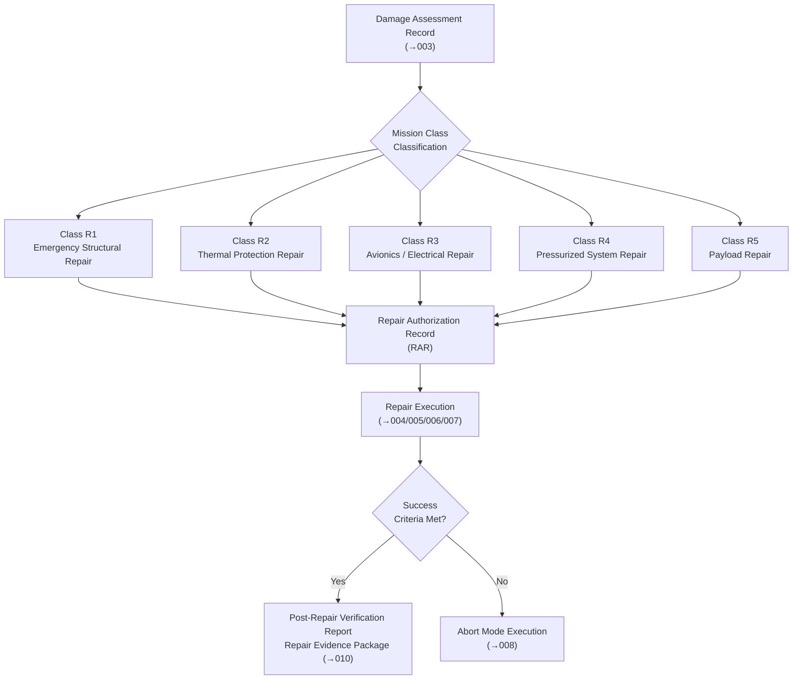

# STA 170-179 · 172-020 — Repair Mission Classes and Objectives

## 1. Purpose

This document defines on-orbit repair mission classes, associated objectives, planning constraints, success criteria, and abort criteria within subsection `172`. The mission class taxonomy provides the operational framework that connects damage assessment results (from `003`) to repair procedure selection, authorization, and verification. All mission classes are governed by the controlled definition established in `001` and the traceability and governance requirements of `010`[^baseline][^n001].

## 2. Scope

- **Mission class taxonomy**: Five on-orbit repair mission classes are defined within this subsection. *Class R1 — Emergency Structural Repair*: immediate response to hypervelocity impact, fatigue crack, or fracture event threatening the structural integrity of a primary or secondary load-carrying member; response time target ≤ 24 hours from damage confirmation; requires fracture mechanics analysis per ECSS-E-ST-32-01C[^ecss3201c] before execution. *Class R2 — Thermal Protection Repair*: restoration of thermal control system performance following MLI damage, coating degradation, or ablative material loss; time-criticality driven by thermal environment and mission phase; requirements per ECSS-E-ST-31C[^ecss31c]. *Class R3 — Avionics/Electrical Repair*: LRU-level replacement of failed avionics units, connectors, or power distribution components to restore functional performance; primarily executed via the LROU exchange process in `005`. *Class R4 — Pressurized System Repair*: seal or patch repair of a detected pressure boundary breach or seal degradation; most stringent admissibility class; mandatory proof test at ≥ 1.5× MEOP before return to service. *Class R5 — Payload Repair*: restoration of payload instrument or sensor capability; may include optical element cleaning, module-level electronics exchange, or connector repair; requires payload authority sign-off in addition to standard repair authorization.

- **Objectives per class**: Class R1 objectives: restore structural margin-of-safety to ≥ original design requirement; prevent fracture propagation; restore load path integrity. Class R2 objectives: restore heat flux and temperature distribution within thermal specification; prevent thermal runaway at sensitive components. Class R3 objectives: restore functional availability of failed avionics function; verify software compatibility; achieve passing functional test. Class R4 objectives: restore pressure boundary integrity; achieve proof test passing criteria; confirm leak rate ≤ allowable. Class R5 objectives: restore payload performance parameters to within specification; complete calibration procedure; confirm performance against pre-damage baseline.

- **Planning constraints**: *Orbital mechanics constraints* — repair window is bounded by servicer approach trajectory, illumination periods for visual inspection, thermal environment constraints on bonding cure, and communication window availability for teleoperated operations. *Repair time budget* — EVA task time analysis or robotic task time analysis shall be performed prior to authorization; time budget includes tool setup, surface preparation, repair application, cure, and post-repair inspection; total time shall not exceed allocated EVA/robotic session duration with a minimum 20% contingency margin. *Consumables budget* — adhesive, sealant, and solvent quantities budgeted per repair class with no reuse across repair sessions; quantity limits determined by servicer stowage capacity. *Communication window dependency* — teleoperated robotic operations shall be scheduled within ground communication windows; autonomous execution beyond communication blackout periods is limited to pre-approved Abort Mode R1 (pause and hold).

- **Success criteria**: The following success criteria are normative for each class. Class R1: computed margin-of-safety of repaired structure under mission design loads ≥ original design margin; fracture mechanics assessment shows no crack propagation under residual life loading; Post-Repair Verification Report (PRVR) signed by structures authority. Class R2: measured or computed heat flux and temperature at monitored nodes within thermal specification limits; thermal performance test passed if accessible. Class R3: functional test passed per post-repair test procedure; software version verified; interface continuity confirmed. Class R4: proof pressure test at ≥ 1.5× MEOP passed; measured leak rate ≤ specified allowable; seal integrity monitoring nominal for 24 hours post-repair. Class R5: payload performance parameters measured and compared to pre-damage calibration data; performance within specification; calibration procedure completed and data archived.

- **Abort criteria**: Abort is mandatory in the following conditions regardless of repair class: (a) structural instability or unexpected deformation detected at or near repair site during operations; (b) consumable depletion (adhesive, sealant, solvent, EVA suit consumables, or robotic power) reaching the abort threshold before repair completion; (c) loss of robotic control authority (end-effector fault, force/torque sensor failure, control computer fault) without immediate recovery; (d) time exceedance: total elapsed repair time exceeds allocated budget plus contingency margin without achieving a safe partial-repair state; (e) communication blackout extending beyond the maximum allowable autonomous hold period. Abort mode selection and execution is governed by `008`.

- **Mission authorization**: Each repair mission requires a formal *Repair Authorization Record (RAR)* before any repair operation commences. The RAR shall include: the completed Damage Assessment Record from `003`, the Repair Admissibility Decision signed by the structures/pressure/payload authority as applicable, the approved Repair Procedure with revision identifier, the proof test plan (Class R4) or equivalent verification plan (all classes), consumables manifest with quantity verification, and the mission director signature. The RAR constitutes the binding authorization document and is archived in the Repair Evidence Package per `010`.

## 3. Diagram

## 4. Footprint

| Metric | Value |
|---|---|
| Architecture | `STA` — Space Technology Architecture |
| Master range | `100–199` |
| Code range | `170-179` |
| Section | `07` — Operaciones y Mantenimiento en Órbita |
| Subsection | `172` — Reparación en Órbita |
| Subsubject | `002` — Repair Mission Classes and Objectives |
| Primary Q-Division | Q-SPACE[^qdiv] |
| Support Q-Divisions | Q-DATAGOV, Q-HPC, Q-HORIZON, Q-STRUCTURES, Q-INDUSTRY, Q-GREENTECH |
| ORB support | ORB-LEG |
| Governance class | `baseline`[^gov] |
| Safety boundary | on-orbit repair critical |
| Folder path | `Q+ATLANTIDE/100-199_STA/170-179_Operaciones-y-Mantenimiento-en-Orbita/172_Reparacion-en-Orbita/` |
| Document | `172-020-Repair-Mission-Classes-and-Objectives.md` (this file) |
| Parent subsection | [`README.md`](./README.md) · [`172-000-General.md`](./172-000-General.md) |
| Parent section | [`../README.md`](../README.md) |
| Parent architecture | [`../../README.md`](../../README.md) |
| Parent baseline | [`organization/Q+ATLANTIDE.md`](../../../../organization/Q+ATLANTIDE.md) |

## 5. References & Citations

[^baseline]: **Q+ATLANTIDE controlled baseline (v1.0.0)** — [`organization/Q+ATLANTIDE.md`](../../../../organization/Q+ATLANTIDE.md).

[^qdiv]: **Q-Division authority** — [`organization/Q-Divisions/`](../../../../organization/Q-Divisions/).

[^gov]: **Governance class** — `baseline` denotes documents under controlled change management within the Q+ATLANTIDE baseline.

[^n001]: **Note N-001** — Q+ATLANTIDE (with its ATLAS-1000 register subpart) is a taxonomy and traceability ecosystem, not an organization chart. See [`organization/Q+ATLANTIDE.md` §4](../../../../organization/Q+ATLANTIDE.md#4-notes).

[^ecss3201c]: **ECSS-E-ST-32-01C** — *Space Engineering — Fracture control*, ESA/ESTEC, 2009.

[^ecss31c]: **ECSS-E-ST-31C** — *Space Engineering — Thermal control general requirements*, ESA/ESTEC, 2008.

[^ecssq70c]: **ECSS-Q-ST-70C** — *Space Product Assurance — Materials, mechanical parts and processes*, ESA/ESTEC, 2008.

[^nastd5009]: **NASA-STD-5009** — *Fracture Control Requirements for Spaceflight Hardware*, NASA, 2008.
