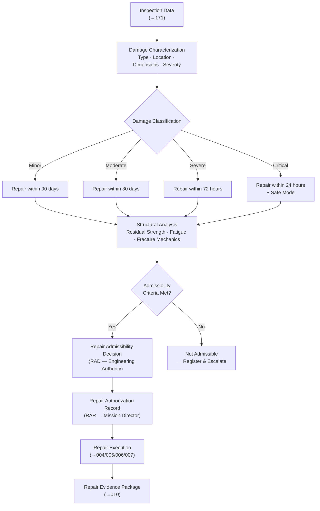

# STA 170-179 · 172-030 — Damage Assessment and Repair Admissibility

## 1. Purpose

This document defines the damage assessment methodology, repair admissibility criteria, and the formal decision process for authorizing on-orbit repair operations within subsection `172`. It establishes the analytical and procedural basis that connects damage detection data (from `171_Inspeccion-en-Orbita`) to the Repair Admissibility Decision that enables repair planning and execution. All assessments shall comply with ECSS-E-ST-32-01C (Fracture control), NASA-STD-5009 (Fracture Control Requirements for Spaceflight Hardware), and ECSS-E-ST-10-09C (Structural finite element models)[^ecss3201c][^nastd5009][^ecss1009c][^baseline][^n001].

## 2. Scope

- **Damage assessment methodology**: Damage characterization begins with inspection data received from `171_Inspeccion-en-Orbita`. Required characterization parameters are: damage type (impact penetration, fatigue crack, delamination, corrosion, seal degradation, MLI damage, connector failure, or other), damage location (structural element identification, coordinate reference, distance to load-introduction points and pressure boundaries), damage dimensions (crack length and orientation, penetration diameter, delamination area, thickness reduction), and severity indicators (measured or estimated load-carrying cross-section reduction, observed leak rate, thermal anomaly amplitude). Damage classification into one of four severity levels: *Minor* (no immediate structural impact; repair within 90 days); *Moderate* (measured performance degradation; repair within 30 days); *Severe* (function or structural margin below requirement; immediate repair required within 72 hours); *Critical* (immediate safety threat to crew, pressure boundary, or mission; repair within 24 hours with concurrent safe-mode management).

- **Structural analysis for repair admissibility**: Residual strength calculation uses damage dimensions as inputs to the applicable analytical model: net-section stress analysis for simple geometries; finite element model update incorporating damage geometry per ECSS-E-ST-10-09C for complex structural elements. Fatigue life assessment determines the remaining cycles to failure with damage present under the applicable load spectrum, providing a repair time window. Fracture mechanics assessment per ECSS-E-ST-32-01C and NASA-STD-5009 establishes the critical crack size and crack growth rate under the residual stress state; if damage dimension exceeds the critical crack size, the case is classified as Critical and immediate repair is mandatory.

- **Repair admissibility criteria**: A repair is classified as admissible if all of the following conditions are met: (a) the residual strength of the repaired structure under all applicable mission load cases meets or exceeds the original design margin of safety; (b) the repair procedure is validated by structural analysis and, where required, by representative coupon testing using qualified repair materials; (c) all repair materials are qualified for the space environment including thermal cycling, vacuum outgassing (TML < 1.0%, CVCM < 0.1%), and cumulative radiation dose per ECSS-Q-ST-70C[^ecssq70c]; (d) repair execution is within demonstrated robotic or EVA task feasibility given available tools, time budget, and access geometry; (e) post-repair verification is achievable via structural analysis, NDI, functional test, or proof test as applicable. Repairs are explicitly **not admissible** under the following conditions: repairs requiring internal access to sealed pressure vessels without the capability to perform proof testing at ≥ 1.5× MEOP post-repair; repairs to primary load-path structural elements without supporting structural analysis demonstrating restored margin; repairs where the repair procedure has not been validated for the specific damage type and substrate material combination; repairs where the cumulative repair evidence (DAR + analysis + material qualification) cannot be assembled for independent review before execution.

- **Damage-repair traceability chain**: The formal traceability chain from damage detection to repair authorization is: *Damage Assessment Record (DAR)* → *Repair Admissibility Decision (RAD)* → *Repair Procedure selection* → *Repair Authorization Record (RAR)* → *Repair Execution* → *Post-Repair Verification Report (PRVR)* → *Repair Evidence Package (REP)*. Each transition requires a named approving authority and a dated signature. All records are maintained in the Repair Evidence Package per `010`. Deviations from the nominal chain must be formally registered with justification and compensating measures documented.

- **Repair procedure selection**: A pre-qualified procedure library shall be maintained containing approved repair procedures for each combination of damage type and substrate material. Procedure selection criteria: damage class compatibility (procedure shall have been qualified for the specific damage type and severity range), repair material availability on the servicer or target spacecraft, and robotic or EVA capability match (tool availability, workspace accessibility, force/torque requirements within robotic capability per `004`). Any deviation from a pre-qualified procedure, including use of a substitute material or modified surface preparation method, requires re-analysis of procedure effectiveness, re-qualification testing if material is changed, and explicit approval in the RAD.

- **Admissibility decision authority hierarchy**: The damage assessment is performed by the inspection team (from `171`). The Repair Admissibility Decision is issued by the responsible engineering authority — structures and materials engineering authority for Classes R1 and R2, avionics engineering authority for Class R3, pressure systems engineering authority for Class R4, and payload authority for Class R5 (per mission class definitions in `002`). The Repair Authorization Record is signed by the mission director. This three-level hierarchy ensures independent review of the technical basis before mission commitment. An escalation path for borderline cases (cases where admissibility criteria are marginally met or where analysis uncertainty is high) shall be documented in the programme-level repair governance plan.

## 3. Diagram

## 4. Footprint

| Metric | Value |
|---|---|
| Architecture | `STA` — Space Technology Architecture |
| Master range | `100–199` |
| Code range | `170-179` |
| Section | `07` — Operaciones y Mantenimiento en Órbita |
| Subsection | `172` — Reparación en Órbita |
| Subsubject | `003` — Damage Assessment and Repair Admissibility |
| Primary Q-Division | Q-SPACE[^qdiv] |
| Support Q-Divisions | Q-DATAGOV, Q-HPC, Q-HORIZON, Q-STRUCTURES, Q-INDUSTRY, Q-GREENTECH |
| ORB support | ORB-LEG |
| Governance class | `baseline`[^gov] |
| Safety boundary | on-orbit repair critical |
| Folder path | `Q+ATLANTIDE/100-199_STA/170-179_Operaciones-y-Mantenimiento-en-Orbita/172_Reparacion-en-Orbita/` |
| Document | `172-030-Damage-Assessment-and-Repair-Admissibility.md` (this file) |
| Parent subsection | [`README.md`](./README.md) · [`172-000-General.md`](./172-000-General.md) |
| Parent section | [`../README.md`](../README.md) |
| Parent architecture | [`../../README.md`](../../README.md) |
| Parent baseline | [`organization/Q+ATLANTIDE.md`](../../../../organization/Q+ATLANTIDE.md) |

## 5. References & Citations

[^baseline]: **Q+ATLANTIDE controlled baseline (v1.0.0)** — [`organization/Q+ATLANTIDE.md`](../../../../organization/Q+ATLANTIDE.md).

[^qdiv]: **Q-Division authority** — [`organization/Q-Divisions/`](../../../../organization/Q-Divisions/).

[^gov]: **Governance class** — `baseline` denotes documents under controlled change management within the Q+ATLANTIDE baseline.

[^n001]: **Note N-001** — Q+ATLANTIDE (with its ATLAS-1000 register subpart) is a taxonomy and traceability ecosystem, not an organization chart. See [`organization/Q+ATLANTIDE.md` §4](../../../../organization/Q+ATLANTIDE.md#4-notes).

[^ecss3201c]: **ECSS-E-ST-32-01C** — *Space Engineering — Fracture control*, ESA/ESTEC, 2009.

[^nastd5009]: **NASA-STD-5009** — *Fracture Control Requirements for Spaceflight Hardware*, NASA, 2008.

[^ecss1009c]: **ECSS-E-ST-10-09C** — *Space Engineering — Structural finite element models*, ESA/ESTEC, 2011.

[^ecssq70c]: **ECSS-Q-ST-70C** — *Space Product Assurance — Materials, mechanical parts and processes*, ESA/ESTEC, 2008.
