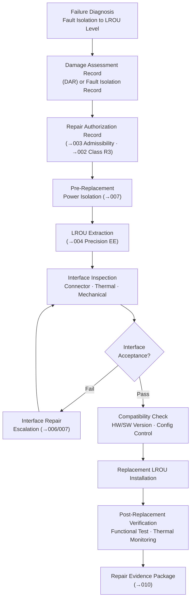

# STA 170-179 · 172-050 — Modular Replacement and Orbital LRU Exchange

## 1. Purpose

This document establishes requirements for modular component replacement and line-replaceable orbital unit (LROU) exchange as the primary repair strategy for avionics, payload, and subsystem units within subsection `172`. LROU exchange is triggered by functional failure or damage-induced degradation (Damage Assessment Record from `003`) and is the principal repair method for Class R3 (Avionics/Electrical Repair) as defined in `002`. Requirements are derived from ECSS-E-ST-70-11C (Space robotics), ECSS-E-ST-32C, ECSS-Q-ST-70C, and NASA-STD-3000[^ecss7011c][^ecss32c][^ecssq70c][^nastd3000][^baseline][^n001].

## 2. Scope

- **LROU taxonomy for repair**: The LROU taxonomy applicable within this subsection uses the same unit categories as those defined for scheduled servicing in `170_Servicing-Orbital`, but scoped to damage-triggered replacement. LROU categories include: avionics units (computers, data handling units, power conditioning units), payload electronic modules, power system units (power distribution units, battery modules, solar array segment assemblies), communication units (transponders, antenna assemblies), and thermal control units (heat pipe assemblies, radiator panels, louver assemblies). For each LROU, the following attributes are defined: urgency class based on failure mode (Class R3 for avionics/electrical, other classes for other types per `002`), heritage version compatibility matrix with target spacecraft, and stowage configuration on the servicer. The urgency class determines the response timeline and authorization level.

- **Repair-triggered LROU exchange process**: The exchange process comprises six sequential controlled phases: (1) *Failure diagnosis* — fault isolation to LROU level using onboard diagnostics and telemetry analysis; a Damage Assessment Record or Fault Isolation Record is generated documenting the failure mode, affected function, and urgency class; (2) *Replacement authorization* — the DAR or Fault Isolation Record is reviewed against repair admissibility criteria in `003`; the Repair Authorization Record is generated; (3) *Pre-replacement preparation* — power isolation sequence for the affected LROU is executed per `007` safing requirements; adjacent LROUs affected by the power isolation are placed in known safe states; (4) *LROU extraction* — robotic or EVA execution per the approved Repair Procedure using the precision manipulation end-effector from `004`; extraction force shall not exceed the LROU design pull-out force; (5) *Interface inspection* — prior to installing the replacement unit, the interface (connector body, pin condition, thermal interface pad, mechanical fastener threads, and structural retention features) is inspected per the criteria in scope item 3 below; (6) *Replacement LROU installation and verification* — installation per procedure; post-installation functional test per scope item 6 below.

- **Interface damage assessment pre-replacement**: The mechanical, electrical, and thermal interface of the LROU seat shall be inspected before installing the replacement unit. Connector pin inspection criteria: no bent pins (tolerance: pin deflection ≤ 0.2 mm from nominal), no broken pins, no contamination of pin contacts (visual and tactile check). Thermal interface compound assessment: replacement of thermal interface pad or compound is mandatory if contamination (particles, adhesive, outgassing residue) is detected or if the existing compound has been exposed to ≥ 3 thermal cycles without replacement per the interface design specification. Mechanical interface: fastener thread condition assessed by visual inspection and, where accessible, torque verification; stripped threads require escalation to a structural interface repair procedure before LROU installation. Interface damage escalation: any interface finding outside acceptance criteria shall halt LROU exchange and trigger a dedicated interface repair assessment, with the interface repair classified and authorized before LROU installation proceeds.

- **Compatibility and configuration control**: The replacement LROU shall be verified for hardware version and software version compatibility with the target spacecraft configuration before installation. A compatibility verification analysis shall be documented in the Repair Authorization Record, confirming that the replacement LROU interfaces are electrically, mechanically, and thermally compatible with the as-built target spacecraft configuration. If the replacement unit represents a version upgrade from the failed unit, a configuration change authorization is required in addition to the standard RAR. The configuration management system shall be updated within 24 hours of successful LROU installation with the new unit serial number, version, and installation date.

- **Stowage and waste management for replaced LROUs**: Failed LROU stowage on the servicer is subject to mass and volume limits defined in the servicer mission manifest; stowage shall not compromise servicer mass properties or safety. Certain failed LROUs shall be designated for return to ground for failure analysis based on failure mode significance; return candidates are identified in the pre-mission planning phase and listed in the mission manifest. The returned LROU shall be packaged in a vibration-damped, contamination-controlled container for the return flight; packaging design shall be qualified for the thermal and vibration environment of re-entry and landing. Evidence requirements for stowage: mass measurement of the failed LROU before and after stowage, with mass recorded in the Repair Evidence Package.

- **Post-replacement verification**: A functional test shall be performed within 30 minutes of LROU installation completion. The test procedure shall be pre-approved as part of the Repair Procedure. Verification elements: (a) interface integrity — connector mating confirmed; mechanical retention fasteners torqued and recorded; thermal interface installation confirmed by telemetry channel assignment; (b) software compatibility check — software version reported by the newly installed LROU confirmed against the expected version; parameter initialization confirmed; (c) functional performance test — LROU function exercised through its standard self-test or a defined abbreviated functional test; test pass criteria defined in the Repair Procedure; (d) thermal interface monitoring — thermal telemetry for the installed LROU monitored for 2 hours post-installation to confirm thermal interface is performing within specification. All verification data shall be recorded in the Repair Evidence Package per `010`.

## 3. Diagram

## 4. Footprint

| Metric | Value |
|---|---|
| Architecture | `STA` — Space Technology Architecture |
| Master range | `100–199` |
| Code range | `170-179` |
| Section | `07` — Operaciones y Mantenimiento en Órbita |
| Subsection | `172` — Reparación en Órbita |
| Subsubject | `005` — Modular Replacement and Orbital LRU Exchange |
| Primary Q-Division | Q-SPACE[^qdiv] |
| Support Q-Divisions | Q-DATAGOV, Q-HPC, Q-HORIZON, Q-STRUCTURES, Q-INDUSTRY, Q-GREENTECH |
| ORB support | ORB-LEG |
| Governance class | `baseline`[^gov] |
| Safety boundary | on-orbit repair critical |
| Folder path | `Q+ATLANTIDE/100-199_STA/170-179_Operaciones-y-Mantenimiento-en-Orbita/172_Reparacion-en-Orbita/` |
| Document | `172-050-Modular-Replacement-and-Orbital-LRU-Exchange.md` (this file) |
| Parent subsection | [`README.md`](./README.md) · [`172-000-General.md`](./172-000-General.md) |
| Parent section | [`../README.md`](../README.md) |
| Parent architecture | [`../../README.md`](../../README.md) |
| Parent baseline | [`organization/Q+ATLANTIDE.md`](../../../../organization/Q+ATLANTIDE.md) |

## 5. References & Citations

[^baseline]: **Q+ATLANTIDE controlled baseline (v1.0.0)** — [`organization/Q+ATLANTIDE.md`](../../../../organization/Q+ATLANTIDE.md).

[^qdiv]: **Q-Division authority** — [`organization/Q-Divisions/`](../../../../organization/Q-Divisions/).

[^gov]: **Governance class** — `baseline` denotes documents under controlled change management within the Q+ATLANTIDE baseline.

[^n001]: **Note N-001** — Q+ATLANTIDE (with its ATLAS-1000 register subpart) is a taxonomy and traceability ecosystem, not an organization chart. See [`organization/Q+ATLANTIDE.md` §4](../../../../organization/Q+ATLANTIDE.md#4-notes).

[^ecss7011c]: **ECSS-E-ST-70-11C** — *Space Engineering — Space robotics technologies*, ESA/ESTEC, 2008.

[^ecss32c]: **ECSS-E-ST-32C** — *Space Engineering — Structural general requirements*, ESA/ESTEC, 2008.

[^ecssq70c]: **ECSS-Q-ST-70C** — *Space Product Assurance — Materials, mechanical parts and processes*, ESA/ESTEC, 2008.

[^nastd3000]: **NASA-STD-3000** — *Man-Systems Integration Standards*, NASA, 1995.
