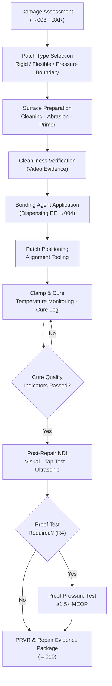

# STA 170-179 · 172-060 — Structural Patch Bonding and Sealing Concepts

## 1. Purpose

This document defines structural patch repair concepts, bonding agent requirements, sealing system concepts, surface preparation requirements, and post-repair verification for on-orbit structural repair within subsection `172`. These concepts address Class R1 (Emergency Structural Repair) and Class R4 (Pressurized System Repair) as defined in `002`, and are informed by damage assessment and admissibility analysis from `003`. Requirements are derived from ECSS-Q-ST-70C, ECSS-E-ST-32C, ECSS-E-ST-32-01C, NASA-STD-5009, and ECSS-E-ST-31C[^ecssq70c][^ecss32c][^ecss3201c][^nastd5009][^ecss31c][^baseline][^n001].

## 2. Scope

- **Structural patch repair concepts**: Three patch types are defined within this subsection. (1) *Rigid patch* — metallic (aluminium alloy or titanium) or carbon fibre reinforced polymer (CFRP) patch, bonded over the damage site to restore load path continuity; patch dimensions and thickness are determined by structural analysis from `003` to restore the original margin-of-safety; (2) *Flexible patch* — multi-layer repair blanket for MLI and thermal protection system (TPS) surface damage; constructed from space-qualified MLI layers with an outer facing material compatible with the TPS surface chemistry; (3) *Pressure boundary patch* — specialized sealing system for a detected pressure vessel or pressurized conduit breach (Class R4); combines a rigid or semi-rigid backing plate with a sealing compound or metallic gasket; subject to mandatory proof test at ≥ 1.5× MEOP before return to service. Patch design requirements applicable to all types: load path restoration verified by analysis, material compatibility with existing substrate confirmed, size and mass within delivery capability on the servicer, and mass impact to target spacecraft within mission budget.

- **Bonding agent requirements for the space environment**: Bonding agents used in on-orbit structural repair shall meet all of the following requirements per ECSS-Q-ST-70C[^ecssq70c]: *Thermal cycling stability* — adhesive bond shall maintain ≥ 80% of room-temperature lap shear strength after 200 thermal cycles from -170°C to +150°C (representative of LEO orbital environment); *Vacuum outgassing* — total mass loss (TML) < 1.0% and collected volatile condensable material (CVCM) < 0.1% per ASTM E595 test at 125°C, 24 hours, in vacuum; *Radiation resistance* — adhesive formulation shall be qualified for the cumulative ionising dose corresponding to the mission lifetime at the target orbit; *Substrate adhesion* — adhesion to flight-qualified substrate materials (aluminium alloys, CFRP, titanium, steel) confirmed by qualification test data; *Cure process* — ambient temperature cure (15–35°C) is required to ensure cure feasibility in the EVA or robotic operational environment; heat-cure adhesives are not permitted unless a dedicated heating tool and thermal monitoring are incorporated in the Repair Procedure; *Bond line thickness* — target 0.1–0.5 mm bond line thickness achieved via shim or calibrated spacer features on the patch, to ensure adequate adhesive coverage and uniform load transfer.

- **Sealing concepts for pressure boundaries**: Four sealing approaches are defined for Class R4 pressurized system repair, selected based on pressure level and geometry: (1) *Room-temperature vulcanizing (RTV) sealant* — suitable for low-pressure applications (MEOP ≤ 0.3 MPa) and smooth, accessible surfaces; applied by dispensing end-effector from `004`; cure time per product datasheet; (2) *Mechanical seal with metallic gasket* — for high-pressure applications (MEOP > 0.3 MPa) or where long-term seal integrity is required; gasket material compatible with pressurized medium; compression controlled via torqued fasteners; (3) *Adhesive plus mechanical fastener combined seal* — for irregular geometry breaches; adhesive provides initial gas-tightness; mechanical fasteners provide sustained clamping load independent of adhesive creep; (4) *In-situ formed seal* — injectable sealant delivered via needle dispenser into a confined breach geometry; highest risk approach; requires confirmation of cure and coverage before proof test. All pressure boundary seals are subject to a mandatory proof pressure test at ≥ 1.5× MEOP after repair and a maximum allowable leak rate test. Sealing materials shall be qualified per ECSS-Q-ST-70C and compatible with the pressurized medium chemistry.

- **Surface preparation requirements**: Adequate surface preparation is the primary predictor of bonded repair performance. The following steps are mandatory before adhesive application: (a) *Contamination removal* — cleaning procedure per ECSS-Q-ST-70C using approved solvent; particle and fluid containment required to prevent contamination of adjacent systems; (b) *Mechanical surface preparation* — mechanical abrasion using the cutting/grinding end-effector from `004` to achieve substrate surface roughness Ra 1.6–6.3 μm (measured or established by qualification); (c) *Primer application* — if required by the bonding agent qualification data, an adhesion primer shall be applied after mechanical abrasion and allowed to dry per product datasheet; (d) *Surface preparation qualification* — each combination of substrate material and bonding agent shall have documented qualification peel test data confirming adhesion performance after the specified surface preparation procedure; (e) *Cleanliness verification* — a visual inspection of the prepared surface shall be performed and recorded (video evidence) before adhesive application; the inspection record is included in the Repair Evidence Package.

- **Application and cure process control**: Bonding agent application shall be performed by the bonding/dispensing end-effector defined in `004`, with metered quantity control to ensure coverage within ± 20% of the nominal design quantity. Patch positioning shall use alignment tooling features pre-fabricated on the patch to achieve positional accuracy within ± 2 mm of the design location. Cure environment monitoring is mandatory: if ambient temperature cure, temperature at the repair site shall be monitored throughout cure duration via thermocouple or infrared sensor; if temperature drops below the minimum cure temperature specified in the adhesive datasheet, cure time shall be extended per the product temperature-cure relationship. Mechanical clamping pressure shall be applied using a dedicated clamp tool designed for EVA glove or robotic end-effector operation; clamp load shall achieve the adhesive-specified pressure within the range ± 30% of nominal. Cure quality indicators (colour change, surface tack test, or timer-based confirmation) shall be recorded and included in the cure log within the Repair Evidence Package.

- **Post-repair verification**: Post-repair verification shall include all applicable methods from the following set, determined by repair class and accessibility: (a) *Visual inspection* — repair area and bond line perimeter inspection for adhesive squeeze-out uniformity, patch alignment, and surface anomalies; (b) *Tap test* — acoustic tap test for disbond detection across the patch area; (c) *Ultrasonic inspection* — ultrasonic phased array or pulse-echo if accessible and if the robotic arm can support the transducer fixture; (d) *Proof pressure test* — mandatory for Class R4 pressure boundary repairs at ≥ 1.5× MEOP; (e) *Structural load monitoring* — if the repair is in a primary load path and a structural health monitoring (SHM) sensor is accessible at the repair site, the SHM baseline shall be updated post-repair and elevated monitoring rate applied for 30 days per `008`; (f) *Repair area monitoring* — post-repair inspection schedule is defined in the Repair Procedure and referenced in `010` lifecycle governance. All verification results shall be recorded in the Post-Repair Verification Report (PRVR) and included in the Repair Evidence Package.

## 3. Diagram

## 4. Footprint

| Metric | Value |
|---|---|
| Architecture | `STA` — Space Technology Architecture |
| Master range | `100–199` |
| Code range | `170-179` |
| Section | `07` — Operaciones y Mantenimiento en Órbita |
| Subsection | `172` — Reparación en Órbita |
| Subsubject | `006` — Structural Patch, Bonding and Sealing Concepts |
| Primary Q-Division | Q-SPACE[^qdiv] |
| Support Q-Divisions | Q-DATAGOV, Q-HPC, Q-HORIZON, Q-STRUCTURES, Q-INDUSTRY, Q-GREENTECH |
| ORB support | ORB-LEG |
| Governance class | `baseline`[^gov] |
| Safety boundary | on-orbit repair critical |
| Folder path | `Q+ATLANTIDE/100-199_STA/170-179_Operaciones-y-Mantenimiento-en-Orbita/172_Reparacion-en-Orbita/` |
| Document | `172-060-Structural-Patch-Bonding-and-Sealing-Concepts.md` (this file) |
| Parent subsection | [`README.md`](./README.md) · [`172-000-General.md`](./172-000-General.md) |
| Parent section | [`../README.md`](../README.md) |
| Parent architecture | [`../../README.md`](../../README.md) |
| Parent baseline | [`organization/Q+ATLANTIDE.md`](../../../../organization/Q+ATLANTIDE.md) |

## 5. References & Citations

[^baseline]: **Q+ATLANTIDE controlled baseline (v1.0.0)** — [`organization/Q+ATLANTIDE.md`](../../../../organization/Q+ATLANTIDE.md).

[^qdiv]: **Q-Division authority** — [`organization/Q-Divisions/`](../../../../organization/Q-Divisions/).

[^gov]: **Governance class** — `baseline` denotes documents under controlled change management within the Q+ATLANTIDE baseline.

[^n001]: **Note N-001** — Q+ATLANTIDE (with its ATLAS-1000 register subpart) is a taxonomy and traceability ecosystem, not an organization chart. See [`organization/Q+ATLANTIDE.md` §4](../../../../organization/Q+ATLANTIDE.md#4-notes).

[^ecssq70c]: **ECSS-Q-ST-70C** — *Space Product Assurance — Materials, mechanical parts and processes*, ESA/ESTEC, 2008.

[^ecss32c]: **ECSS-E-ST-32C** — *Space Engineering — Structural general requirements*, ESA/ESTEC, 2008.

[^ecss3201c]: **ECSS-E-ST-32-01C** — *Space Engineering — Fracture control*, ESA/ESTEC, 2009.

[^nastd5009]: **NASA-STD-5009** — *Fracture Control Requirements for Spaceflight Hardware*, NASA, 2008.

[^ecss31c]: **ECSS-E-ST-31C** — *Space Engineering — Thermal control general requirements*, ESA/ESTEC, 2008.
