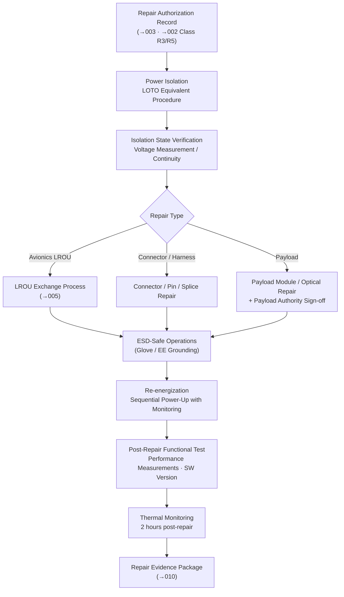

# STA 170-179 · 172-070 — Electrical Avionics and Payload Repair Interfaces

## 1. Purpose

This document defines repair interface requirements for electrical systems, avionics units, and payload instruments, including isolation procedures, connector repair, ESD control, and post-repair verification within subsection `172`. These requirements support Class R3 (Avionics/Electrical Repair) and Class R5 (Payload Repair) as defined in `002`, and interface with the LROU exchange process in `005`. Requirements are derived from ECSS-E-ST-32C, ECSS-Q-ST-70C, ECSS-E-ST-20-06C (Spacecraft charging), and NASA-STD-3000[^ecss32c][^ecssq70c][^ecss2006c][^nastd3000][^baseline][^n001].

## 2. Scope

- **Electrical system repair scope**: On-orbit electrical system repair within this subsection covers the following repair categories: (1) *Power system repair* — solar array connector repair (connector body replacement, pin replacement, backshell re-termination), battery interface connector repair (mating connector replacement), and power distribution unit (PDU) LROU exchange per `005`; (2) *Signal harness repair* — connector replacement at accessible harness terminations; splice repair concepts are defined for accessible harness segments (splice method: heat-shrink solder sleeve or mechanical crimp sleeve, qualified for thermal cycling per ECSS-Q-ST-70C); harness re-routing after splice shall be documented in a harness configuration update; (3) *Grounding and bonding repair* — grounding strap replacement using pre-cut, pre-crimped replacement straps stowed on the servicer; metallic bonding strip repair using adhesive-backed replacement strips; ground resistance measurement ≤ 0.1 Ω after repair to confirm ground continuity; (4) *ESD precautions* — all electrical repair operations require ESD-safe practices per scope item 5 below; (5) *EMC management* — access covers removed during repair create potential EMC apertures; duration of EMC aperture exposure shall be minimised; adjacent systems sensitive to EMI shall be placed in reduced emission mode during the repair window.

- **Avionics LRU repair and replacement**: Avionics LRU exchange uses the process defined in `005`. Specific considerations for avionics repairs: *Connector repair* — avionics connectors with bent or broken pins shall be assessed for pin replacement using qualified pin-replacement tools before deciding to replace the entire connector body; pin replacement procedure qualification requires test evidence of electrical continuity and mechanical retention force meeting connector specification; *Interface damage* — the backshell, strain relief, and connector body shall be inspected for cracking, deformation, or contamination before installing a replacement LROU; *Software considerations* — avionics LROU exchange may require software re-loading or parameter re-initialization via the onboard data handling system; the software loading procedure shall be pre-approved and included in the Repair Procedure; software version confirmation is a mandatory post-repair verification step; *Avionics repair evidence* — the functional test report documenting pass/fail status for each tested function, and the software configuration verification record, shall both be included in the Repair Evidence Package per `010`.

- **Payload repair interfaces**: Payload instrument repair within this subsection covers: (1) *Payload electronics module repair* — primarily LROU exchange per `005`; module-level exchange is the primary strategy for electronics failures; (2) *Optical payload repair* — primary mirror or lens element cleaning using approved cleaning materials and procedures qualified per ECSS-Q-ST-70C; optical element replacement if cleaning is insufficient; cleaning and replacement procedures require separate payload authority approval due to contamination sensitivity; (3) *Payload connector interface repair* — per avionics connector repair above, with additional restriction that optical connector interfaces (fibre-optic) shall only be repaired by procedures with demonstrated optical insertion loss performance within specification; (4) *Payload calibration post-repair* — a calibration procedure shall be executed after any payload repair affecting measurement performance; calibration data shall be compared to the pre-damage calibration baseline to confirm performance restoration; calibration records shall be archived in the Repair Evidence Package; (5) *Payload repair authorization* — an additional sign-off from the payload authority (payload PI or payload system responsible) is required for any payload repair in addition to the standard Repair Authorization Record.

- **Power isolation and safing procedures**: Power isolation before any electrical, avionics, or payload repair is mandatory. The power isolation procedure for on-orbit operations is the equivalent of a ground lockout/tagout (LOTO) procedure: (a) issue a power isolation request through the mission control command chain; (b) command the affected circuit(s) off and verify off-state via telemetry; (c) verify isolation state by voltage measurement or continuity check at the repair interface (non-contact voltage sensor or multimeter equivalent adapted for EVA/robotic use); (d) apply soft tie-down or tape to any connectors that will be demated to prevent accidental re-mating; (e) arc flash risk management — minimum approach distance to energized conductors during operations with adjacent circuits still energized shall be defined in the Repair Procedure based on the circuit voltage level; (f) re-energization procedure — sequential power-up with monitoring of inrush current and initial function state at each step; (g) incomplete repair abort procedure — if repair is interrupted before completion, power isolation state shall be maintained until either repair is completed or a formal safe configuration is achieved and documented.

- **ESD control requirements**: ESD-sensitive electronic components exposed during repair require ESD control measures adapted for the EVA and robotic operational environment. ESD risk classification shall be assigned to each repair operation based on the most ESD-sensitive component exposed (per ANSI/ESDA ESD S20.20 device sensitivity classification). For EVA operations: EVA glove ESD resistance properties shall be characterized and documented; if glove resistance is insufficient for the classified ESD sensitivity level, a grounded ESD wrist strap equivalent adapted for spacesuit use shall be employed. For robotic operations: the end-effector tip and all tool surfaces that contact ESD-sensitive components shall be fabricated from ESD-safe materials or shall be grounded to the servicer structure; grounding path continuity shall be verified before each repair session. ESD event logging — any ESD-related anomaly observed during repair shall be logged with component identification and time stamp.

- **Post-repair verification for electrical and avionics**: Post-repair verification shall be performed per the pre-approved test procedure and shall confirm all of the following: (a) functional test — the repaired unit or circuit shall pass its standard self-test or abbreviated functional test; pass criteria shall be quantitative (e.g., voltage levels within specification, bit error rate below threshold, timing margins met); (b) performance measurements — electrical performance parameters relevant to the repair (voltage regulation, current consumption, signal amplitude, timing, or bit error rate as applicable to the repair class) shall be measured and recorded; (c) software version verification — the software version and parameter configuration of any repaired avionics LROU shall be verified via onboard telemetry; (d) interface continuity test — connector pin-by-pin continuity or functional bus transaction confirmation as applicable; (e) thermal performance monitoring — thermal telemetry for all LROUs where the thermal interface was disturbed shall be monitored for a minimum of 2 hours post-repair; any out-of-specification temperature shall trigger review before closing the Repair Evidence Package. All verification data shall be recorded in the Repair Evidence Package per `010`.

## 3. Diagram

## 4. Footprint

| Metric | Value |
|---|---|
| Architecture | `STA` — Space Technology Architecture |
| Master range | `100–199` |
| Code range | `170-179` |
| Section | `07` — Operaciones y Mantenimiento en Órbita |
| Subsection | `172` — Reparación en Órbita |
| Subsubject | `007` — Electrical, Avionics and Payload Repair Interfaces |
| Primary Q-Division | Q-SPACE[^qdiv] |
| Support Q-Divisions | Q-DATAGOV, Q-HPC, Q-HORIZON, Q-STRUCTURES, Q-INDUSTRY, Q-GREENTECH |
| ORB support | ORB-LEG |
| Governance class | `baseline`[^gov] |
| Safety boundary | on-orbit repair critical |
| Folder path | `Q+ATLANTIDE/100-199_STA/170-179_Operaciones-y-Mantenimiento-en-Orbita/172_Reparacion-en-Orbita/` |
| Document | `172-070-Electrical-Avionics-and-Payload-Repair-Interfaces.md` (this file) |
| Parent subsection | [`README.md`](./README.md) · [`172-000-General.md`](./172-000-General.md) |
| Parent section | [`../README.md`](../README.md) |
| Parent architecture | [`../../README.md`](../../README.md) |
| Parent baseline | [`organization/Q+ATLANTIDE.md`](../../../../organization/Q+ATLANTIDE.md) |

## 5. References & Citations

[^baseline]: **Q+ATLANTIDE controlled baseline (v1.0.0)** — [`organization/Q+ATLANTIDE.md`](../../../../organization/Q+ATLANTIDE.md).

[^qdiv]: **Q-Division authority** — [`organization/Q-Divisions/`](../../../../organization/Q-Divisions/).

[^gov]: **Governance class** — `baseline` denotes documents under controlled change management within the Q+ATLANTIDE baseline.

[^n001]: **Note N-001** — Q+ATLANTIDE (with its ATLAS-1000 register subpart) is a taxonomy and traceability ecosystem, not an organization chart. See [`organization/Q+ATLANTIDE.md` §4](../../../../organization/Q+ATLANTIDE.md#4-notes).

[^ecss32c]: **ECSS-E-ST-32C** — *Space Engineering — Structural general requirements*, ESA/ESTEC, 2008.

[^ecssq70c]: **ECSS-Q-ST-70C** — *Space Product Assurance — Materials, mechanical parts and processes*, ESA/ESTEC, 2008.

[^ecss2006c]: **ECSS-E-ST-20-06C** — *Space Engineering — Spacecraft charging*, ESA/ESTEC, 2008.

[^nastd3000]: **NASA-STD-3000** — *Man-Systems Integration Standards*, NASA, 1995.
