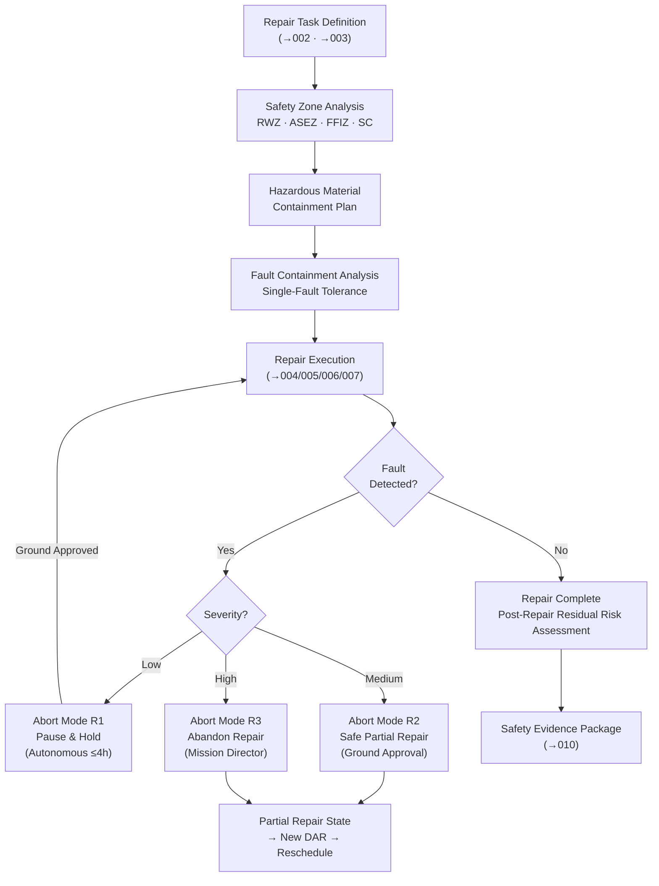

# STA 170-179 · 172-080 — Repair Safety Zones Fault Containment and Abort Modes

## 1. Purpose

This document defines repair operational safety zones, fault containment requirements, abort authority, and abort modes for on-orbit repair operations within subsection `172`. Safety zone definitions and abort mode architecture apply to all repair classes (R1–R5) defined in `002`. Requirements are derived from ECSS-E-ST-70-11C (Space robotics), ECSS-E-ST-10-04C (Hazard analysis), ECSS-E-ST-32C, and NASA-STD-5009[^ecss7011c][^ecss1004c][^ecss32c][^nastd5009][^baseline][^n001].

## 2. Scope

- **Repair operational safety zones**: Four concentric safety zones are defined around the repair site for each repair operation. Zone dimensions are computed from worst-case tool excursion analysis and material release scenario analysis. (1) *Repair Work Zone (RWZ)* — the volume immediately surrounding the repair site within which the robotic arm, EVA crew member, repair tools, and materials are permitted during active repair; boundaries set by the repair task workspace analysis from `004`; robot motion planning from `004` is constrained to remain within the RWZ; (2) *Adjacent Structure Exclusion Zone (ASEZ)* — a minimum 200 mm buffer volume around the RWZ from which repair tools and materials are excluded; provides clearance from adjacent structural elements, thermal hardware, and electrical harnesses not part of the repair; the ASEZ boundary shall be verified collision-free for the full range of repair motions using the 3D model from `004`; (3) *Free-Flyer Inspection Zone (FFIZ)* — the volume used by a free-flying inspection robot or camera platform to monitor the repair without entering the RWZ; located at minimum 500 mm from the RWZ boundary in a position providing unobstructed view of the repair site; (4) *Safety Cordon (SC)* — the outermost zone, encompassing the repair site and any hazardous material sources (adhesive containers, solvent containers, pyrotechnic actuators if applicable); all personnel and unrelated systems shall remain outside the SC during material application phases; SC dimensions set by worst-case material release and dispersion analysis.

- **Hazardous material containment**: Quantities of bonding agents and solvents on the servicer shall be limited to the mission minimum required by the approved repair procedures. All liquid materials (adhesives, solvents, primers) shall be stored and applied with primary and secondary containment: primary containment is the sealed dispenser assembly; secondary containment is a catch tray or absorbent material integrated into the dispensing end-effector or repair fixture. A material release scenario analysis shall be performed for each repair material: scenarios include accidental over-pressure of dispenser, end-effector fault during dispensing, and cure product off-gassing; consequence assessment covers contamination of adjacent optical surfaces, solar array cells, and thermal control surfaces. A material release response procedure shall be defined for each scenario, specifying the robotic or EVA response required within 60 seconds of release detection. Contamination risk assessment for adjacent spacecraft systems shall be documented in the repair safety analysis.

- **Fault containment requirements during repair**: Robotic repair systems shall meet single-fault tolerance requirements for all safety-critical failure modes: actuator failure (loss of joint torque or runaway), end-effector fault (unintended release or over-force), and control computer failure (loss of commanded trajectory following). For each failure mode, the fault response shall prevent the manipulator from applying uncontrolled forces to the repair site or the target spacecraft structure. Mid-repair fault containment specifies the required safe state for each repair phase: in the surface preparation phase, safe state is retraction to pre-defined safe-stow position; in the adhesive application phase, safe state is dispenser seal-off and retraction; during cure, safe state is removal of clamping forces while maintaining temperature monitoring. If a repair is partially completed and a fault interrupts the process, the partially applied adhesive shall be allowed to cure in place (without load application) until a full structural assessment of the partial repair state is performed. A common-cause failure analysis for the repair robotic system (considering shared power supply, common software module, and common structural path faults) shall be documented in the safety evidence.

- **Abort modes**: Three abort modes are defined in increasing severity. *Abort Mode R1 — Pause and Hold*: stop all repair activity; hold the robotic arm at its current safe position or retract to the nearest safe-stow position; maintain power isolation states; transmit fault status to ground; await ground instruction before proceeding; maximum autonomous hold duration before escalation to R2: 4 hours. *Abort Mode R2 — Safe Partial Repair*: complete the minimum repair actions needed to stabilize the structure or seal the breach in a safe configuration (e.g., apply clamping load to an adhesive-bonded patch already in place; complete fastener installation on a mechanical seal); after achieving the safe partial-repair configuration, withdraw the robotic arm to a safe distance (≥ 500 mm from repair site); implement the target spacecraft safety mode to reduce loads and thermal exposure at the repair site; transmit comprehensive fault status and partial-repair state to ground for disposition. *Abort Mode R3 — Abandon Repair*: immediately retract servicer robot to the safe stow configuration; re-establish servicer station-keeping distance ≥ 5 m from target; implement target spacecraft full safe mode; the partially repaired or unrepaired damage state is assessed using inspection `171` and a new Damage Assessment Record is generated; reschedule of the repair mission is initiated. Abort mode selection authority: Mode R1 is autonomous; Mode R2 requires ground approval or automatic execution if communication blackout prevents ground contact beyond the autonomous hold limit; Mode R3 requires mission director authorization except in an immediate safety emergency.

- **Post-repair structural residual risk**: Following any repair, the residual structural risk of the repaired element shall be formally assessed. The residual risk assessment shall include: updated margin-of-safety calculation incorporating repair factors (adhesive creep, bond line defects per quality of execution); in-orbit monitoring plan for the repair site specifying the SHM sensor coverage to be applied and the elevated monitoring rate (minimum 30 days at enhanced monitoring frequency after repair); inspection schedule for the repair area specifying the next mandatory inspection window via `171_Inspeccion-en-Orbita`; residual risk acceptance: the residual risk assessment shall be reviewed and accepted by the structures authority; and risk register update: the programme risk register shall be updated to reflect the post-repair residual risk status within 48 hours of repair completion.

- **Safety evidence and records**: The repair safety evidence package shall include all of the following and shall be archived in the Repair Evidence Package per `010`: (a) *Hazard analysis* — safety analysis of repair operations per ECSS-E-ST-10-04C documenting identified hazards, causes, effects, and controls for each repair class; (b) *Safety zone analysis report* — numerical analysis establishing safety zone dimensions from tool excursion and material release scenarios; (c) *Fault containment evidence* — single-fault tolerance analysis or test evidence for the robotic repair system; (d) *Abort mode demonstration* — simulation evidence that each abort mode has been exercised in a representative repair scenario in the 3D simulation environment from `004`; (e) *Post-repair safety record* — confirmation that the post-repair residual risk assessment has been completed and accepted.

## 3. Diagram

## 4. Footprint

| Metric | Value |
|---|---|
| Architecture | `STA` — Space Technology Architecture |
| Master range | `100–199` |
| Code range | `170-179` |
| Section | `07` — Operaciones y Mantenimiento en Órbita |
| Subsection | `172` — Reparación en Órbita |
| Subsubject | `008` — Repair Safety Zones, Fault Containment and Abort Modes |
| Primary Q-Division | Q-SPACE[^qdiv] |
| Support Q-Divisions | Q-DATAGOV, Q-HPC, Q-HORIZON, Q-STRUCTURES, Q-INDUSTRY, Q-GREENTECH |
| ORB support | ORB-LEG |
| Governance class | `baseline`[^gov] |
| Safety boundary | on-orbit repair critical |
| Folder path | `Q+ATLANTIDE/100-199_STA/170-179_Operaciones-y-Mantenimiento-en-Orbita/172_Reparacion-en-Orbita/` |
| Document | `172-080-Repair-Safety-Zones-Fault-Containment-and-Abort-Modes.md` (this file) |
| Parent subsection | [`README.md`](./README.md) · [`172-000-General.md`](./172-000-General.md) |
| Parent section | [`../README.md`](../README.md) |
| Parent architecture | [`../../README.md`](../../README.md) |
| Parent baseline | [`organization/Q+ATLANTIDE.md`](../../../../organization/Q+ATLANTIDE.md) |

## 5. References & Citations

[^baseline]: **Q+ATLANTIDE controlled baseline (v1.0.0)** — [`organization/Q+ATLANTIDE.md`](../../../../organization/Q+ATLANTIDE.md).

[^qdiv]: **Q-Division authority** — [`organization/Q-Divisions/`](../../../../organization/Q-Divisions/).

[^gov]: **Governance class** — `baseline` denotes documents under controlled change management within the Q+ATLANTIDE baseline.

[^n001]: **Note N-001** — Q+ATLANTIDE (with its ATLAS-1000 register subpart) is a taxonomy and traceability ecosystem, not an organization chart. See [`organization/Q+ATLANTIDE.md` §4](../../../../organization/Q+ATLANTIDE.md#4-notes).

[^ecss7011c]: **ECSS-E-ST-70-11C** — *Space Engineering — Space robotics technologies*, ESA/ESTEC, 2008.

[^ecss1004c]: **ECSS-E-ST-10-04C** — *Space Engineering — Space environment*, ESA/ESTEC, 2008. *(Also used as reference for hazard analysis methodology.)*

[^ecss32c]: **ECSS-E-ST-32C** — *Space Engineering — Structural general requirements*, ESA/ESTEC, 2008.

[^nastd5009]: **NASA-STD-5009** — *Fracture Control Requirements for Spaceflight Hardware*, NASA, 2008.
