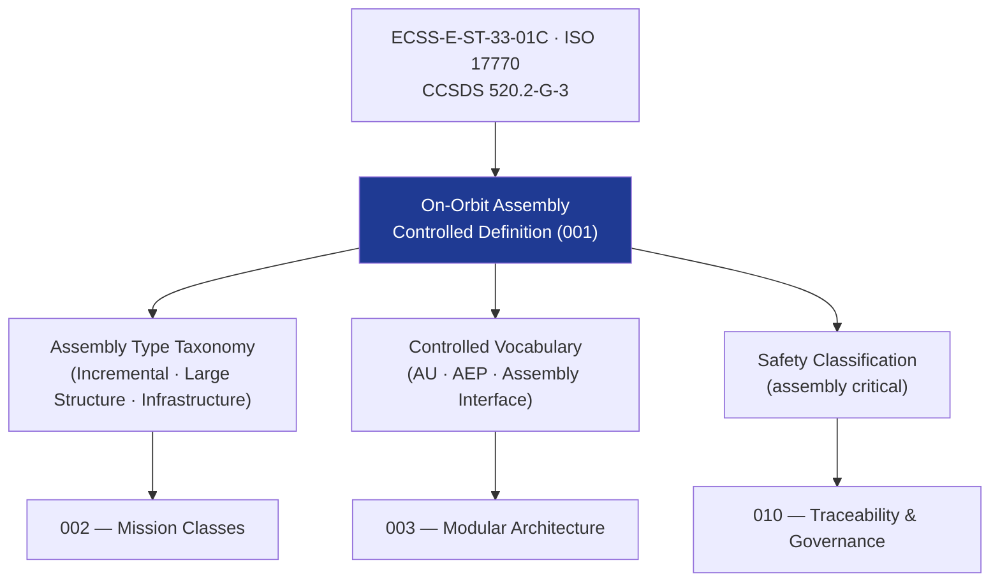

# STA 170-179 · Section 07 · Subsection 173 · Subsubject 001 — On-Orbit Assembly Controlled Definition

## 1. Purpose

Establishes the **normative definition and controlled scope** of On-Orbit Assembly within the Q+ATLANTIDE STA band, per ECSS-E-ST-33-01C, ISO 17770, and CCSDS 520.2-G-3.

## 2. Scope

- **Controlled definition** — On-Orbit Assembly encompasses all operations that join two or more independently launched or deployed spacecraft modules, structural elements, or subsystems in orbit to form a larger integrated system, including structural joining, interface activation, and integrated verification. Assembly operations are distinct from servicing (→170), inspection (→171), and repair (→172) in that they result in a permanent or semi-permanent structural configuration change to the assembled system.
- **Applicability boundary** — STA 173 covers assembly mission architecture, modular interface design, joining mechanisms, integrated interface activation, and assembly safety management; excludes GNC algorithm design (→140), flight software implementation (→142), ground mission operations procedures (→143), and logistics supply chain for assembly elements.
- **Assembly type taxonomy** — Incremental Modular Assembly: successive addition of modules to a growing structure (e.g., space station segments); Large Structure Assembly: deployment and connection of structurally significant elements (solar arrays, antennas, trusses); Infrastructure Deployment Assembly: positioning and connecting infrastructure elements (power nodes, habitat modules, propulsion stages); each type has distinct approach strategy, joining mechanism requirements, and integrated verification scope.
- **Controlled vocabulary** — *Assembly Unit (AU)*: the minimum independently launched or deployed element that participates in assembly; *Assembly Sequence*: the planned order of joining operations; *Assembly Interface*: the mechanical, electrical, data, thermal, and fluid connection point between two AUs; *Assembly Evidence Package (AEP)*: the controlled record of assembly operations, verification results, and configuration state; *Integrated Assembly Configuration*: the verified structural and functional state of the assembled system after all planned joining operations.
- **Safety classification** — on-orbit assembly critical; physical contact and structural joining operations require explicit safety zone management, collision avoidance, and fault containment; joining/locking verification is mandatory before integrated power/data/thermal/fluid activation; assembly operations on pressurized elements require pressure boundary integrity verification.

## 3. Diagram — Assembly Scope and Taxonomy

## 4. Footprint

| Metric | Value |
|---|---|
| Architecture | `STA` — Space Technology Architecture |
| Master range | `100–199` |
| Code range | `170-179` |
| Section | `07` — Operaciones y Mantenimiento en Órbita |
| Subsection | `173` — Ensamblaje en Órbita |
| Subsubject | `001` — On-Orbit Assembly Controlled Definition |
| Primary Q-Division | Q-SPACE[^qdiv] |
| ORB support | ORB-LEG |
| Governance class | `baseline`[^gov] |
| Document | `001_On-Orbit-Assembly-Controlled-Definition.md` (this file) |
| Parent subsection | [`README.md`](./README.md) · [`000_Overview.md`](./000_Overview.md) |

## 5. References & Citations

[^ecssest3301c]: **ECSS-E-ST-33-01C — Mechanisms** — mechanism design and qualification requirements applicable to assembly joining and latching mechanisms.

[^iso17770]: **ISO 17770 — Space systems docking interface** — standard interface geometry and load requirements for docking/berthing in assembly operations.

[^ccsds5202g3]: **CCSDS 520.2-G-3 — Rendezvous and Proximity Operations** — proximity operations standards applicable to assembly approach and positioning phases.

[^qdiv]: **Q-Division authority** — See [`organization/Q+ATLANTIDE.md` §4](../../../../organization/Q+ATLANTIDE.md#4-notes).

[^gov]: **Governance class** — `baseline`.

### Applicable industry standards

- ECSS-E-ST-33-01C — Mechanisms[^ecssest3301c]
- ISO 17770 — Space systems docking interface[^iso17770]
- CCSDS 520.2-G-3 — Rendezvous and Proximity Operations[^ccsds5202g3]
