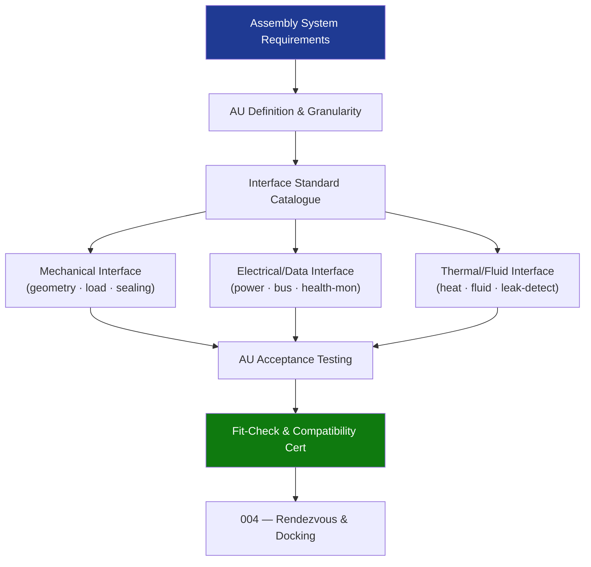

# STA 170-179 · Section 07 · Subsection 173 · Subsubject 003 — Modular Architecture and Assembly Units

## 1. Purpose

Defines the modular architecture principles, Assembly Unit (AU) design requirements, and interface standardisation for on-orbit assembly within the Q+ATLANTIDE STA band.

## 2. Scope

- **Assembly Unit (AU) definition and granularity** — the AU is the minimum independently launched, transported, or deployed element that participates in on-orbit assembly; AU granularity is determined by launch vehicle packaging constraints, robotic handling mass and volume limits, orbital manoeuvre propellant budget, and assembly sequence parallelism; AU mass and volume limits shall be defined in the Assembly System Requirements Document with explicit justification; structural stiffness requirements at the AU level shall ensure dynamic decoupling from the assembled structure's fundamental modes to within defined frequency margins.
- **Modular architecture design principles** — interface standardisation: all AU mating interfaces shall conform to the assembly programme standard interface catalogue; assembly sequence independence: each AU design shall support assembly in any sequence permitted by the assembly dependency graph without requiring design modifications; graceful degradation: the assembled structure shall remain structurally stable and functionally operational if any single non-critical AU is absent or replaced; growth node provision: designated future-growth attachment points shall be protected and maintained throughout all assembly phases.
- **Mechanical interface requirements** — interface geometry: standard male/female connector geometry per ISO 17770 or programme-specific standard; load path: mechanical interface shall carry the design limit loads in all directions; alignment tolerance: capture cone half-angle and alignment pin tolerances shall accommodate GNC approach dispersion and robotic positioning accuracy budgets; sealing: pressurised interfaces shall provide dual-redundant seals with inter-seal leak monitoring provisions; torque and bending moment capacity: specified per AU pair with margin over design limit loads.
- **Electrical and data interface architecture** — power transfer connectors: voltage class, current rating, and connector key to prevent mis-mating; high-speed data buses: interface data rate, protocol, and connector defined per programme data architecture standard; health monitoring interfaces: discrete telemetry for interface engagement, seal status, latch state; cross-strap provisions: each critical interface shall provide a redundant electrical path routed via independent connectors; ESD protection requirements for all connector mating events.
- **Thermal and fluid interfaces** — heat-rejection coupling: thermal contact conductance at interface, surface finish, and flatness requirements; fluid transfer fittings: propellant or coolant transfer port geometry, pressure rating, and quick-disconnect mechanism; leak detection provisions: inter-fitting volume pressure monitoring or sniff-port access for post-connection leak verification; thermal isolation provisions for interfaces where differential temperature is required.
- **AU pre-flight qualification** — interface acceptance testing: each AU mating interface shall undergo acceptance-level mechanical mate/demate cycling and load testing before launch; fit-check verification: physical fit-check with flight representative interfaces or designated fit-check article prior to launch; compatibility certification: formal certification document signed by both AU design authorities confirming interface compatibility; heritage qualification: qualified interface designs from prior assemblies may be accepted by similarity with documented rationale.

## 3. Diagram — AU Interface Architecture

## 4. Footprint

| Metric | Value |
|---|---|
| Architecture | `STA` — Space Technology Architecture |
| Master range | `100–199` |
| Code range | `170-179` |
| Section | `07` — Operaciones y Mantenimiento en Órbita |
| Subsection | `173` — Ensamblaje en Órbita |
| Subsubject | `003` — Modular Architecture and Assembly Units |
| Primary Q-Division | Q-SPACE[^qdiv] |
| ORB support | ORB-LEG |
| Governance class | `baseline`[^gov] |
| Document | `003_Modular-Architecture-and-Assembly-Units.md` (this file) |
| Parent subsection | [`README.md`](./README.md) · [`000_Overview.md`](./000_Overview.md) |

## 5. References & Citations

[^ecssest3301c]: **ECSS-E-ST-33-01C — Mechanisms** — mechanism design and qualification requirements for assembly joining and latching.

[^iso17770]: **ISO 17770 — Space systems docking interface** — standard interface geometry, load requirements, and test criteria.

[^ecssest2006c]: **ECSS-E-ST-20-06C — Spacecraft charging** — ESD protection requirements for connector mating events.

[^qdiv]: **Q-Division authority** — See [`organization/Q+ATLANTIDE.md` §4](../../../../organization/Q+ATLANTIDE.md#4-notes).

[^gov]: **Governance class** — `baseline`.

### Applicable industry standards

- ECSS-E-ST-33-01C — Mechanisms[^ecssest3301c]
- ISO 17770 — Space systems docking interface[^iso17770]
- ECSS-E-ST-20-06C — Spacecraft charging[^ecssest2006c]
