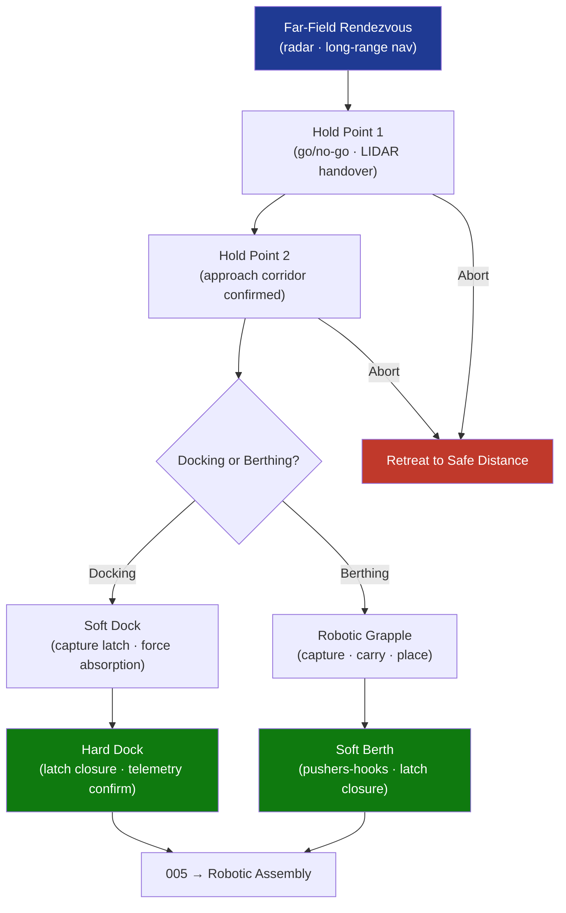

# STA 170-179 · Section 07 · Subsection 173 · Subsubject 004 — Rendezvous, Docking, Berthing and Positioning Interfaces

## 1. Purpose

Specifies rendezvous approach corridors, docking and berthing interface requirements, and final positioning constraints for on-orbit assembly operations within the Q+ATLANTIDE STA band.

## 2. Scope

- **Rendezvous approach strategy** — approach corridor geometry: defined as a cone or box centred on the target docking or grapple axis with specified half-angle and length; hold points: mandatory trajectory waypoints at defined ranges with go/no-go gate review; relative navigation sensor handover sequence: long-range radar → mid-range LIDAR → short-range optical/structured-light, with defined handover ranges and overlap verification; go/no-go criteria at each hold point: relative state accuracy, sensor health, target port health, communication link quality, safety zone clear; approach velocity profile: maximum approach velocity as a function of range, with minimum braking margin requirement.
- **Docking interface specification** — interface geometry: compatible with programme standard (ISO 17770 IDSS geometry or equivalent programme standard); capture ring and alignment cone: defined funnel geometry to accommodate approach dispersion; soft-dock capture: initial contact with capture latches engaged, residual velocity absorbed within defined force-time envelope; hard-dock sequence: commanded latch closure sequence with individual latch telemetry; hard-dock load capacity: structural interface rated to design limit loads in all six degrees of freedom; re-dock provisions: mechanism shall withstand the specified number of mate/demate cycles with no degradation.
- **Berthing interface specification** — grapple fixture geometry: standard grapple fixture design compatible with robotic manipulator end-effector; robotic arm reach and force limits: berthing trajectory within manipulator workspace, maximum contact force limits during berthing approach; berthing port geometry: passive port design with capture cone and alignment features; berthing sequence: free-drift capture → soft-berthing contact → controlled placement → pushers and hooks engagement → latch closure; compliance with lateral force limits during pushers-and-hooks engagement phase.
- **Final positioning and alignment constraints** — translational alignment tolerance at mating: maximum lateral and axial offset at interface contact initiation; rotational alignment tolerance: maximum roll, pitch, and yaw misalignment at contact; residual velocity limit: maximum approach velocity at contact point to remain within structural capture capacity; contact force limit: maximum allowable contact force during capture sequence; micro-vibration environment: assembled structure fundamental modes must remain above the minimum frequency margin from operational disturbance sources after joining.
- **Proximity navigation sensor suite for assembly** — sensor complement: rendezvous LIDAR (relative range and bearing), docking cameras (image-based alignment), structured-light sensor (final approach surface topology), inertial measurement unit for relative state integration; sensor fusion architecture: weighted fusion with fault detection and sensor exclusion; relative navigation accuracy budget: position, velocity, and attitude error allocation at each hold point and at capture; sensor calibration requirements: periodic in-orbit calibration procedure for LIDAR and camera.
- **Contact and capture failure modes and retry procedures** — failed capture: defined maximum contact force before abort; missed capture: automatic separation to defined hold-point range for retry; retry authorisation: ground authority required for more than defined number of retry attempts; contact anomaly abort: any unplanned structural contact outside capture sequence triggers abort-to-retreat; post-abort inspection: visual inspection of docking/grapple interface required before retry authorisation.

## 3. Diagram — Rendezvous and Docking/Berthing Sequence

## 4. Footprint

| Metric | Value |
|---|---|
| Architecture | `STA` — Space Technology Architecture |
| Master range | `100–199` |
| Code range | `170-179` |
| Section | `07` — Operaciones y Mantenimiento en Órbita |
| Subsection | `173` — Ensamblaje en Órbita |
| Subsubject | `004` — Rendezvous, Docking, Berthing and Positioning Interfaces |
| Primary Q-Division | Q-SPACE[^qdiv] |
| ORB support | ORB-LEG |
| Governance class | `baseline`[^gov] |
| Document | `004_Rendezvous-Docking-Berthing-and-Positioning-Interfaces.md` (this file) |
| Parent subsection | [`README.md`](./README.md) · [`000_Overview.md`](./000_Overview.md) |

## 5. References & Citations

[^iso17770]: **ISO 17770 — Space systems docking interface** — standard docking interface geometry, capture loads, and latch requirements.

[^ccsds5202g3]: **CCSDS 520.2-G-3 — Rendezvous and Proximity Operations** — approach corridor design, hold-point criteria, and safety zone standards.

[^ecssest7011c]: **ECSS-E-ST-70-11C — Space segment operability** — assembly operations interface and proximity operations planning requirements.

[^ecssest1003c]: **ECSS-E-ST-10-03C — Verification by test** — interface acceptance test requirements for docking and berthing mechanisms.

[^qdiv]: **Q-Division authority** — See [`organization/Q+ATLANTIDE.md` §4](../../../../organization/Q+ATLANTIDE.md#4-notes).

[^gov]: **Governance class** — `baseline`.

### Applicable industry standards

- ISO 17770 — Space systems docking interface[^iso17770]
- CCSDS 520.2-G-3 — Rendezvous and Proximity Operations[^ccsds5202g3]
- ECSS-E-ST-70-11C — Space segment operability[^ecssest7011c]
- ECSS-E-ST-10-03C — Verification by test[^ecssest1003c]
