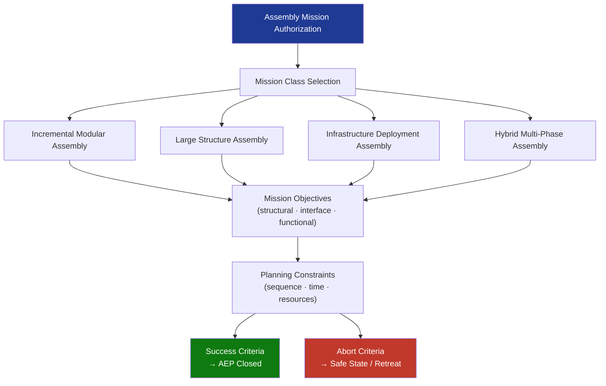

# STA 170-179 · 173-020 — Assembly Mission Classes and Objectives

## 1. Purpose

Defines the taxonomy of on-orbit assembly mission classes, their objectives, planning constraints, success criteria, and abort criteria for Q+ATLANTIDE STA-band missions.

## 2. Scope

- **Mission class taxonomy** — *Incremental Modular Assembly (IMA)*: successive addition of independently launched modules to a growing structure with defined growth nodes (e.g., space station segment additions, modular platform extension); *Large Structure Assembly (LSA)*: deployment and structural connection of major load-bearing elements such as truss segments, large solar arrays, or antenna reflectors exceeding single-launch packaging limits; *Infrastructure Deployment Assembly (IDA)*: positioning and integration of enabling infrastructure elements (power nodes, habitat modules, propulsion stages, orbital depot tanks) that form the backbone of a larger operational facility; *Hybrid Multi-Phase Assembly (HMA)*: missions combining two or more class types in a phased sequence, requiring an overarching assembly master plan with explicit phase boundaries and phase-completion gates.
- **Mission objectives per class** — IMA objectives: achieve a target integrated module count, verify all inter-module interfaces active, demonstrate structural stiffness compliance of the assembled configuration; LSA objectives: achieve structural deployment and latch confirmation, verify load-path integrity, validate pointing and thermal performance of deployed element; IDA objectives: verify infrastructure element structural integration, activate power/data/thermal/fluid interfaces, confirm facility-level system functionality after integration; HMA objectives: phase-gate-controlled achievement of all component-class objectives in sequence.
- **Mission planning constraints** — assembly sequence dependency graph: each joining operation has defined prerequisites (prior module in place, interface verification complete, safety zone clear); time-on-orbit constraints: assembly completion windows driven by orbital lifetime budgets, debris environment, and crew or visiting vehicle timelines; ground contact window requirements: minimum contact frequency for assembly go/no-go authority delegation; crew and robotic resource allocation: simultaneous EVA and robotic operations constraints; propellant and power budget allocation per assembly phase.
- **Success and completion criteria** — structural joining completion: all planned latches engaged and telemetered confirmed; interface activation completion: power, data, thermal, and fluid interfaces activated and health-check passed; assembly configuration verification: mass properties, centre of mass, and moments of inertia within design envelope; functional baseline: first integrated functional test passed after assembly completion; Assembly Evidence Package (AEP) closed.
- **Abort and contingency criteria** — assembly halt criteria: any unplanned latch-engagement anomaly, interface activation fault, zone violation, or GNC deviation exceeding defined thresholds shall trigger an Assembly Halt; partial-assembly safe states: defined stable configurations that may be maintained indefinitely if assembly cannot be completed (each phase must have a declared safe state); abort mode definitions: Abort-to-Hold (cease active operations, maintain current configuration), Abort-to-Retreat (controlled separation of incoming module to safe drift-free parking orbit), Mission-Redesign (partial assembly accepted as final operational configuration following formal risk assessment).

## 3. Diagram — Assembly Mission Classes and Objectives

## 4. Footprint

| Metric | Value |
|---|---|
| Architecture | `STA` — Space Technology Architecture |
| Master range | `100–199` |
| Code range | `170-179` |
| Section | `07` — Operaciones y Mantenimiento en Órbita |
| Subsection | `173` — Ensamblaje en Órbita |
| Subsubject | `002` — Assembly Mission Classes and Objectives |
| Primary Q-Division | Q-SPACE[^qdiv] |
| ORB support | ORB-LEG |
| Governance class | `baseline`[^gov] |
| Document | `173-020-Assembly-Mission-Classes-and-Objectives.md` (this file) |
| Parent subsection | [`README.md`](./README.md) · [`173-000-General.md`](./173-000-General.md) |

## 5. References & Citations

[^ecssest7011c]: **ECSS-E-ST-70-11C — Space segment operability** — assembly sequence planning, operations interface, and mission phase planning requirements.

[^iso17770]: **ISO 17770 — Space systems docking interface** — standard interface geometry and planning requirements applicable to assembly mission planning.

[^ccsds5202g3]: **CCSDS 520.2-G-3 — Rendezvous and Proximity Operations** — proximity operations constraints applicable to assembly mission planning.

[^qdiv]: **Q-Division authority** — See [`organization/Q+ATLANTIDE.md` §4](../../../../organization/Q+ATLANTIDE.md#4-notes).

[^gov]: **Governance class** — `baseline`.

### Applicable industry standards

- ECSS-E-ST-70-11C — Space segment operability[^ecssest7011c]
- ISO 17770 — Space systems docking interface[^iso17770]
- CCSDS 520.2-G-3 — Rendezvous and Proximity Operations[^ccsds5202g3]
