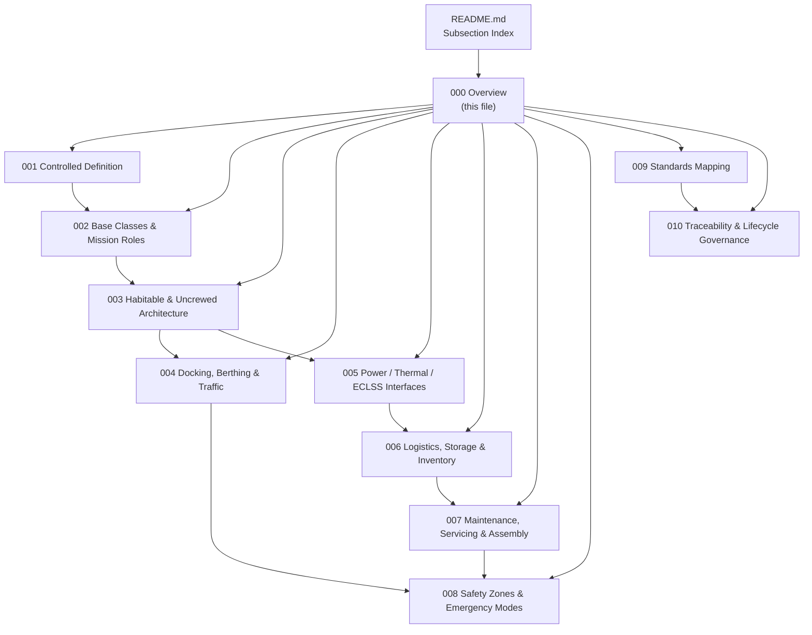

# STA 180-189 · Section 08 · Subsection 180 — Bases Orbitales

## 1. Purpose

Overview entry-point for the *Bases Orbitales* subsection within the `180-189` code range (Section `08` — *Infraestructura y Logística Espacial*) of the **STA** architecture band (*Space Technology Architecture*, master range `100–199`).

This subsubject (`000 Overview`) introduces the STA 180-189.180 slice and links it to the controlled Q+ATLANTIDE baseline[^baseline]. It establishes the orbital-infrastructure framework — controlled definition, base classes and mission roles, habitable/uncrewed architecture, docking/berthing and traffic interfaces, power/thermal/ECLSS resource interfaces, logistics and cargo control, maintenance and assembly support, safety zones and survivability, infrastructure standards mapping, and lifecycle traceability — governing all orbital-base design activities within the Q+ATLANTIDE crewed-space programme. This subsection is designated **orbital-infrastructure critical**.

## 2. Scope

- Covers the *Bases Orbitales* slice of the parent code range `180-189`.
- Inherits Q-Division authority and ORB support from the parent row in [`../../README.md` §3](../../README.md#3-architecture-table)[^archtable].
- Subsequent subsubjects (`001`–`010`) extend this Overview; the populated set in this baseline is `001`–`010`, indexed in [`README.md`](./README.md).
- Concepts in scope across the subsection:
  - Controlled definitions: orbital base, habitat module, logistics node, depot, gateway
  - Base classes: LEO stations, lunar-orbit gateways, cis-lunar relays, deep-space waypoints, propellant depots
  - Architecture variants: habitable (crewed), uncrewed/autonomous logistics nodes
  - Docking and berthing systems: active/passive, androgynous, IDSS-compatible, CBM
  - Traffic management: approach corridors, keep-out zones (KOZ), visiting vehicle protocols
  - Power interfaces: solar array sizing, power bus architecture, cross-strapping, battery backup
  - Thermal control: active/passive loops (ATCS), radiator sizing, heat rejection budgets
  - ECLSS interfaces: atmosphere management, water recovery, food storage, O₂/CO₂ boundaries
  - Logistics management: cargo manifesting, storage volumes, FIFO/LIFO protocols, inventory databases
  - Maintenance infrastructure: EVA handrails, foot restraints, SAFER, robotic arm interfaces
  - Safety zones, emergency evacuation routes, shelter-in-place and survivability boundaries
  - Standards compliance: ECSS, NASA-STD-3001, CCSDS proximity operations, ISO 24113

## 3. Subsection Map

## 4. Footprint

| Metric | Value |
|---|---|
| Architecture | `STA` — Space Technology Architecture |
| Master range | `100–199` |
| Code range | `180-189` |
| Section | `08` — Infraestructura y Logística Espacial |
| Subsection | `180` — Bases Orbitales |
| Subsubject | `000` — Overview |
| Primary Q-Division | Q-SPACE[^qdiv] |
| Support Q-Divisions | Q-DATAGOV, Q-HPC, Q-HORIZON, Q-STRUCTURES, Q-GREENTECH, Q-INDUSTRY |
| ORB support | ORB-PMO, ORB-LEG |
| Governance class | `baseline`[^gov] |
| Folder path | `Q+ATLANTIDE/100-199_STA/180-189_Infraestructura-y-Logistica-Espacial/180_Bases-Orbitales/` |
| Document | `000_Overview.md` (this file) |
| Parent subsection | [`README.md`](./README.md) |
| Parent architecture | [`../../README.md`](../../README.md) |
| Parent baseline | [`organization/Q+ATLANTIDE.md`](../../../../organization/Q+ATLANTIDE.md) |

## 5. References & Citations

[^baseline]: **Q+ATLANTIDE controlled baseline (v1.0.0)** — [`organization/Q+ATLANTIDE.md`](../../../../organization/Q+ATLANTIDE.md). Defines the controlled `000-999` architecture-band taxonomy and the ATLAS-1000 register subpart.

[^archtable]: **STA §3 Architecture Table** — [`../../README.md` §3](../../README.md#3-architecture-table). Authoritative source for the `180-189` row.

[^qdiv]: **Q-Division authority** — Q-Divisions provide technical authority over an architecture row (Q+ATLANTIDE Note N-002). See [`organization/Q+ATLANTIDE.md` §4](../../../../organization/Q+ATLANTIDE.md#4-notes).

[^gov]: **Governance class** — `baseline` denotes documents under controlled change management within the Q+ATLANTIDE baseline.

### Applicable Industry Standards

| Standard | Title | Relevance |
|---|---|---|
| ECSS-E-ST-32C | Space engineering — Structural general requirements | Module structural interfaces |
| ECSS-E-ST-20C | Space engineering — Electrical and electronic | Power bus and harness |
| ECSS-E-ST-31C | Space engineering — Thermal control | Heat rejection and loops |
| NASA-STD-3001 Vol.1 & 2 | Space Human Factors and Ergonomics | Habitability and crew interfaces |
| CCSDS 910.11-B-1 | Rendezvous and Proximity Operations | Docking/berthing traffic |
| ISO 24113:2019 | Space systems — Space debris mitigation | Disposal and debris |
| ECSS-E-ST-10-03C | Space engineering — Testing | Verification and qualification |
