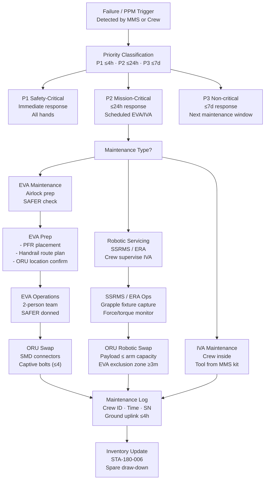

# STA 180-189 · Section 08 · Subsection 180 · Subsubject 007 — Maintenance, Servicing and Assembly Support

## 1. Purpose

Establishes the maintenance, EVA/robotic servicing, and on-orbit assembly support framework for orbital bases within the STA 180 subsystem[^baseline]. This subsubject defines the planned preventive maintenance (PPM) programme structure, corrective maintenance scheduling principles, EVA infrastructure requirements (handrails, foot restraints, portable foot restraints, SAFER units), robotic arm interface standards (SSRMS-class, ERA-class), on-orbit replacement unit (ORU) design philosophy, and on-orbit assembly sequence management.

Maintenance philosophy for long-duration orbital bases follows a Design for Maintainability (DfM) approach: all field-replaceable units accessible within 2 EVA hours from nearest airlock, minimum EVA team of 2 crewmembers, and each external ORU accessible by robotic arm without crew EVA where operationally feasible. Assembly support introduces additional coordination between visiting vehicle schedules, robotic arm timelines, and EVA windows to ensure safe simultaneous operations.

## 2. Scope

- **Planned preventive maintenance (PPM)**: PPM intervals derived from component mean time between maintenance (MTBM); PPM tasks categorised by location (IVA, EVA, Robotic); PPM schedule managed in onboard maintenance management system (MMS) with ground uplink synchronisation.
- **Corrective maintenance scheduling**: unplanned maintenance triggered by failure detection; priority classification (Safety-Critical P1 ≤ 4h response, Mission-Critical P2 ≤ 24h, Non-critical P3 ≤ 7 days); spare parts draw-down from STA-180-006 inventory.
- **EVA infrastructure — handrails**: aluminium alloy 1.5 m pitch along primary EVA translation paths; load rating ≥ 1000 N per rail; anti-snag surface treatment; glow-in-dark thermal tape at intersections.
- **EVA infrastructure — foot restraints**: portable foot restraint (PFR) compatibility with all external worksite PFR sockets; fixed foot restraint (FFR) at high-use worksites (airlock, robotic workstation, main docking port); foot restraint load rating ≥ 1500 N.
- **SAFER (Simplified Aid For EVA Rescue)**: one SAFER unit per EVA crewmember; propellant quantity verified pre-EVA; minimum ΔV capability 3.0 m/s; SAFER donning/doffing time included in EVA preparation timeline.
- **Robotic arm interfaces — SSRMS-class**: 7-DOF manipulator with ≥ 17 m reach; end-effector: latching end-effector (LEE) compatible grapple fixtures (GF) at 3-m pitch along primary external truss; force/torque sensor at wrist; payload capacity ≥ 116,000 kg (heritage ISS SSRMS).
- **Robotic arm interfaces — ERA-class**: European Robotic Arm 7-DOF; grapple fixture compatibility; self-relocation between external anchor points without crew assistance; payload capacity ≥ 8000 kg.
- **ORU design philosophy**: ORUs defined as any externally replaceable functional unit; ORU mass ≤ 350 kg (EVA single-person limit) or ≤ SSRMS payload capacity; ORU connectors: single-motion disconnect (SMD) electrical, QD fluid, mechanical capture bolt ≤ 4 bolts with captive bolt feature.
- **ORU accessibility requirements**: all P1/P2 ORUs accessible without removing other ORUs (no-stack requirement); robotic access from ≥ 1 approach vector; EVA access within 2-EVA-hour translation from nearest airlock.
- **Assembly sequence management**: on-orbit assembly sequencing tool (OAST) tracking integration order, mass properties at each step, clearance envelopes, and temporary attachment hardware removal checkpoints.
- **Simultaneous EVA and robotic operations**: exclusion zone between EVA crewmember and active robotic arm end-effector ≥ 3 m; mandatory voice call-out before robotic motion within 10 m of EVA crewmember; abort-safe robotic hold within 500 ms of crew call.
- **Maintenance documentation and traceability**: all maintenance actions recorded in onboard log with crewmember ID, time, part serial number, and pre/post-condition assessment; data uplinked to ground maintenance database within 4 hours.

## 3. Maintenance Workflow and Robotic Interface Diagram

## 4. Footprint

| Metric | Value |
|---|---|
| Architecture | `STA` — Space Technology Architecture |
| Master range | `100–199` |
| Code range | `180-189` |
| Section | `08` — Infraestructura y Logística Espacial |
| Subsection | `180` — Bases Orbitales |
| Subsubject | `007` — Maintenance, Servicing and Assembly Support |
| Primary Q-Division | Q-SPACE[^qdiv] |
| Support Q-Divisions | Q-DATAGOV, Q-HPC, Q-HORIZON, Q-STRUCTURES, Q-GREENTECH, Q-INDUSTRY |
| ORB support | ORB-PMO, ORB-LEG |
| Governance class | `baseline`[^gov] |
| Folder path | `Q+ATLANTIDE/100-199_STA/180-189_Infraestructura-y-Logistica-Espacial/180_Bases-Orbitales/` |
| Document | `007_Maintenance-Servicing-and-Assembly-Support.md` (this file) |
| Parent subsection | [`README.md`](./README.md) · [`000_Overview.md`](./000_Overview.md) |
| Parent architecture | [`../../README.md`](../../README.md) |
| Parent baseline | [`organization/Q+ATLANTIDE.md`](../../../../organization/Q+ATLANTIDE.md) |

## 5. References & Citations

[^baseline]: **Q+ATLANTIDE controlled baseline (v1.0.0)** — [`organization/Q+ATLANTIDE.md`](../../../../organization/Q+ATLANTIDE.md). Defines the controlled `000-999` architecture-band taxonomy and the ATLAS-1000 register subpart.

[^archtable]: **STA §3 Architecture Table** — [`../../README.md` §3](../../README.md#3-architecture-table). Authoritative source for the `180-189` row.

[^qdiv]: **Q-Division authority** — Q-Divisions provide technical authority over an architecture row (Q+ATLANTIDE Note N-002). See [`organization/Q+ATLANTIDE.md` §4](../../../../organization/Q+ATLANTIDE.md#4-notes).

[^gov]: **Governance class** — `baseline` denotes documents under controlled change management within the Q+ATLANTIDE baseline.

[^ecss_e_st_10]: **ECSS-E-ST-10C** — Space engineering: System engineering (ESA, 2009). Design for maintainability requirements and maintenance analysis methodology.

[^nasa_7123]: **NASA/SP-2016-6105** — NASA Systems Engineering Handbook Rev.2 (NASA, 2016). ORU design philosophy, assembly sequence management, and maintenance planning methodology.

[^nasa_std_3001]: **NASA-STD-3001 Vol.2** — Space Human Factors Design Standards (NASA, 2015). EVA timeline limits, crew physical workload, and maintainability ergonomics in microgravity.

### Applicable Industry Standards

| Standard | Title | Relevance |
|---|---|---|
| ECSS-E-ST-10C | Space engineering — System engineering | Design for maintainability and maintenance analysis |
| NASA-STD-3001 Vol.2 | Space Human Factors Design Standards | EVA ergonomics, crew workload limits, tool accessibility |
| MIL-HDBK-472 | Maintainability Prediction | MTBM estimation methodology for ORU scheduling |
| NASA/SP-2016-6105 | NASA Systems Engineering Handbook | ORU design philosophy and assembly sequencing |
| ECSS-E-ST-11C | Space engineering — Mechanisms | Robotic arm interface geometry and grapple fixture design |
| ECSS-Q-ST-40C | Space engineering — Safety | EVA simultaneous operations exclusion zone requirements |
| IEC 60812 | Analysis techniques — FMEA | Failure mode identification for maintenance priority classification |
