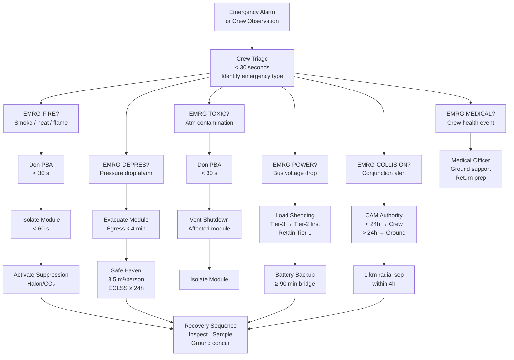

# STA 180-189 · Section 08 · Subsection 180 · Subsubject 008 — Safety Zones, Emergency Modes and Survivability

## 1. Purpose

Establishes the safety zone classification, emergency mode definitions, and crew survivability criteria for orbital bases within the STA 180 subsystem[^baseline]. This subsubject is the primary safety governance document for the *Bases Orbitales* node: it defines the spatial boundaries that govern crew movements and vehicle operations, the emergency mode decision logic that overrides normal operations, and the minimum survivability thresholds that all orbital base designs must meet.

The `no_aaa_rule` is mandatory throughout this subsubject: the identifier "AAA" must not be used for any safety zone classification, emergency mode identifier, or survivability criterion. Safety zones and emergency modes are identified using the Green/Amber/Red classification system and named mode identifiers defined herein. All downstream subsubjects in STA-180 that reference emergency conditions shall use only identifiers established in this document.

## 2. Scope

- **Safety zone classification**:
  - *Green Zone*: nominal operations permitted; all systems within specification; full crew access.
  - *Amber Zone*: degraded operations; at least one non-safety-critical system outside nominal; heightened crew awareness; restricted EVA; MCC notification required within 15 minutes.
  - *Red Zone*: emergency condition; immediate crew action required; no EVA unless life-saving; MCC authority transferred to crew on-scene commander.
- **Emergency mode taxonomy** (no "AAA" identifiers):
  - `EMRG-FIRE`: fire detection/suppression; crew donning PBA (portable breathing apparatus); affected module isolation; halon/CO₂ suppression activation.
  - `EMRG-DEPRES`: rapid/slow depressurisation; module isolation; crew evacuation to safe haven; leak isolation procedure.
  - `EMRG-TOXIC`: toxic atmosphere; crew donning PBA; ventilation shutdown in affected module; affected module isolation.
  - `EMRG-POWER`: primary power failure; load shedding sequence activation; battery backup engagement; emergency lighting only.
  - `EMRG-COLLISION`: conjunction warning; collision avoidance manoeuvre (CAM) authority delegated to crew; thruster safing sequence if CAM not available.
  - `EMRG-MEDICAL`: medical emergency; crew medical officer authority; ground medical support; potential early crew return.
- **Emergency egress paths**: minimum 2 independent egress paths from each habitable module to safe haven or docked crew vehicle; egress time from most remote point ≤ 4 minutes[^nasa_std_3001]; path clearance ≥ 0.8 m × 0.8 m hatch aperture.
- **Safe haven requirements**: minimum pressurised volume 3.5 m³ per refuge crew member; ECLSS autonomy ≥ 24 hours without external power/ECLSS (battery + stored O₂); radiation storm shelter within safe haven meeting ≥ 10 g/cm² aluminium-equivalent shielding.
- **Shelter-in-place volume**: radiation shelter minimum net volume 2.3 m³ per person; stocked with 24-hour emergency rations, water, first aid; located at station geometric centre for maximum shielding.
- **Emergency power mode**: automatic power load shedding sequence: non-essential loads first (science, non-critical comms), then mission-critical loads, retaining only Tier-1 life-critical loads (ECLSS, emergency lighting, crew communication, fire detection); battery bridge time ≥ 90 minutes.
- **Fire/toxic atmosphere protocol**: crew dons PBA within 30 seconds of alarm; affected module hatch closed and locked within 60 seconds; suppression system activation only after crew clear; atmosphere monitoring resumes after 10-minute stabilisation period.
- **Collision avoidance manoeuvre (CAM) authority**: ground-initiated CAM for conjunction warning lead time > 24 hours; crew-initiated CAM for lead time < 24 hours; thruster minimum impulse for 1 km radial separation within 4 hours; post-CAM orbit determination required within 6 hours.
- **Crew survivability boundary**: minimum design requirement — all crew survive any single credible failure for ≥ 96 hours without external support; ECLSS dual redundancy on all life-critical functions; no single-point failure shall cause loss of crew.
- **Post-emergency recovery sequence**: inspection of affected systems; atmosphere sampling before module re-entry; ground concurrence before returning to Green Zone; incident report uplinked within 2 hours of emergency resolution.
- **Debris impact survivability**: station structural integrity maintained following micrometeorite/orbital debris (MMOD) impact at ≤ 1 cm diameter at LEO velocities; critical systems shielded to survive P(no penetration) ≥ 0.99 over station design life.

## 3. Emergency Mode Decision Tree

## 4. Footprint

| Metric | Value |
|---|---|
| Architecture | `STA` — Space Technology Architecture |
| Master range | `100–199` |
| Code range | `180-189` |
| Section | `08` — Infraestructura y Logística Espacial |
| Subsection | `180` — Bases Orbitales |
| Subsubject | `008` — Safety Zones, Emergency Modes and Survivability |
| Primary Q-Division | Q-SPACE[^qdiv] |
| Support Q-Divisions | Q-DATAGOV, Q-HPC, Q-HORIZON, Q-STRUCTURES, Q-GREENTECH, Q-INDUSTRY |
| ORB support | ORB-PMO, ORB-LEG |
| Governance class | `baseline`[^gov] |
| Folder path | `Q+ATLANTIDE/100-199_STA/180-189_Infraestructura-y-Logistica-Espacial/180_Bases-Orbitales/` |
| Document | `008_Safety-Zones-Emergency-Modes-and-Survivability.md` (this file) |
| Parent subsection | [`README.md`](./README.md) · [`000_Overview.md`](./000_Overview.md) |
| Parent architecture | [`../../README.md`](../../README.md) |
| Parent baseline | [`organization/Q+ATLANTIDE.md`](../../../../organization/Q+ATLANTIDE.md) |

## 5. References & Citations

[^baseline]: **Q+ATLANTIDE controlled baseline (v1.0.0)** — [`organization/Q+ATLANTIDE.md`](../../../../organization/Q+ATLANTIDE.md). Defines the controlled `000-999` architecture-band taxonomy and the ATLAS-1000 register subpart.

[^archtable]: **STA §3 Architecture Table** — [`../../README.md` §3](../../README.md#3-architecture-table). Authoritative source for the `180-189` row.

[^qdiv]: **Q-Division authority** — Q-Divisions provide technical authority over an architecture row (Q+ATLANTIDE Note N-002). See [`organization/Q+ATLANTIDE.md` §4](../../../../organization/Q+ATLANTIDE.md#4-notes).

[^gov]: **Governance class** — `baseline` denotes documents under controlled change management within the Q+ATLANTIDE baseline.

[^nasa_std_3001]: **NASA-STD-3001 Vol.1 & 2** — Space Human Factors and Ergonomics (NASA, 2014/2015). Emergency egress time limits, safe haven volume, crew survivability requirements.

[^ecss_q_st_40]: **ECSS-Q-ST-40C** — Space engineering: Safety (ESA, 2011). Hazard analysis, safety zone classification, and emergency mode design requirements for crewed space systems.

[^ccsds_910]: **CCSDS 910.11-B-1** — Rendezvous and Proximity Operations (CCSDS, 2018). Collision avoidance manoeuvre authority and conjunction warning response times.

### Applicable Industry Standards

| Standard | Title | Relevance |
|---|---|---|
| ECSS-Q-ST-40C | Space engineering — Safety | Hazard analysis, safety zone design, emergency mode requirements |
| NASA-STD-3001 Vol.1 & 2 | Space Human Factors and Ergonomics | Egress time, safe haven volume, survivability thresholds |
| CCSDS 910.11-B-1 | Rendezvous and Proximity Operations | CAM authority and conjunction warning response |
| NASA-STD-6001B | Flammability, Offgassing, and Compatibility Testing | Fire suppression agent selection and atmosphere safety |
| ECSS-E-ST-10-04C | Space engineering — Space environment | MMOD shielding design requirements for survivability |
| MIL-STD-882E | System Safety | Hazard classification and risk acceptance criteria |
| ISO 9241-112 | Ergonomics of human-system interaction | Emergency alarm display design and crew response time |
