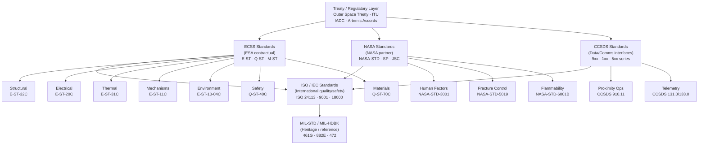

# STA 180-189 · Section 08 · Subsection 180 · Subsubject 009 — ECSS / NASA / CCSDS Orbital Infrastructure Standards Mapping

## 1. Purpose

Provides the comprehensive standards mapping for all applicable international standards governing orbital base design, manufacturing, verification, and operation within the STA 180 subsystem[^baseline]. This subsubject serves as the normative reference register for all subsubjects in STA-180, establishing the authority hierarchy among ECSS, NASA, CCSDS, ISO, MIL-STD, and treaty-level regulatory instruments. It identifies the scope, issuing body, current edition, and applicability of each standard to specific aspects of orbital base design and operation.

Programme teams shall use this mapping as the first point of reference when selecting applicable standards for a design activity. Where ECSS and NASA standards conflict, the Q-SPACE technical authority shall issue a deviation/waiver per ORB-PMO change control. ITAR/EAR considerations for technology transfer are identified at the standard level.

## 2. Scope

- **ECSS standards coverage**: structural (E-ST-32), electrical/electronic (E-ST-20), thermal (E-ST-31), mechanisms (E-ST-11), space environment (E-ST-10-04), testing (E-ST-10-03), reliability (Q-ST-30), safety (Q-ST-40), materials (Q-ST-70), system engineering (E-ST-10), project management (M-ST-10), configuration management (M-ST-40).
- **NASA standards coverage**: human factors (NASA-STD-3001), structural (NASA-STD-5019, 5020), flammability (NASA-STD-6001), oxygen compatibility (NASA-STD-6002), materials (MSFC-SPEC-522), software (NASA-STD-8739.8), systems engineering (SP-2016-6105).
- **CCSDS standards coverage**: proximity operations (910.11), telemetry/command (131.0, 133.0, 401.0), ranging and navigation (500.0), space link (211.0, 231.0).
- **ISO standards coverage**: debris mitigation (ISO 24113), quality management (ISO 9001), reliability (ISO 31000, IEC 60812 FMEA), RFID (ISO 18000-6C), ergonomics (ISO 9241).
- **MIL-STD heritage coverage**: electromagnetic compatibility (MIL-STD-461G), system safety (MIL-STD-882E), reliability/maintainability (MIL-HDBK-472), marking and storage (MIL-STD-129R).
- **Treaty and regulatory instruments**: Outer Space Treaty (1967), Liability Convention (1972), Registration Convention (1976), ITU Radio Regulations, IADC debris guidelines, Artemis Accords (2020).
- **Conflict resolution hierarchy**: (1) Treaty/regulatory instruments; (2) ESA-contractual ECSS standards; (3) NASA-STD (where NASA partner); (4) CCSDS (for data/communication interfaces); (5) ISO; (6) MIL-STD (heritage/reference only).
- **ITAR/EAR flagging**: standards or components whose application may involve export-controlled technology (e.g., ITAR Cat. IV crewed spacecraft, Cat. XV radiation-hardened electronics) are flagged in the mapping table.
- **Tailoring authority**: ECSS standards may be tailored per ECSS-M-ST-10 tailoring procedure; tailoring requires documented rationale and Q-SPACE approval; tailored standards listed in programme-specific Applicable Documents List (ADL).
- **Edition management**: this mapping references editions current at Q+ATLANTIDE v1.0.0 baseline date; programme ADL shall confirm edition applicability at programme kick-off; superseded editions require change record.

## 3. Standards Hierarchy Diagram

## 4. Comprehensive Standards Mapping Table

| Standard | Issuing Body | Edition | Scope | Applicability to STA-180 | ITAR Flag |
|---|---|---|---|---|---|
| ECSS-E-ST-32C | ESA/ECSS | 2008 | Structural general requirements | Module structure, berthing loads, pressure vessels | No |
| ECSS-E-ST-20C | ESA/ECSS | 2008 | Electrical and electronic | Power bus, harness, EMC, grounding | No |
| ECSS-E-ST-31C | ESA/ECSS | 2008 | Thermal control | ATCS loop design, radiators, coatings | No |
| ECSS-E-ST-11C | ESA/ECSS | 2008 | Mechanisms | Docking/berthing mechanisms, EVA fixtures | No |
| ECSS-E-ST-10-04C | ESA/ECSS | 2008 | Space environment | MMOD shielding, radiation, debris | No |
| ECSS-E-ST-10-03C | ESA/ECSS | 2012 | Testing | Verification and qualification test planning | No |
| ECSS-E-ST-10C | ESA/ECSS | 2009 | System engineering | System architecture, DfM, ICD management | No |
| ECSS-Q-ST-30C | ESA/ECSS | 2009 | Dependability | Reliability, FMEA, FMECA for orbital bases | No |
| ECSS-Q-ST-40C | ESA/ECSS | 2011 | Safety | Hazard analysis, safety zones, emergency modes | No |
| ECSS-Q-ST-70C | ESA/ECSS | 2008 | Materials and processes | Hazmat compatibility, outgassing, flammability | No |
| ECSS-M-ST-10C Rev.1 | ESA/ECSS | 2009 | Project planning | Phase gate criteria, work breakdown | No |
| ECSS-M-ST-40C | ESA/ECSS | 2009 | Configuration management | Hardware baseline and change control | No |
| NASA-STD-3001 Vol.1 & 2 | NASA | 2014/2015 | Space human factors | Habitability, ECLSS performance, ergonomics | No |
| NASA-STD-5019 | NASA | 2014 | Fracture control | Docking structure, pressure vessel fatigue | Yes (Cat.IV ref) |
| NASA-STD-5020 | NASA | 2012 | Threaded fasteners | Fastener selection in docking/berthing hardware | No |
| NASA-STD-6001B | NASA | 2016 | Flammability/offgassing | Fire suppression agent selection, atmosphere safety | No |
| NASA-STD-6002 | NASA | 2018 | Oxygen compatibility | ECLSS oxygen system material compatibility | No |
| NASA/SP-2016-6105 | NASA | 2016 | Systems engineering | ORU design, assembly sequencing, SE methodology | No |
| CCSDS 910.11-B-1 | CCSDS | 2018 | Proximity operations | Rendezvous, KOZ, CAM, approach corridors | No |
| CCSDS 131.0-B-3 | CCSDS | 2015 | TM channel coding | Telemetry channel coding for station comms | No |
| CCSDS 133.0-B-2 | CCSDS | 2012 | Space packet protocol | Onboard data packet structure | No |
| CCSDS 401.0-B-32 | CCSDS | 2021 | Radio frequency/modulation | Station RF link budget and modulation | No |
| ISO 24113:2019 | ISO | 2019 | Space debris mitigation | Disposal planning, passivation, lifetime limits | No |
| ISO 9001:2015 | ISO | 2015 | Quality management systems | Programme quality management | No |
| IEC 60812:2018 | IEC | 2018 | FMEA | Failure mode analysis for maintenance priority | No |
| ISO 18000-6C | ISO | 2013 | RFID item management | Inventory tracking tag specification | No |
| MIL-STD-461G | DoD | 2015 | EMC | Power bus EMC, filter requirements | Yes (ref) |
| MIL-STD-882E | DoD | 2012 | System safety | Hazard classification and risk acceptance | Yes (ref) |
| IADC-2002-01 Rev.2 | IADC | 2021 | Space debris mitigation guidelines | Orbital base debris mitigation compliance | No |
| Outer Space Treaty (1967) | UN | 1967 | International space law | Jurisdiction, liability, national authorisation | N/A |
| Artemis Accords (2020) | NASA/multi | 2020 | Lunar exploration principles | Cis-lunar base interoperability | N/A |

## 5. Footprint

| Metric | Value |
|---|---|
| Architecture | `STA` — Space Technology Architecture |
| Master range | `100–199` |
| Code range | `180-189` |
| Section | `08` — Infraestructura y Logística Espacial |
| Subsection | `180` — Bases Orbitales |
| Subsubject | `009` — ECSS / NASA / CCSDS Orbital Infrastructure Standards Mapping |
| Primary Q-Division | Q-SPACE[^qdiv] |
| Support Q-Divisions | Q-DATAGOV, Q-HPC, Q-HORIZON, Q-STRUCTURES, Q-GREENTECH, Q-INDUSTRY |
| ORB support | ORB-PMO, ORB-LEG |
| Governance class | `baseline`[^gov] |
| Folder path | `Q+ATLANTIDE/100-199_STA/180-189_Infraestructura-y-Logistica-Espacial/180_Bases-Orbitales/` |
| Document | `009_ECSS-NASA-CCSDS-Orbital-Infrastructure-Standards-Mapping.md` (this file) |
| Parent subsection | [`README.md`](./README.md) · [`000_Overview.md`](./000_Overview.md) |
| Parent architecture | [`../../README.md`](../../README.md) |
| Parent baseline | [`organization/Q+ATLANTIDE.md`](../../../../organization/Q+ATLANTIDE.md) |

## 6. References & Citations

[^baseline]: **Q+ATLANTIDE controlled baseline (v1.0.0)** — [`organization/Q+ATLANTIDE.md`](../../../../organization/Q+ATLANTIDE.md). Defines the controlled `000-999` architecture-band taxonomy and the ATLAS-1000 register subpart.

[^archtable]: **STA §3 Architecture Table** — [`../../README.md` §3](../../README.md#3-architecture-table). Authoritative source for the `180-189` row.

[^qdiv]: **Q-Division authority** — Q-Divisions provide technical authority over an architecture row (Q+ATLANTIDE Note N-002). See [`organization/Q+ATLANTIDE.md` §4](../../../../organization/Q+ATLANTIDE.md#4-notes).

[^gov]: **Governance class** — `baseline` denotes documents under controlled change management within the Q+ATLANTIDE baseline.

[^ecss_m_st_10]: **ECSS-M-ST-10C Rev.1** — Space engineering: Project planning and implementation (ESA, 2009). Defines tailoring procedure, ADL management, and phase gate criteria.

[^nasa_itar]: **ITAR (International Traffic in Arms Regulations)** — 22 CFR Parts 120–130, USML Category IV (Launch Vehicles, Guided Missiles, Ballistic Missiles, Rockets) and Category XV (Spacecraft). Flags in the mapping table indicate standards that may involve ITAR-controlled technology when applied to orbital hardware.
