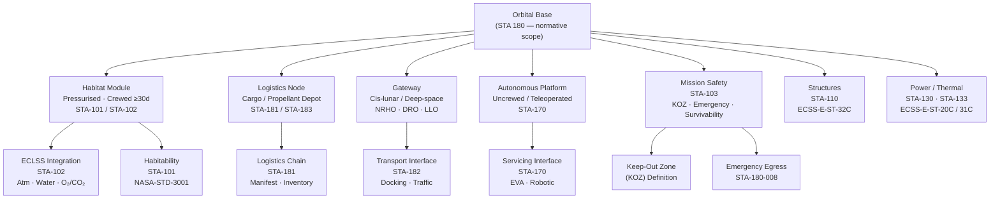

# STA 180-189 · 180-010 — Orbital Bases Controlled Definition

## 1. Purpose

Establishes the controlled vocabulary and normative definitions for *Orbital Bases* within the Q+ATLANTIDE taxonomy[^baseline]. This document defines the boundary between an "orbital base" and adjacent concepts (spacecraft, depot, station, gateway), establishes applicability criteria for the STA 180 namespace, and identifies the regulatory anchors and international instruments that govern orbital infrastructure design, construction, operation, and disposal.

All definitions in this document are normative within the Q+ATLANTIDE baseline. Subsubjects `002`–`010` shall cite and extend — never contradict — the definitions herein. The `no_aaa_rule` applies throughout: the identifier sequence "AAA" must not be used for any safety-critical design element within this subsection.

## 2. Scope

- **Controlled definitions** (normative):
  - *Orbital base*: a permanent or semi-permanent crewed or uncrewed structure in Earth orbit, cis-lunar space, or interplanetary orbit, designed to host logistics, habitation, servicing or assembly functions for an extended period (≥ 90 days planned operational life).
  - *Habitat module*: a pressurised element designed for continuous crew occupancy (≥ 30 days) providing life-support, sleep, work, and recreation volumes per NASA-STD-3001[^nasa_std_3001] minimums.
  - *Logistics node*: an unpressurised or pressurised element dedicated primarily to cargo storage, propellant depot, or resupply staging, without continuous crew occupancy requirement.
  - *Gateway*: a crewed-tended orbital base in cis-lunar or deep-space orbit (NRHO, DRO, LLO, or interplanetary transfer) serving as aggregation point for surface and deep-space missions.
  - *Autonomous platform*: an uncrewed orbital infrastructure element operating without continuous crew presence; may support teleoperated or autonomous robotic servicing.
  - *Docking port*: a mechanism enabling two spacecraft or modules to form a pressurised or unpressurised structural and functional connection, meeting IDSS or equivalent interface standards.
  - *Berthing port*: a structural interface enabling module attachment via robotic arm capture and bolting (e.g., CBM), distinct from active docking.
  - *Keep-Out Zone (KOZ)*: a defined volume around an orbital base within which visiting vehicles must not operate without explicit mission control authorisation.
- **Applicability**: applies to all STA 180 design activities regardless of orbit regime (LEO, MEO, GEO, NRHO, DRO, HEO, LLO, interplanetary).
- **Boundary conditions**: interfaces with STA-100 (General Space Architecture), STA-101 (Habitability), STA-102 (ECLSS), STA-103 (Mission Safety), STA-170 (Orbital Servicing).
- **Regulatory anchors**: Outer Space Treaty (1967)[^outer_space_treaty], Registration Convention (1976), Liability Convention (1972), ITU Radio Regulations (current edition), IADC Space Debris Mitigation Guidelines (2007/2021), Artemis Accords (2020).
- **No-AAA rule**: the identifier "AAA" shall not be used for any safety-critical design element within this subsection per `no_aaa_rule: true`.
- **Orbit regime applicability matrix**: all definitions apply across LEO (200–2000 km), MEO (2000–35786 km), GEO (35786 km), cis-lunar (TLI through NRHO/DRO), and interplanetary (beyond lunar SOI) regimes unless a definition explicitly restricts its scope.
- **Revision authority**: controlled definition changes require Q-SPACE concurrence and ORB-PMO change record; no unilateral modification by support Q-Divisions.

## 3. Taxonomy Diagram

## 4. Footprint

| Metric | Value |
|---|---|
| Architecture | `STA` — Space Technology Architecture |
| Master range | `100–199` |
| Code range | `180-189` |
| Section | `08` — Infraestructura y Logística Espacial |
| Subsection | `180` — Bases Orbitales |
| Subsubject | `001` — Orbital Bases Controlled Definition |
| Primary Q-Division | Q-SPACE[^qdiv] |
| Support Q-Divisions | Q-DATAGOV, Q-HPC, Q-HORIZON, Q-STRUCTURES, Q-GREENTECH, Q-INDUSTRY |
| ORB support | ORB-PMO, ORB-LEG |
| Governance class | `baseline`[^gov] |
| Folder path | `Q+ATLANTIDE/100-199_STA/180-189_Infraestructura-y-Logistica-Espacial/180_Bases-Orbitales/` |
| Document | `180-010-Orbital-Bases-Controlled-Definition.md` (this file) |
| Parent subsection | [`README.md`](./README.md) · [`180-000-General.md`](./180-000-General.md) |
| Parent architecture | [`../../README.md`](../../README.md) |
| Parent baseline | [`organization/Q+ATLANTIDE.md`](../../../../organization/Q+ATLANTIDE.md) |

## 5. References & Citations

[^baseline]: **Q+ATLANTIDE controlled baseline (v1.0.0)** — [`organization/Q+ATLANTIDE.md`](../../../../organization/Q+ATLANTIDE.md). Defines the controlled `000-999` architecture-band taxonomy and the ATLAS-1000 register subpart.

[^archtable]: **STA §3 Architecture Table** — [`../../README.md` §3](../../README.md#3-architecture-table). Authoritative source for the `180-189` row.

[^qdiv]: **Q-Division authority** — Q-Divisions provide technical authority over an architecture row (Q+ATLANTIDE Note N-002). See [`organization/Q+ATLANTIDE.md` §4](../../../../organization/Q+ATLANTIDE.md#4-notes).

[^gov]: **Governance class** — `baseline` denotes documents under controlled change management within the Q+ATLANTIDE baseline.

[^nasa_std_3001]: **NASA-STD-3001 Vol.1 & 2** — Space Human Factors and Ergonomics (NASA, 2014/2015). Minimum habitability, human-factors thresholds, and crew health standards for crewed habitat modules.

[^outer_space_treaty]: **Outer Space Treaty (1967)** — Treaty on Principles Governing the Activities of States in the Exploration and Use of Outer Space, Including the Moon and Other Celestial Bodies. Primary international law anchor for orbital infrastructure jurisdiction, liability, and registration.

[^ecss_e_st_32]: **ECSS-E-ST-32C** — Space engineering: Structural general requirements (ESA, 2008). Provides structural load cases and interface design requirements for pressurised modules and structural connections.

### Applicable Industry Standards

| Standard | Title | Relevance |
|---|---|---|
| ECSS-E-ST-32C | Space engineering — Structural general requirements | Pressurised module and docking port structural loads |
| NASA-STD-3001 Vol.1 & 2 | Space Human Factors and Ergonomics | Habitat module definitions and minimum crew volume |
| CCSDS 910.11-B-1 | Rendezvous and Proximity Operations | KOZ and docking approach corridor definitions |
| ISO 24113:2019 | Space systems — Space debris mitigation requirements | Orbital base disposal and passivation obligations |
| Outer Space Treaty (1967) | Treaty on Principles — Outer Space | Jurisdiction, liability, and registration anchors |
| IADC-2002-01 Rev.2 (2021) | IADC Space Debris Mitigation Guidelines | Debris mitigation for large orbital structures |
| Artemis Accords (2020) | Principles for Cooperation in Space Exploration | Cis-lunar and lunar orbit base applicability |
