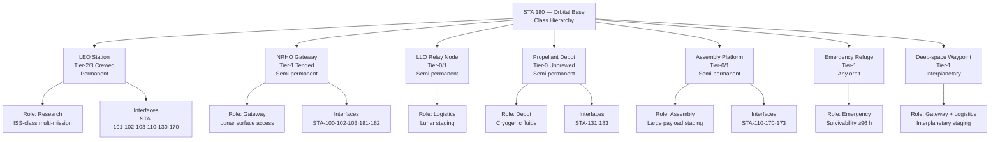

# STA 180-189 · 180-020 — Orbital Base Classes and Mission Roles

## 1. Purpose

Classifies orbital bases by orbit regime, crew capacity, permanence level, and primary mission role within the Q+ATLANTIDE STA 180 taxonomy[^baseline]. This subsubject provides the authoritative class hierarchy — from LEO research stations to cis-lunar gateways and deep-space staging platforms — enabling architects and mission planners to select the appropriate base class for a given programme requirement. Each class carries a defined mission role (research, logistics, assembly, gateway, emergency refuge) and associated interface obligations inherited from STA-100 and STA-103[^archtable].

Mission roles determine which downstream subsubjects (`003`–`010`) are mandatory contributors for that class. An assembly platform, for example, mandates full compliance with STA-180-007 (maintenance/assembly), STA-180-004 (docking/berthing), and STA-180-008 (safety zones), while a propellant depot may defer STA-180-003 (habitable architecture) requirements to the visiting vehicle's own habitability system.

## 2. Scope

- **Orbit regime classification**: LEO (200–550 km ISS-class; 550–2000 km higher), MEO, GEO, HEO (Molniya/Tundra), cis-lunar (NRHO, DRO, LLO, low-energy transfer), deep-space (beyond lunar SOI).
- **Crew capacity tiers**: Tier-0 Uncrewed/autonomous; Tier-1 Tended (≤ 90 days/yr crew presence); Tier-2 Continuously crewed (≥ 180 days/yr); Tier-3 Permanent station (≥ 365 days/yr with crew rotation).
- **Permanence levels**: Temporary (< 1 year planned life), Semi-permanent (1–10 years), Permanent (> 10 years, ISS-class or beyond).
- **Mission role taxonomy**: (R) Research, (L) Logistics/Depot, (A) Assembly/Staging, (G) Gateway, (E) Emergency Refuge/Rescue node.
- **LEO Station class**: ISS-heritage, large modular pressurised volume, Tier-2/3 crewed, multi-mission (R+L+A), ECLSS-intensive, debris-shield requirements per ECSS-E-ST-10-04C[^ecss_debris].
- **NRHO Gateway class**: Lunar-orbit, Tier-1 tended, multi-mission (G+L+A), reduced power budget, deep-space radiation environment (beyond magnetosphere), limited resupply cadence, must support lunar surface operations.
- **LLO Relay class**: Low lunar orbit, Tier-0/1, primarily (L+A), serves as staging node for lunar surface logistics chains (STA-181).
- **Propellant Depot class**: Tier-0 uncrewed, mission role (L), cryogenic fluid management critical, high-frequency visiting vehicle traffic, robust RFDS (robotic fluid transfer system).
- **Assembly Platform class**: Tier-0/1, mission role (A), large payload accommodation volume, robotic arm infrastructure (SSRMS-class), EVA-friendly external architecture.
- **Emergency Refuge node**: Tier-1, mission role (E), minimum habitation, full ECLSS backup, redundant power, must be accessible from all docked/berthed vehicles within 4 minutes[^nasa_std_3001].
- **Interface obligations by class**: each class row in the table below specifies mandatory and conditional interface documents within STA-180.

## 3. Base Class Taxonomy

| Class | Orbit | Crew Tier | Permanence | Primary Role | Key Interfaces | Mandatory STA-180 Subsubjects |
|---|---|---|---|---|---|---|
| LEO Research Station | LEO 400–550 km | Tier-2/3 | Permanent | R + L + A | STA-101, 102, 103, 110, 130, 170 | 003, 004, 005, 006, 007, 008 |
| NRHO Cis-lunar Gateway | NRHO | Tier-1 | Semi-permanent | G + L + A | STA-100, 102, 103, 181, 182 | 003, 004, 005, 006, 007, 008 |
| LLO Relay Node | LLO | Tier-0/1 | Semi-permanent | L + A | STA-181, 182, 183 | 004, 005, 006, 007 |
| Propellant Depot | LEO / NRHO | Tier-0 | Semi-permanent | L | STA-131, 183 | 004, 005, 006 |
| Assembly Platform | LEO / NRHO | Tier-0/1 | Semi-permanent | A | STA-110, 170, 173 | 004, 005, 006, 007, 008 |
| Emergency Refuge | Any | Tier-1 | Semi-permanent | E | STA-102, 103 | 003, 005, 008 |
| Deep-space Waypoint | Interplanetary | Tier-1 | Temporary | G + L | STA-100, 181, 182 | 004, 005, 006, 007, 008 |

## 4. Class Taxonomy Diagram

## 5. Footprint

| Metric | Value |
|---|---|
| Architecture | `STA` — Space Technology Architecture |
| Master range | `100–199` |
| Code range | `180-189` |
| Section | `08` — Infraestructura y Logística Espacial |
| Subsection | `180` — Bases Orbitales |
| Subsubject | `002` — Orbital Base Classes and Mission Roles |
| Primary Q-Division | Q-SPACE[^qdiv] |
| Support Q-Divisions | Q-DATAGOV, Q-HPC, Q-HORIZON, Q-STRUCTURES, Q-GREENTECH, Q-INDUSTRY |
| ORB support | ORB-PMO, ORB-LEG |
| Governance class | `baseline`[^gov] |
| Folder path | `Q+ATLANTIDE/100-199_STA/180-189_Infraestructura-y-Logistica-Espacial/180_Bases-Orbitales/` |
| Document | `180-020-Orbital-Base-Classes-and-Mission-Roles.md` (this file) |
| Parent subsection | [`README.md`](./README.md) · [`180-000-General.md`](./180-000-General.md) |
| Parent architecture | [`../../README.md`](../../README.md) |
| Parent baseline | [`organization/Q+ATLANTIDE.md`](../../../../organization/Q+ATLANTIDE.md) |

## 6. References & Citations

[^baseline]: **Q+ATLANTIDE controlled baseline (v1.0.0)** — [`organization/Q+ATLANTIDE.md`](../../../../organization/Q+ATLANTIDE.md). Defines the controlled `000-999` architecture-band taxonomy and the ATLAS-1000 register subpart.

[^archtable]: **STA §3 Architecture Table** — [`../../README.md` §3](../../README.md#3-architecture-table). Authoritative source for the `180-189` row.

[^qdiv]: **Q-Division authority** — Q-Divisions provide technical authority over an architecture row (Q+ATLANTIDE Note N-002). See [`organization/Q+ATLANTIDE.md` §4](../../../../organization/Q+ATLANTIDE.md#4-notes).

[^gov]: **Governance class** — `baseline` denotes documents under controlled change management within the Q+ATLANTIDE baseline.

[^nasa_std_3001]: **NASA-STD-3001 Vol.2** — Space Human Factors Design Standards (NASA, 2015). Emergency egress time requirements and safe-haven accessibility criteria.

[^ecss_debris]: **ECSS-E-ST-10-04C** — Space engineering: Space environment (ESA, 2008). Debris shielding requirements for LEO orbital platforms including Whipple shield sizing.

### Applicable Industry Standards

| Standard | Title | Relevance |
|---|---|---|
| NASA-STD-3001 Vol.1 & 2 | Space Human Factors and Ergonomics | Crew tier and permanence-level habitability thresholds |
| ECSS-E-ST-10-04C | Space engineering — Space environment | LEO debris shielding; cis-lunar radiation environment |
| CCSDS 910.11-B-1 | Rendezvous and Proximity Operations | Traffic classification by base class and orbit regime |
| ECSS-E-ST-32C | Space engineering — Structural general requirements | Module structural class selection by orbit and crew tier |
| ISO 24113:2019 | Space debris mitigation requirements | Disposal obligations by orbit class (LEO vs. above GEO) |
| ECSS-M-ST-10C Rev.1 | Space engineering — Project planning | Mission class determination and phase gate applicability |
| NASA SP-2016-6105 | Systems Engineering Handbook | Architecture class definition and trade study methodology |
