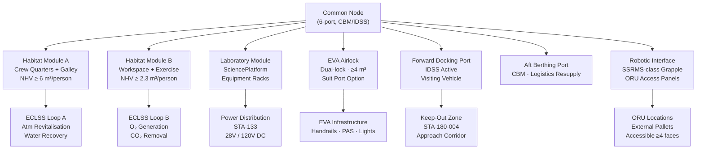

# STA 180-189 · 180-030 — Habitable and Uncrewed Base Architecture

## 1. Purpose

Defines the architectural framework for both habitable (crewed) and uncrewed orbital base elements within the STA 180 subsystem[^baseline]. This subsubject establishes module sizing criteria, pressurised volume allocation per crew member, node and tunnel interconnection topology, EVA airlock placement rules, external robotic interface locations, and the structural architecture principles governing module-to-module hard-mating interfaces.

Habitable architecture imposes the most demanding integration constraints in an orbital base programme: ECLSS boundary conditions (STA-102), habitability minimums (STA-101), structural load paths under docking dynamic loads (STA-110), and emergency egress routing (STA-180-008) must all converge at the architectural design phase. Uncrewed architectures, while relieving ECLSS and habitability constraints, impose their own demands on thermal management (no crew metabolic loads to exploit), autonomous fault management, and robotic accessibility for ORU replacement.

## 2. Scope

- **Pressurised module sizing**: minimum net habitable volume (NHV) per NASA-STD-3001[^nasa_std_3001] — 2.3 m³/person (performance) to 6.0 m³/person (health and performance optimum); total pressurised volume allocation per module type.
- **Module cross-section standards**: circular cross-sections ≥ 4.0 m inner diameter for large habitat modules; minimum hatch clear opening ≥ 0.8 m × 0.8 m per ECSS-E-ST-32C[^ecss_st_32].
- **Node and tunnel topology**: centralised node-spoke architecture vs. linear truss-connected modules; node configuration (6-port Common Node, 4-port Mini Node); tunnel/hatch interface diameter standardisation.
- **EVA airlock architecture**: dual-lock airlock (crew lock + equipment lock), suit donning volume, airlock volume ≥ 4 m³ net, pre-breathe protocol accommodation, suit port concept for advanced designs.
- **Airlock placement rules**: located on external or node structure with clear EVA egress path; minimum 2 m clearance radius from solar arrays and high-gain antennas.
- **External robotic interfaces**: Payload Attachment System (PAS) locations, robotic arm work-envelope coverage mapping, ORU access panel locations, handrail density (≥ 1 per 1.5 m linear track)[^ecss_st_11c].
- **Structural interface standards**: CBM (Common Berthing Mechanism) for soft-mating; IDSS (International Docking System Standard) for hard-mating active ports; load path continuity from module end-cone through truss to resisting structure.
- **Uncrewed architecture drivers**: autonomous thermal management (no metabolic load), radiation-tolerant avionics packaging, robotic ORU access from all external faces, passivation provisions.
- **Pressurisation boundary management**: module bulkhead burst pressure ≥ 2× MEOP; leak-before-burst design philosophy per ECSS-E-ST-32C; inter-module isolation valve placement.
- **Internal volumetric allocation**: crew quarters, exercise, work, hygiene, galley, equipment bays, stowage — allocation tables per mission duration category (≤ 30d, 30–180d, > 180d).
- **Radiation shielding integration**: multi-layer insulation (MLI), polyethylene storm shelters, module wall areal density targets for GCR/SPE exposure in cis-lunar and deep-space regimes per ECSS-E-ST-10-04C.
- **Microgravity ergonomics**: no inherent up/down; all work surfaces, restraints, and traffic flows designed for 6-DOF crew movement; consistent orientation cues (lighting, labelling, colour coding).

## 3. Module Interconnection Diagram

## 4. Footprint

| Metric | Value |
|---|---|
| Architecture | `STA` — Space Technology Architecture |
| Master range | `100–199` |
| Code range | `180-189` |
| Section | `08` — Infraestructura y Logística Espacial |
| Subsection | `180` — Bases Orbitales |
| Subsubject | `003` — Habitable and Uncrewed Base Architecture |
| Primary Q-Division | Q-SPACE[^qdiv] |
| Support Q-Divisions | Q-DATAGOV, Q-HPC, Q-HORIZON, Q-STRUCTURES, Q-GREENTECH, Q-INDUSTRY |
| ORB support | ORB-PMO, ORB-LEG |
| Governance class | `baseline`[^gov] |
| Folder path | `Q+ATLANTIDE/100-199_STA/180-189_Infraestructura-y-Logistica-Espacial/180_Bases-Orbitales/` |
| Document | `180-030-Habitable-and-Uncrewed-Base-Architecture.md` (this file) |
| Parent subsection | [`README.md`](./README.md) · [`180-000-General.md`](./180-000-General.md) |
| Parent architecture | [`../../README.md`](../../README.md) |
| Parent baseline | [`organization/Q+ATLANTIDE.md`](../../../../organization/Q+ATLANTIDE.md) |

## 5. References & Citations

[^baseline]: **Q+ATLANTIDE controlled baseline (v1.0.0)** — [`organization/Q+ATLANTIDE.md`](../../../../organization/Q+ATLANTIDE.md). Defines the controlled `000-999` architecture-band taxonomy and the ATLAS-1000 register subpart.

[^archtable]: **STA §3 Architecture Table** — [`../../README.md` §3](../../README.md#3-architecture-table). Authoritative source for the `180-189` row.

[^qdiv]: **Q-Division authority** — Q-Divisions provide technical authority over an architecture row (Q+ATLANTIDE Note N-002). See [`organization/Q+ATLANTIDE.md` §4](../../../../organization/Q+ATLANTIDE.md#4-notes).

[^gov]: **Governance class** — `baseline` denotes documents under controlled change management within the Q+ATLANTIDE baseline.

[^nasa_std_3001]: **NASA-STD-3001 Vol.1 & 2** — Space Human Factors and Ergonomics (NASA, 2014/2015). Net habitable volume, habitability minimums, and crew ergonomics requirements for crewed modules.

[^ecss_st_32]: **ECSS-E-ST-32C** — Space engineering: Structural general requirements (ESA, 2008). Burst pressure, hatch sizing, load path, and pressurisation boundary requirements.

[^ecss_st_11c]: **ECSS-E-ST-11C** — Space engineering: Mechanisms (ESA, 2008). Docking and berthing mechanism design requirements including hatch and EVA accessibility.

### Applicable Industry Standards

| Standard | Title | Relevance |
|---|---|---|
| NASA-STD-3001 Vol.1 & 2 | Space Human Factors and Ergonomics | NHV, ergonomics, crew volume, airlock sizing |
| ECSS-E-ST-32C | Space engineering — Structural general requirements | Module structural design, burst pressure, hatch sizing |
| ECSS-E-ST-11C | Space engineering — Mechanisms | Docking/berthing mechanisms, hatch design |
| ECSS-E-ST-10-04C | Space engineering — Space environment | Radiation shielding requirements for module walls |
| IDA (IDSS) Interface Definition Document | International Docking System Standard | Active docking port interface geometry and loads |
| NASA JSC 65829 | Common Berthing Mechanism ICD | CBM structural and electrical interface specification |
| ECSS-E-ST-31C | Space engineering — Thermal control | Module thermal interface and insulation requirements |
