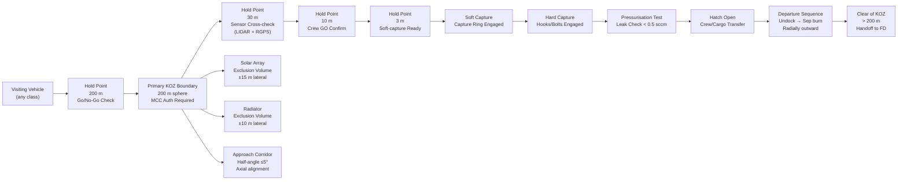

# STA 180-189 · 180-040 — Docking Berthing and Traffic Interfaces

## 1. Purpose

Defines the docking and berthing mechanism requirements, approach corridor geometry, keep-out zone (KOZ) specifications, and visiting vehicle traffic protocol framework for orbital bases within the STA 180 subsystem[^baseline]. This subsubject establishes the normative interface control architecture between the orbital base and all visiting or permanently attached vehicles — including crewed vehicles, cargo resupply vehicles, propellant tankers, and servicing spacecraft.

Docking/berthing and traffic management constitute a safety-critical domain: improper approach geometry, KOZ violations, or mechanism failures can result in loss of structural integrity, pressurisation loss, or collision with solar arrays and radiators. All visiting vehicle interface control documents (ICD) for an STA-180 orbital base must be validated against this subsubject prior to mission operations approval.

## 2. Scope

- **Docking mechanism classes**: active/passive docking (initiator/receptor), androgynous docking (IDSS-compliant, either partner may initiate), soft-docking (probe-drogue), hard-docking (hooks and latches engaged), APAS (Androgynous Peripheral Attach System) heritage.
- **International Docking System Standard (IDSS)**: Interface Definition Document (IDD) Rev.G requirements — capture ring stroke, capture latch engagement force, structural load ratings (limit and ultimate), tunnel diameter ≥ 800 mm clear opening.
- **Common Berthing Mechanism (CBM)**: active CBM (ACBM) on visiting vehicle, passive CBM (PCBM) on station; 16 bolt capture, pressurisation test before hatch opening; CBM clear aperture ≥ 1270 mm; load ratings per JSC 65829.
- **Approach corridor geometry**: approach ellipsoid definition (±40 m lateral, ±10 m vertical at 200 m range); corridor half-angle ≤ 5° within 20 m of docking port centreline; mandatory hold points (200 m, 30 m, 10 m, 3 m).
- **Keep-Out Zone (KOZ) specification**: primary KOZ — 200 m sphere; secondary KOZ — ellipsoidal volume defined by base geometry and solar array/radiator exclusion volumes; no visiting vehicle within primary KOZ without mission control authorisation.
- **Visiting vehicle traffic protocols**: approach phase (free-drift, proximity operations, final approach), loiter conditions at hold points, departure phase (backing away, separation burn, handoff to flight dynamics).
- **Rendezvous sensor suites**: LIDAR, RGPS (relative GPS), star tracker, video guidance system; cross-check requirements between at least 2 independent sensors within 30 m.
- **Docking port allocation and prioritisation**: forward (axial) ports for crewed vehicles; aft/nadir/zenith radial ports for logistics vehicles; lateral ports for module attachment; conflict resolution rules when ports are occupied.
- **Multi-vehicle simultaneous operations**: traffic separation rules when ≥ 2 visiting vehicles in proximity; minimum 500 m separation between approach corridors; mission control sequencing authority.
- **Departure and emergency undocking**: emergency undocking command authority (crew-initiated), mandatory separation burn direction (radially outward from base), recontact avoidance trajectory.
- **CCSDS proximity operations compliance**: adherence to CCSDS 910.11-B-1[^ccsds] for telemetry/command encoding during rendezvous; standardised range/range-rate measurement formats.
- **Mechanism qualification and certification**: flight qualification per ECSS-E-ST-11C[^ecss_st_11c]; docking mechanism shock load test, pressurisation leak test, mating/demating cycle life ≥ 50 cycles.

## 3. Approach Corridor and KOZ Diagram

## 4. Footprint

| Metric | Value |
|---|---|
| Architecture | `STA` — Space Technology Architecture |
| Master range | `100–199` |
| Code range | `180-189` |
| Section | `08` — Infraestructura y Logística Espacial |
| Subsection | `180` — Bases Orbitales |
| Subsubject | `004` — Docking, Berthing and Traffic Interfaces |
| Primary Q-Division | Q-SPACE[^qdiv] |
| Support Q-Divisions | Q-DATAGOV, Q-HPC, Q-HORIZON, Q-STRUCTURES, Q-GREENTECH, Q-INDUSTRY |
| ORB support | ORB-PMO, ORB-LEG |
| Governance class | `baseline`[^gov] |
| Folder path | `Q+ATLANTIDE/100-199_STA/180-189_Infraestructura-y-Logistica-Espacial/180_Bases-Orbitales/` |
| Document | `180-040-Docking-Berthing-and-Traffic-Interfaces.md` (this file) |
| Parent subsection | [`README.md`](./README.md) · [`180-000-General.md`](./180-000-General.md) |
| Parent architecture | [`../../README.md`](../../README.md) |
| Parent baseline | [`organization/Q+ATLANTIDE.md`](../../../../organization/Q+ATLANTIDE.md) |

## 5. References & Citations

[^baseline]: **Q+ATLANTIDE controlled baseline (v1.0.0)** — [`organization/Q+ATLANTIDE.md`](../../../../organization/Q+ATLANTIDE.md). Defines the controlled `000-999` architecture-band taxonomy and the ATLAS-1000 register subpart.

[^archtable]: **STA §3 Architecture Table** — [`../../README.md` §3](../../README.md#3-architecture-table). Authoritative source for the `180-189` row.

[^qdiv]: **Q-Division authority** — Q-Divisions provide technical authority over an architecture row (Q+ATLANTIDE Note N-002). See [`organization/Q+ATLANTIDE.md` §4](../../../../organization/Q+ATLANTIDE.md#4-notes).

[^gov]: **Governance class** — `baseline` denotes documents under controlled change management within the Q+ATLANTIDE baseline.

[^ccsds]: **CCSDS 910.11-B-1** — Rendezvous and Proximity Operations (CCSDS, 2018). Normative standard for telemetry, command encoding, and range/range-rate formats during proximity operations.

[^ecss_st_11c]: **ECSS-E-ST-11C** — Space engineering: Mechanisms (ESA, 2008). Docking and berthing mechanism qualification, shock, leak, and cycle life requirements.

[^nasa_std_5019]: **NASA-STD-5019** — Fracture Control Requirements for Spaceflight Hardware (NASA, 2014). Applies to docking mechanism structural elements under cyclic docking loads.

### Applicable Industry Standards

| Standard | Title | Relevance |
|---|---|---|
| IDSS IDD Rev.G | International Docking System Standard Interface Definition | Normative docking geometry, loads, and tunnel dimensions |
| CCSDS 910.11-B-1 | Rendezvous and Proximity Operations | Proximity telemetry/command encoding and hold-point protocols |
| ECSS-E-ST-11C | Space engineering — Mechanisms | Docking/berthing mechanism design and qualification |
| NASA-STD-5019 | Fracture Control for Spaceflight Hardware | Structural integrity of docking mechanism under cyclic loads |
| NASA JSC 65829 | Common Berthing Mechanism ICD | CBM active/passive interface specification |
| ECSS-E-ST-32C | Space engineering — Structural general requirements | Docking structural load path and interface loads |
| ISO 24113:2019 | Space debris mitigation requirements | Visiting vehicle separation burn and recontact avoidance |
