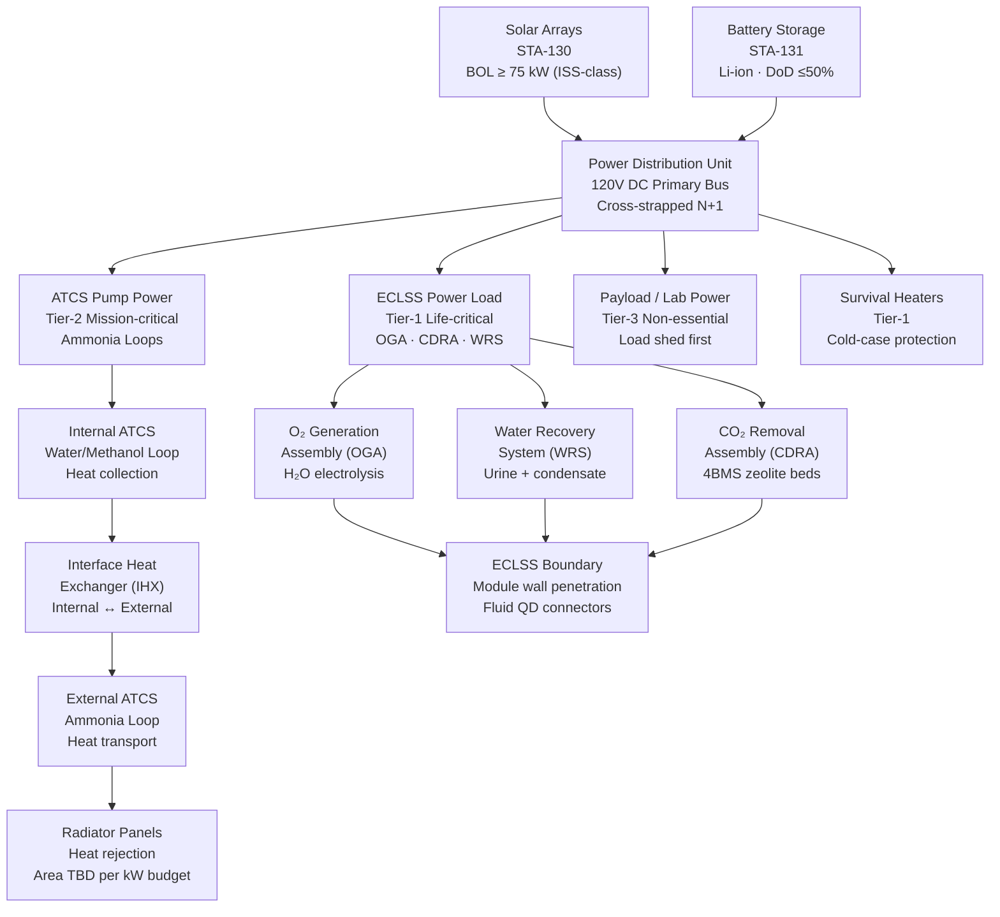

# STA 180-189 · 180-050 — Power Thermal ECLSS and Resource Interfaces

## 1. Purpose

Defines the resource interface architecture — electrical power, thermal control, and Environmental Control and Life Support System (ECLSS) — for orbital bases within STA 180[^baseline]. These three resource domains are tightly coupled: solar array power generation drives thermal waste heat production requiring active thermal rejection, while ECLSS consumes significant power and generates metabolic and equipment heat loads that feed back into the thermal control budget.

This subsubject establishes the interface boundaries between power generation (STA-130), energy storage (STA-131), power distribution (STA-133), thermal control (STA-112), and life support (STA-102). It specifies interconnect standards (umbilical connectors, fluid couplings, bus bars), capacity allocation methods, redundancy requirements, and the cross-strapping topology that ensures continued resource availability following single-point failures.

## 2. Scope

- **Solar array power generation**: high-efficiency multi-junction solar cells (≥ 29% BOL efficiency), end-of-life (EOL) power budget margin ≥ 25% above peak demand; ISS-class solar arrays (75 kW total BOL) as heritage reference; roll-out solar array (ROSA) technology for compact stowage.
- **Power bus architecture**: primary distribution at 120 V DC (ISS high-voltage legacy) or 28 V DC (smaller platforms); DC-DC converter regulation to secondary 28 V loads; high-voltage 480 V DC for high-power propulsion loads; bus tie switches for cross-strapping.
- **Battery backup system**: Li-ion cells (STA-131), minimum 1.5 orbital eclipse coverage (ISS eclipse ~35 min); depth-of-discharge (DoD) ≤ 50% for life extension; battery charge control unit (BCCU) per module.
- **Cross-strapping topology**: N+1 redundancy at distribution bus level; automatic bus tie engagement on single-string failure; emergency power mode load shedding sequence (non-critical loads first).
- **Active Thermal Control System (ATCS)**: two-phase ammonia loop (ISS-heritage) or single-phase water/methanol loop for internal heat transport; external ammonia loop to radiator panels; interface heat exchanger (IHX) between internal and external loops.
- **Radiator sizing**: minimum radiator area per heat rejection requirement (kW/m² at 5°C fluid temperature); radiator deployment/retraction for visiting vehicle clearance; dust/micrometeorite protection for cis-lunar and deep-space environments.
- **Passive thermal control**: multi-layer insulation (MLI) blanket specifications; white/black thermal coating selection for orbit regime; heater power allocation for cold-case survival.
- **ECLSS boundary definition**: atmosphere management subsystem (AMS) boundary at module wall penetration; water recovery system (WRS) fluid coupling type and flowrate specifications; oxygen generation assembly (OGA) electrical power interface; CO₂ removal assembly (CDRA) per-module vs. centralised architecture.
- **Fluid umbilical connectors**: quick-disconnect (QD) fluid coupling types (water, ammonia, nitrogen, oxygen, CO₂ scrubber reagents); ISO 6162 / SAE AS4372 hydraulic connector compatibility; colour coding and mechanical keying for gas/liquid service prevention.
- **Load allocation matrix**: per-module steady-state, peak, and emergency power allocations; ECLSS priority tier (Tier-1: life-critical; Tier-2: mission-critical; Tier-3: non-essential); automatic load shedding thresholds.
- **Resource margin management**: contingency power reserve ≥ 15% BOL, ≥ 10% EOL; thermal margin ≥ 20% above worst-case combined heat load; ECLSS consumable reserve ≥ 30-day buffer.
- **Umbilical interface and disconnection**: berthed vehicle umbilical connection sequence (electrical before fluid); disconnection sequence (fluid before electrical); emergency disconnect capability within 60 seconds.

## 3. Power / Thermal / ECLSS Interface Diagram

## 4. Footprint

| Metric | Value |
|---|---|
| Architecture | `STA` — Space Technology Architecture |
| Master range | `100–199` |
| Code range | `180-189` |
| Section | `08` — Infraestructura y Logística Espacial |
| Subsection | `180` — Bases Orbitales |
| Subsubject | `005` — Power, Thermal, ECLSS and Resource Interfaces |
| Primary Q-Division | Q-SPACE[^qdiv] |
| Support Q-Divisions | Q-DATAGOV, Q-HPC, Q-HORIZON, Q-STRUCTURES, Q-GREENTECH, Q-INDUSTRY |
| ORB support | ORB-PMO, ORB-LEG |
| Governance class | `baseline`[^gov] |
| Folder path | `Q+ATLANTIDE/100-199_STA/180-189_Infraestructura-y-Logistica-Espacial/180_Bases-Orbitales/` |
| Document | `180-050-Power-Thermal-ECLSS-and-Resource-Interfaces.md` (this file) |
| Parent subsection | [`README.md`](./README.md) · [`180-000-General.md`](./180-000-General.md) |
| Parent architecture | [`../../README.md`](../../README.md) |
| Parent baseline | [`organization/Q+ATLANTIDE.md`](../../../../organization/Q+ATLANTIDE.md) |

## 5. References & Citations

[^baseline]: **Q+ATLANTIDE controlled baseline (v1.0.0)** — [`organization/Q+ATLANTIDE.md`](../../../../organization/Q+ATLANTIDE.md). Defines the controlled `000-999` architecture-band taxonomy and the ATLAS-1000 register subpart.

[^archtable]: **STA §3 Architecture Table** — [`../../README.md` §3](../../README.md#3-architecture-table). Authoritative source for the `180-189` row.

[^qdiv]: **Q-Division authority** — Q-Divisions provide technical authority over an architecture row (Q+ATLANTIDE Note N-002). See [`organization/Q+ATLANTIDE.md` §4](../../../../organization/Q+ATLANTIDE.md#4-notes).

[^gov]: **Governance class** — `baseline` denotes documents under controlled change management within the Q+ATLANTIDE baseline.

[^ecss_st_20]: **ECSS-E-ST-20C** — Space engineering: Electrical and electronic (ESA, 2008). Power bus architecture, harness sizing, protection coordination, and grounding requirements.

[^ecss_st_31]: **ECSS-E-ST-31C** — Space engineering: Thermal control (ESA, 2008). Radiator sizing methodology, heat pipe design, thermal interface resistance, and ATCS loop design.

[^nasa_std_3001]: **NASA-STD-3001 Vol.1** — Space Human Factors and Ergonomics (NASA, 2014). ECLSS performance thresholds: O₂ partial pressure, CO₂ limits, humidity, temperature, and noise levels.

### Applicable Industry Standards

| Standard | Title | Relevance |
|---|---|---|
| ECSS-E-ST-20C | Space engineering — Electrical and electronic | Power bus architecture, harness, protection, grounding |
| ECSS-E-ST-31C | Space engineering — Thermal control | ATCS loop design, radiator sizing, thermal coatings |
| NASA-STD-3001 Vol.1 | Space Human Factors — Crew Health | ECLSS atmospheric composition and performance limits |
| ECSS-E-ST-32C | Space engineering — Structural | Fluid line routing and pressure vessel requirements |
| MIL-STD-461G | Electromagnetic Interference Control | Power bus EMC and filter requirements |
| SAE AS4372 | Fluid Quick Disconnects for Aerospace | Umbilical QD coupling specification for fluids |
| ECSS-E-ST-10-04C | Space engineering — Space environment | Solar array degradation, radiation dose for battery cells |
