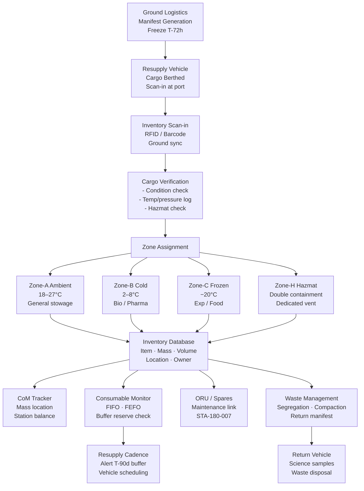

# STA 180-189 · 180-060 — Logistics Storage Cargo and Inventory Control

## 1. Purpose

Defines the logistics management framework for orbital bases within the STA 180 subsystem[^baseline], encompassing cargo manifesting, stowage volume allocation, storage zone classification, inventory tracking system requirements, resupply cadence planning, cargo handover procedures, and waste management logistics. Orbital logistics is a constrained domain: mass, volume, and stowage location must be tracked to sub-kilogram and sub-litre accuracy to manage centre-of-mass budgets, ensure emergency consumable reserves are accessible, and prevent habitability degradation through cargo accumulation in crew-occupied volumes.

This subsubject interfaces directly with STA-181 (Cis-lunar Logistics Chain) for ground-to-orbit and orbit-to-surface cargo flows, and with STA-180-007 (Maintenance) for spare parts and ORU inventory management.

## 2. Scope

- **Cargo manifesting**: item-level manifest (mass, volume, stowage location, owner, use-by date, hazmat class); electronic manifest synchronisation between ground logistics system and onboard inventory database; manifest freeze 72 hours before vehicle launch.
- **Stowage volume allocation**: total pressurised stowage volume budget per crew-size and mission duration; allocation categories: crew provisions, spares and ORUs, science experiments, EVA equipment, medical supplies, waste; reserved emergency buffer ≥ 10% of total pressurised stowage.
- **Storage zone classification**:
  - Zone-A (Ambient): standard pressurised stowage, temperature 18–27°C, humidity 25–75% RH.
  - Zone-B (Cold): controlled 2–8°C for biological samples, perishables, and certain pharmaceuticals.
  - Zone-C (Frozen): −20°C for biological experiments and food requiring freeze preservation.
  - Zone-H (Hazmat): isolated stowage for hazardous materials (toxic, flammable, oxidiser); double containment; dedicated ventilation path.
- **Inventory tracking system**: RFID tagging (ISO 18000-6C compatible) or barcode (Data Matrix ECC200) on all items ≥ 100 g; scan-in/scan-out at all berthing ports; ground-synchronised electronic inventory database; crew handheld scanner interface.
- **FIFO/LIFO stowage protocols**: consumables (food, water, atmosphere replenishment) managed FIFO; ORUs and spares managed by expiry date (FEFO); fragile items stored in dedicated shock-isolated locker bays.
- **Resupply cadence planning**: minimum resupply interval derived from consumable use rate, buffer reserve, and vehicle availability; nominal resupply cadence for ISS-class station: 4–6 vehicles/year; contingency buffer for delayed resupply: 90-day self-sufficiency from last berthed vehicle departure.
- **Cargo transfer handover procedure**: ground-to-crew handover checklist; cargo condition verification (pressure seals, temperature logs, radiation dose badge); discrepancy reporting within 24 hours of hatch opening.
- **Waste management logistics**: waste segregation (biological, dry trash, hazmat, disposable crew equipment); waste compaction and storage volume accounting; waste vehicle mass and volume allocations per resupply return vehicle.
- **Centre-of-mass (CoM) management**: stowage location constraints derived from station CoM budget; heavy items (> 10 kg) require CoM analysis before relocation; automated CoM tracking tool integration with inventory database.
- **Propellant logistics** (if depot element present): cryogenic fluid inventory (LO₂, LH₂, LCH₄, or storable NTO/MMH); boil-off rate budgets; transfer line priming and purge procedures; fluid mass tracking to ±1% accuracy.
- **Emergency consumable reserve**: minimum 30-day reserve of food, water, and atmosphere replenishment in dedicated, accessible, locked storage; reserve inventory verified at each resupply event.
- **Cargo return logistics**: science sample return manifesting; priority classification (time-critical, condition-sensitive, standard); cold chain traceability from base to Earth laboratory.

## 3. Cargo Flow and Inventory Control Diagram

## 4. Footprint

| Metric | Value |
|---|---|
| Architecture | `STA` — Space Technology Architecture |
| Master range | `100–199` |
| Code range | `180-189` |
| Section | `08` — Infraestructura y Logística Espacial |
| Subsection | `180` — Bases Orbitales |
| Subsubject | `006` — Logistics, Storage, Cargo and Inventory Control |
| Primary Q-Division | Q-SPACE[^qdiv] |
| Support Q-Divisions | Q-DATAGOV, Q-HPC, Q-HORIZON, Q-STRUCTURES, Q-GREENTECH, Q-INDUSTRY |
| ORB support | ORB-PMO, ORB-LEG |
| Governance class | `baseline`[^gov] |
| Folder path | `Q+ATLANTIDE/100-199_STA/180-189_Infraestructura-y-Logistica-Espacial/180_Bases-Orbitales/` |
| Document | `180-060-Logistics-Storage-Cargo-and-Inventory-Control.md` (this file) |
| Parent subsection | [`README.md`](./README.md) · [`180-000-General.md`](./180-000-General.md) |
| Parent architecture | [`../../README.md`](../../README.md) |
| Parent baseline | [`organization/Q+ATLANTIDE.md`](../../../../organization/Q+ATLANTIDE.md) |

## 5. References & Citations

[^baseline]: **Q+ATLANTIDE controlled baseline (v1.0.0)** — [`organization/Q+ATLANTIDE.md`](../../../../organization/Q+ATLANTIDE.md). Defines the controlled `000-999` architecture-band taxonomy and the ATLAS-1000 register subpart.

[^archtable]: **STA §3 Architecture Table** — [`../../README.md` §3](../../README.md#3-architecture-table). Authoritative source for the `180-189` row.

[^qdiv]: **Q-Division authority** — Q-Divisions provide technical authority over an architecture row (Q+ATLANTIDE Note N-002). See [`organization/Q+ATLANTIDE.md` §4](../../../../organization/Q+ATLANTIDE.md#4-notes).

[^gov]: **Governance class** — `baseline` denotes documents under controlled change management within the Q+ATLANTIDE baseline.

[^nasa_std_3001]: **NASA-STD-3001 Vol.1** — Space Human Factors and Ergonomics (NASA, 2014). Stowage volume minimums and habitability impact of cargo accumulation.

[^iso_18000]: **ISO 18000-6C** — Information technology — Radio frequency identification for item management: Part 6 (ISO, 2013). RFID air interface standard for inventory tracking tags.

[^ecss_m_st_40]: **ECSS-M-ST-40C** — Space engineering: Configuration management (ESA, 2009). Configuration and inventory baseline management applicable to orbital hardware items.

### Applicable Industry Standards

| Standard | Title | Relevance |
|---|---|---|
| NASA-STD-3001 Vol.1 | Space Human Factors — Crew Health | Stowage volume minimums, habitability impact of clutter |
| ISO 18000-6C | RFID for Item Management | Inventory RFID tag air interface specification |
| ECSS-M-ST-40C | Space engineering — Configuration management | Hardware baseline and inventory configuration control |
| ISO 11228-1 | Ergonomics — Manual handling | Manual cargo transfer loads in microgravity |
| NASA-JSC-20584 | Crew Health Care System (CHeCS) Standards | Medical supply logistics and cold-chain traceability |
| ECSS-Q-ST-70C | Space engineering — Materials and processes | Hazardous material compatibility for Zone-H storage |
| MIL-STD-129R | Military Marking for Shipment and Storage | Cargo labelling and marking standards (heritage reference) |
