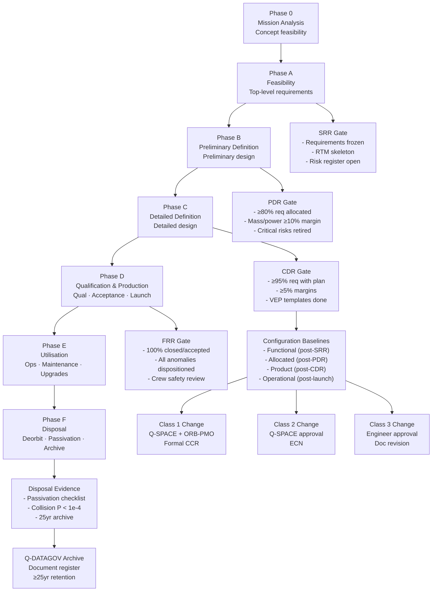

# STA 180-189 · 180-090 — Traceability Evidence and Lifecycle Governance

## 1. Purpose

Defines the requirements traceability framework, verification evidence package structure, configuration baseline management approach, lifecycle phase gate criteria, and change authority hierarchy for orbital bases within the STA 180 subsystem[^baseline]. This subsubject provides the governance backbone for the entire STA-180 documentation set: every design decision, requirement, test result, and operational change must be traceable through the lifecycle from mission concept (Phase 0) to end-of-life disposal (Phase F) per the ECSS lifecycle model[^ecss_m_st_10].

Traceability and evidence governance are not administrative overhead — for orbital-infrastructure critical systems, the ability to demonstrate that every safety-critical requirement has been verified and that every baseline change has been authorised is a fundamental mission assurance obligation. The Q+ATLANTIDE baseline model requires that all STA-180 subsubjects contribute to a shared requirements traceability matrix (RTM) that is maintained under Q-DATAGOV configuration control.

## 2. Scope

- **Requirements traceability matrix (RTM) structure**: RTM covers all STA-180 requirements from top-level mission need to subsystem verification; columns: requirement ID, requirement text, source document, verification method, verification status, evidence reference, responsible Q-Division.
- **Verification method taxonomy**:
  - *Analysis (A)*: mathematical or computational proof; includes FEA, thermal analysis, trajectory analysis.
  - *Test (T)*: physical testing (unit, subsystem, system level); includes qualification and acceptance test.
  - *Inspection (I)*: visual or dimensional verification; includes drawing checks, configuration audits.
  - *Similarity (S)*: heritage demonstration — item identical or similar to previously qualified item; similarity justification document required.
  - *Demonstration (D)*: functional operation observed without instrumented measurement.
- **Verification evidence package (VEP)**: per requirement, VEP contains: test report reference (T), analysis report reference (A), inspection record (I), or similarity justification (S/D); VEP completeness gate at CDR.
- **CDR/PDR/SRR gate criteria**:
  - SRR (System Requirements Review): requirements baseline frozen; RTM skeleton populated; top-level architecture defined; risk register open.
  - PDR (Preliminary Design Review): ≥ 80% requirements allocated to subsystems; mass/power budgets closed to ≥ 10% margin; critical design risks retired or mitigated.
  - CDR (Critical Design Review): ≥ 95% requirements with verification plan; mass/power margins ≥ 5%; qualification test plans approved; VEP templates complete.
  - FRR (Flight Readiness Review): 100% requirements with closed or accepted-risk evidence; all open anomalies dispositioned; crew safety review complete.
- **Configuration baseline management**: four baseline levels — Functional Baseline (post-SRR), Allocated Baseline (post-PDR), Product Baseline (post-CDR), Operational Baseline (post-launch); change authority as defined in §below.
- **Change authority levels**:
  - Class 1 (Major): change to functional or allocated baseline; requires Q-SPACE + ORB-PMO board approval; formal configuration change request (CCR).
  - Class 2 (Minor): change to product baseline not affecting form/fit/function; requires Q-SPACE approval only; engineering change notice (ECN).
  - Class 3 (Administrative): documentation correction or clarification; responsible engineer approval; document revision control.
- **End-of-life disposition evidence**: deorbit/disposal plan verified by orbital mechanics analysis; passivation checklist completed (propellant vent, battery discharge, pressure vessel safe); collision probability post-disposal < 1×10⁻⁴ per ISO 24113[^iso_24113]; disposal evidence package archived for ≥ 25 years.
- **Lifecycle phases (ECSS Phase 0–F)**:
  - Phase 0: Mission Analysis — concept feasibility, top-level requirements.
  - Phase A: Feasibility — system architecture, preliminary requirements.
  - Phase B: Preliminary Definition — preliminary design, risk mitigation.
  - Phase C: Detailed Definition — detailed design, qualification plans.
  - Phase D: Qualification and Production — qualification, acceptance, launch.
  - Phase E: Utilisation — operations, maintenance, upgrades.
  - Phase F: Disposal — deorbit/passivation, evidence archival.
- **Document identifier scheme for STA-180**: `QATL-ATLAS-1000-STA-180-189-08-180-NNN-<TYPE>` where NNN is subsubject number and TYPE is document type (OVERVIEW, DEFINITION, CLASSES, etc.); identifiers managed in Q-DATAGOV document register.
- **Anomaly and non-conformance management**: non-conformance report (NCR) raised within 24 hours of anomaly detection; NCR disposition (use-as-is, rework, scrap) requires Q-SPACE approval for safety-critical items; open NCRs tracked in programme risk register.
- **Audit and compliance**: internal design reviews at each phase gate per ECSS-M-ST-10[^ecss_m_st_10]; independent safety review by Q-SPACE safety board before CDR and FRR; compliance matrix against this subsubject maintained by ORB-PMO.
- **Knowledge retention and archival**: all baseline documents, test reports, and VEPs archived in Q-DATAGOV controlled repository with ≥ 25-year retention; search-accessible index; version-controlled with change history.

## 3. Lifecycle Phase and Evidence Gate Diagram

## 4. Footprint

| Metric | Value |
|---|---|
| Architecture | `STA` — Space Technology Architecture |
| Master range | `100–199` |
| Code range | `180-189` |
| Section | `08` — Infraestructura y Logística Espacial |
| Subsection | `180` — Bases Orbitales |
| Subsubject | `010` — Traceability, Evidence and Lifecycle Governance |
| Primary Q-Division | Q-SPACE[^qdiv] |
| Support Q-Divisions | Q-DATAGOV, Q-HPC, Q-HORIZON, Q-STRUCTURES, Q-GREENTECH, Q-INDUSTRY |
| ORB support | ORB-PMO, ORB-LEG |
| Governance class | `baseline`[^gov] |
| Folder path | `Q+ATLANTIDE/100-199_STA/180-189_Infraestructura-y-Logistica-Espacial/180_Bases-Orbitales/` |
| Document | `180-090-Traceability-Evidence-and-Lifecycle-Governance.md` (this file) |
| Parent subsection | [`README.md`](./README.md) · [`180-000-General.md`](./180-000-General.md) |
| Parent architecture | [`../../README.md`](../../README.md) |
| Parent baseline | [`organization/Q+ATLANTIDE.md`](../../../../organization/Q+ATLANTIDE.md) |

## 5. References & Citations

[^baseline]: **Q+ATLANTIDE controlled baseline (v1.0.0)** — [`organization/Q+ATLANTIDE.md`](../../../../organization/Q+ATLANTIDE.md). Defines the controlled `000-999` architecture-band taxonomy and the ATLAS-1000 register subpart.

[^archtable]: **STA §3 Architecture Table** — [`../../README.md` §3](../../README.md#3-architecture-table). Authoritative source for the `180-189` row.

[^qdiv]: **Q-Division authority** — Q-Divisions provide technical authority over an architecture row (Q+ATLANTIDE Note N-002). See [`organization/Q+ATLANTIDE.md` §4](../../../../organization/Q+ATLANTIDE.md#4-notes).

[^gov]: **Governance class** — `baseline` denotes documents under controlled change management within the Q+ATLANTIDE baseline.

[^ecss_m_st_10]: **ECSS-M-ST-10C Rev.1** — Space engineering: Project planning and implementation (ESA, 2009). Defines ECSS lifecycle phases (0–F), phase gate criteria, review boards, and tailoring procedures.

[^iso_24113]: **ISO 24113:2019** — Space systems: Space debris mitigation requirements (ISO, 2019). Disposal collision probability threshold (< 1×10⁻⁴) and passivation evidence requirements.

[^ecss_m_st_40]: **ECSS-M-ST-40C** — Space engineering: Configuration management (ESA, 2009). Baseline levels, configuration change authority, CCR/ECN documentation requirements.

### Applicable Industry Standards

| Standard | Title | Relevance |
|---|---|---|
| ECSS-M-ST-10C Rev.1 | Space engineering — Project planning | Lifecycle phase definitions, phase gate criteria, review board |
| ECSS-M-ST-40C | Space engineering — Configuration management | Baseline management, CCR/ECN, change authority |
| ECSS-Q-ST-30C | Space engineering — Dependability | RTM structure, FMEA, verification evidence requirements |
| ISO 24113:2019 | Space debris mitigation requirements | End-of-life disposal evidence and passivation requirements |
| NASA/SP-2016-6105 | NASA Systems Engineering Handbook | Requirements traceability, VEP structure, gate review criteria |
| MIL-HDBK-61B | Configuration Management Guidance | Configuration baseline and change control methodology (heritage) |
| INCOSE SE Handbook v4 | Systems Engineering Handbook | Requirements verification method taxonomy (A/T/I/S/D) |
