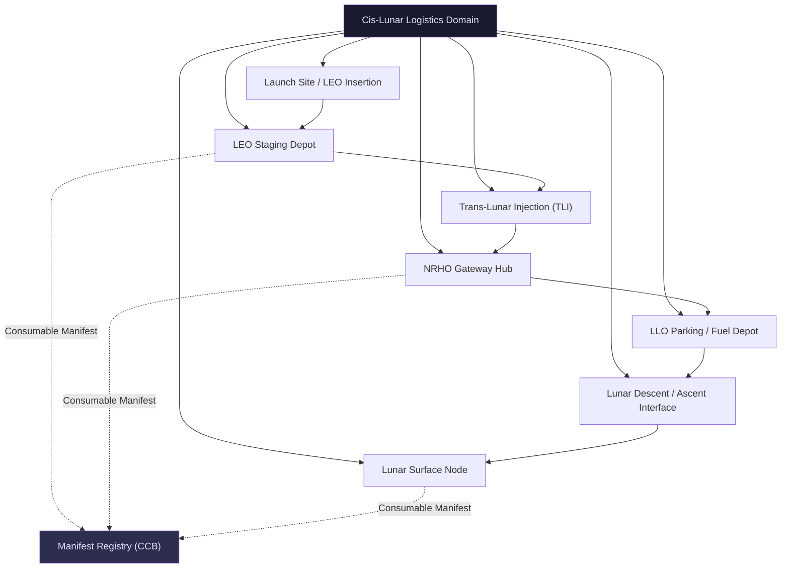

# STA 180-189 · Section 08 · Subsection 181 · Subsubject 001 — Cis-Lunar Logistics Controlled Definition

## 1. Purpose

Establishes the controlled vocabulary and normative definitions governing all cis-lunar logistics design, analysis, and operations activities within the Q+ATLANTIDE baseline[^baseline][^n001]. These definitions are authoritative for subsection `181` and shall be applied consistently across all dependent subsubjects (`002`–`010`). Regulatory anchors include the Outer Space Treaty (1967), the Artemis Accords (2020), and COSPAR planetary protection policy (for payloads with lunar surface-contact phases).

The `no_aaa_rule` applies throughout this subsubject: the identifier "AAA" shall not be used for any safety-critical logistics element, manifest entry, node identifier, or trajectory label.

## 2. Scope

- **Cis-lunar space** definition and spatial boundary conditions
- **Logistics chain** decomposition from Earth surface through lunar surface
- **Transfer vehicle** classification and distinction from launch vehicle and landing craft
- **Depot node** functional definition, types, and governance requirements
- **Staging orbit** definitions and operational parameters
- **Consumable manifest** controlled document structure and traceability requirements
- **Regulatory anchors**: Outer Space Treaty, Artemis Accords, COSPAR planetary protection
- **Applicability boundary**: LEO (≥ 200 km altitude) through lunar surface (0 m MSL)
- **Exclusions**: interplanetary space beyond lunar SOI, Earth launch phases below LEO insertion
- **Identifier rules**: `no_aaa_rule` — "AAA" must not appear in any safety-critical identifier within this subsection

## 3. Controlled Definitions

### 3.1 Cis-Lunar Space

*Cis-lunar space* is the volume of space bounded by Earth's gravitational sphere of influence on the inner boundary and the Moon's sphere of influence (SOI, approximately 66,100 km from the lunar centre) on the outer boundary. For operational purposes, the inner boundary is taken as the lowest stable circular LEO altitude (approximately 200 km above Earth's surface), and the outer boundary encompasses the region from low-lunar orbit (LLO) through near-rectilinear halo orbit (NRHO) to the lunar surface.

### 3.2 Logistics Chain

*Logistics chain* is the ordered, controlled sequence of transport, staging, storage, and transfer operations linking an origin node (Earth surface launch site or LEO staging depot) to a destination node (NRHO Gateway, LLO parking orbit, or lunar surface landing site). The logistics chain is fully characterised by its node graph, the cargo/consumable manifests at each node, the transfer vehicle assignments, and the timeline of operations.

### 3.3 Transfer Vehicle

A *transfer vehicle* is a spacecraft designed primarily to transport cargo or crew between two orbital nodes within cis-lunar space. A transfer vehicle is explicitly distinct from a launch vehicle (which operates in the Earth ascent phase) and a landing craft (which operates in the lunar descent/ascent phase). Transfer vehicles may be expendable or reusable and may require propellant resupply at depot nodes.

### 3.4 Depot Node

A *depot node* is an orbital infrastructure element providing one or more of the following services at a designated staging orbit: propellant storage and transfer, pressurised cargo storage and trans-shipment, power supply to visiting vehicles, thermal conditioning for cryogenic propellants, and communications relay. Three primary depot node types are defined:
- **LEO staging depot**: in LEO (300–550 km circular), serving aggregation, checkout, and initial fuelling
- **NRHO gateway hub**: in near-rectilinear halo orbit around the Moon, serving crew transfer and cargo trans-shipment
- **Lunar-orbit fuel depot**: in LLO (≈ 100 km circular), serving descent vehicle propellant pre-positioning

### 3.5 Staging Orbit

A *staging orbit* is a parking orbit used to aggregate payloads, refuel transfer vehicles, or hold cargo prior to the next transfer burn. Staging orbits are characterised by their semi-major axis, eccentricity, inclination, and operational lifetime. The selection of a staging orbit trades delta-V cost against propellant boil-off duration and launch window frequency.

### 3.6 Consumable Manifest

A *consumable manifest* is a controlled document (under CCB authority) listing all consumables carried in a given shipment, identified by: item identifier (non-AAA), mass (kg), volume (m³), hazard class (per IATA/NASA hazardous materials classification), required delivery date, days-of-supply credit, and receiving node. The consumable manifest is a traceability artefact required for every logistics mission.

## 4. Domain Decomposition Diagram

## 5. Footprint

| Metric | Value |
|---|---|
| Architecture | `STA` — Space Technology Architecture |
| Master range | `100–199` |
| Code range | `180-189` |
| Section | `08` — Infraestructura y Logística Espacial |
| Subsection | `181` — Logística Cis-Lunar |
| Subsubject | `001` — Cis-Lunar Logistics Controlled Definition |
| Primary Q-Division | Q-SPACE[^qdiv] |
| Support Q-Divisions | Q-DATAGOV, Q-HPC, Q-HORIZON, Q-GREENTECH, Q-INDUSTRY |
| ORB support | ORB-PMO, ORB-LEG |
| Governance class | `baseline`[^gov] |
| Folder path | `Q+ATLANTIDE/100-199_STA/180-189_Infraestructura-y-Logistica-Espacial/181_Logistica-Cis-Lunar/` |
| Document | `001_Cis-Lunar-Logistics-Controlled-Definition.md` (this file) |
| Parent subsection | [`README.md`](./README.md) · [`000_Overview.md`](./000_Overview.md) |
| Parent section | [`../README.md`](../README.md) |
| Parent architecture | [`../../README.md`](../../README.md) |
| Parent baseline | [`organization/Q+ATLANTIDE.md`](../../../../organization/Q+ATLANTIDE.md) |

## 6. References & Citations

[^baseline]: **Q+ATLANTIDE controlled baseline (v1.0.0)** — [`organization/Q+ATLANTIDE.md`](../../../../organization/Q+ATLANTIDE.md). Defines the controlled `000-999` architecture-band taxonomy and the ATLAS-1000 register subpart.

[^archtable]: **STA §3 Architecture Table** — [`../../README.md` §3](../../README.md#3-architecture-table). Authoritative source for the `180-189` row.

[^qdiv]: **Q-Division authority** — Q-Divisions provide technical authority over an architecture row (Q+ATLANTIDE Note N-002). See [`organization/Q+ATLANTIDE.md` §4](../../../../organization/Q+ATLANTIDE.md#4-notes).

[^gov]: **Governance class** — `baseline` denotes documents under controlled change management within the Q+ATLANTIDE baseline.

[^n001]: **Note N-001** — Q+ATLANTIDE (with its ATLAS-1000 register subpart) is a taxonomy and traceability ecosystem, not an organization chart. See [`organization/Q+ATLANTIDE.md` §4](../../../../organization/Q+ATLANTIDE.md#4-notes).

### Applicable Industry Standards

| Standard | Issuing Body | Edition | Scope | Applicability to STA-181.001 |
|---|---|---|---|---|
| ECSS-E-ST-60C | ESA/ECSS | 2013 | GNC | Transfer orbit design and rendezvous definitions |
| Artemis Accords | NASA/Partner Agencies | 2020 | Cis-lunar policy | Operational framework and node definitions |
| NASA SP-2016-6105 Rev2 | NASA | 2016 | SE Handbook | Logistics architecture design methodology |
| ECSS-Q-ST-20C | ESA/ECSS | 2009 | Dependability | Reliability definitions for logistics elements |
| Outer Space Treaty | UN | 1967 | International space law | Regulatory anchor for cis-lunar operations |
| COSPAR PP Policy | COSPAR | 2020 | Planetary protection | Lunar surface payload classification |
