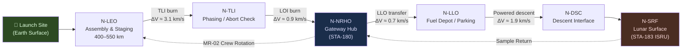

# STA 180-189 · Section 08 · Subsection 181 · Subsubject 002 — Cis-Lunar Logistics Domain and Mission Roles

## 1. Purpose

Defines the spatial domain of cis-lunar logistics operations and specifies the mission roles performed at each node within the logistics chain, from LEO assembly orbit through lunar surface delivery[^baseline][^n001]. This subsubject establishes the node-role assignment framework that governs mission planning, traffic scheduling, cargo manifest routing, and contingency escalation across subsection `181`. Each spatial node carries a defined set of logistics functions; no node shall perform functions outside its authorised role set without an approved baseline change request (BCR).

This subsubject is designated **cis-lunar logistics critical**. The `no_aaa_rule` applies: no spatial node, mission role, or vehicle identifier shall use "AAA" as a designator.

## 2. Scope

- **LEO assembly orbit**: aggregation, checkout, propellant loading, launch vehicle payload integration
- **TLI staging node**: trans-lunar injection burn execution, phasing orbit management, abort window assessment
- **NRHO/LLO Gateway (STA-180)**: crew transfer, cargo trans-shipment, propellant offload and resupply, communications relay hub
- **Descent/ascent interface**: landing system docking/separation, surface delivery handover, ascent vehicle propellant pre-positioning
- **Lunar surface node**: resource extraction interface (STA-183 ISRU), surface depot operations, sample return packaging
- **Mission role types**: resupply mission, crew rotation, science payload delivery, propellant ferry, emergency supply
- **Role assignment authority**: ORB-PMO assigns roles to nodes; changes require CCB approval
- **Role interdependencies**: NRHO gateway role depends on LEO depot readiness and TLI execution; descent interface depends on gateway propellant stock
- **Node capability envelope**: each node characterised by docking port count, power availability, cryogenic storage capacity, and communications coverage
- **Exclusion of dual-role conflicts**: no single vehicle shall simultaneously serve as transfer vehicle and depot node without explicit authority

## 3. Spatial Domain and Mission Roles

### 3.1 Node Definitions

| Node ID | Name | Orbit / Location | Primary Mission Roles |
|---|---|---|---|
| N-LEO | LEO Assembly Orbit | 400–550 km circular, 51.6° inclination | Aggregation, checkout, initial fuelling |
| N-TLI | TLI Staging | HEO or direct from N-LEO | TLI burn execution, phasing, abort assessment |
| N-NRHO | NRHO Gateway Hub | NRHO (9:2 resonance, 3000×71000 km) | Crew transfer, cargo trans-shipment, refuelling hub |
| N-LLO | LLO Parking / Fuel Depot | 100 km circular LLO | Descent vehicle propellant pre-positioning, parking |
| N-DSC | Descent/Ascent Interface | Powered descent initiation altitude | Surface delivery handover, ascent vehicle refuelling |
| N-SRF | Lunar Surface Node | Lunar surface (site-dependent) | ISRU interface (STA-183), surface depot, sample return |

### 3.2 Mission Role Definitions

| Role ID | Role Name | Initiating Node | Terminating Node | Critical Path |
|---|---|---|---|---|
| MR-01 | Resupply Mission | N-LEO | N-NRHO or N-SRF | Yes |
| MR-02 | Crew Rotation | N-LEO | N-NRHO | Yes |
| MR-03 | Science Payload Delivery | N-LEO | N-SRF | No |
| MR-04 | Propellant Ferry | N-LEO | N-LLO | Yes |
| MR-05 | Emergency Supply | N-LEO | N-NRHO or N-SRF | Yes (priority) |

## 4. Domain Map Diagram

## 5. Footprint

| Metric | Value |
|---|---|
| Architecture | `STA` — Space Technology Architecture |
| Master range | `100–199` |
| Code range | `180-189` |
| Section | `08` — Infraestructura y Logística Espacial |
| Subsection | `181` — Logística Cis-Lunar |
| Subsubject | `002` — Cis-Lunar Logistics Domain and Mission Roles |
| Primary Q-Division | Q-SPACE[^qdiv] |
| Support Q-Divisions | Q-DATAGOV, Q-HPC, Q-HORIZON, Q-GREENTECH, Q-INDUSTRY |
| ORB support | ORB-PMO, ORB-LEG |
| Governance class | `baseline`[^gov] |
| Folder path | `Q+ATLANTIDE/100-199_STA/180-189_Infraestructura-y-Logistica-Espacial/181_Logistica-Cis-Lunar/` |
| Document | `002_Cis-Lunar-Logistics-Domain-and-Mission-Roles.md` (this file) |
| Parent subsection | [`README.md`](./README.md) · [`000_Overview.md`](./000_Overview.md) |
| Parent section | [`../README.md`](../README.md) |
| Parent architecture | [`../../README.md`](../../README.md) |
| Parent baseline | [`organization/Q+ATLANTIDE.md`](../../../../organization/Q+ATLANTIDE.md) |

## 6. References & Citations

[^baseline]: **Q+ATLANTIDE controlled baseline (v1.0.0)** — [`organization/Q+ATLANTIDE.md`](../../../../organization/Q+ATLANTIDE.md). Defines the controlled `000-999` architecture-band taxonomy and the ATLAS-1000 register subpart.

[^archtable]: **STA §3 Architecture Table** — [`../../README.md` §3](../../README.md#3-architecture-table). Authoritative source for the `180-189` row.

[^qdiv]: **Q-Division authority** — Q-Divisions provide technical authority over an architecture row (Q+ATLANTIDE Note N-002). See [`organization/Q+ATLANTIDE.md` §4](../../../../organization/Q+ATLANTIDE.md#4-notes).

[^gov]: **Governance class** — `baseline` denotes documents under controlled change management within the Q+ATLANTIDE baseline.

[^n001]: **Note N-001** — Q+ATLANTIDE (with its ATLAS-1000 register subpart) is a taxonomy and traceability ecosystem, not an organization chart. See [`organization/Q+ATLANTIDE.md` §4](../../../../organization/Q+ATLANTIDE.md#4-notes).

### Applicable Industry Standards

| Standard | Issuing Body | Edition | Scope | Applicability to STA-181.002 |
|---|---|---|---|---|
| ECSS-E-ST-60C | ESA/ECSS | 2013 | GNC | Node-to-node trajectory definitions |
| Artemis Accords | NASA/Partner Agencies | 2020 | Cis-lunar policy | Mission role framework |
| NASA SP-2016-6105 Rev2 | NASA | 2016 | SE Handbook | Domain node architecture |
| NASA-STD-3001 Vol.1 | NASA | 2015 | Human integration | Crew node role constraints |
| ECSS-M-ST-10C Rev.1 | ESA/ECSS | 2009 | Project planning | Mission role assignment governance |
