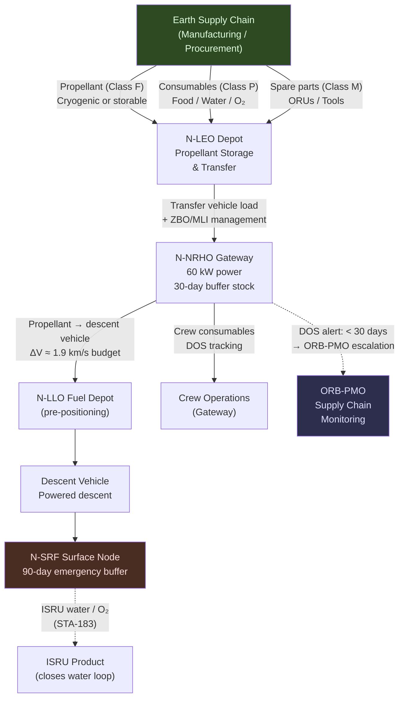

# STA 180-189 · Section 08 · Subsection 181 · Subsubject 005 — Propellant, Water, Power and Consumables Logistics

## 1. Purpose

Defines the logistics architecture for propellant, water, electrical power, and all consumable supplies required to sustain cis-lunar logistics operations within the Q+ATLANTIDE programme[^baseline][^n001]. Covers propellant type selection and supply chain management, boil-off mitigation strategies, water supply chain (potable and hygiene), power availability at depot nodes, and the full consumables flow model with days-of-supply (DOS) margin requirements. This subsubject provides the mass budget inputs for the transfer architecture in [`003`](./003_Earth-Orbit-Lunar-Orbit-Transfer-Architecture.md) and the contingency planning baseline for [`008`](./008_Supply-Chain-Resilience-and-Contingency-Operations.md).

This subsubject is designated **cis-lunar logistics critical**. Propellant and consumables logistics failures are potential mission-ending events; all supply chains shall maintain the minimum DOS margins specified herein, and all deviations require immediate ORB-PMO escalation.

## 2. Scope

- **Propellant types**: cryogenic LH₂/LOX (Isp ≈ 450 s), storable hypergolics (NTO/MMH, Isp ≈ 315 s), cryogenic LCH₄/LOX (Isp ≈ 380 s), xenon/krypton for electric propulsion (EP, Isp 1,500–10,000 s)
- **Boil-off mitigation**: passive multi-layer insulation (MLI, boil-off rate 0.1–0.5 %/day LH₂), active zero-boil-off (ZBO) with cryocoolers (power 100–500 W/kW stored), trade between ZBO energy cost and propellant mass loss per transfer duration
- **Cryogenic transfer protocols**: chilldown sequence, two-phase flow management, mass accounting via flow meters, post-transfer vent management
- **Water supply chain**: potable water (1.8 kg/person/day minimum per NASA-STD-3001), hygiene water (0.5 kg/person/day), ECLSS water recovery rate target ≥ 90%, make-up supply rate per resupply mission
- **Power availability at depot nodes**: solar array sizing for LEO depot (10 kW BOL), NRHO gateway power (60 kW BOL from PPE), battery buffer for eclipse periods (LEO: up to 35 min eclipse per orbit)
- **Consumables flow categories**: food provisions (1.8 kg/person/day, 28-day packaging cycles), oxygen (0.84 kg/person/day), nitrogen (leak make-up), spare parts (ORU category), medical supplies (mission phase-dependent)
- **Days-of-supply (DOS) margin requirements**: nominal operations — 30-day buffer at each crewed node; contingency operations — 60-day buffer; emergency baseline — 90-day buffer (non-waivable)
- **Supply rate modelling**: crewed node consumption rate = crew size × individual rates × activity factor (1.0–1.3 depending on EVA schedule)
- **Cryogenic depot sizing**: tank sizing trade for LH₂/LOX (ullage fraction 5%, thermal mass, interface mass); storable propellant tanks (pressurisation system, PMD, leak detection)
- **Waste stream management**: solid waste (0.12 kg/person/day), liquid waste (ECLSS input), off-gas management — these drive return cargo and depot environmental control sizing

## 3. Consumables Supply Chain Diagram

## 4. DOS Margin Requirements

| Node | Consumable Category | Nominal Buffer | Contingency Buffer | Emergency Buffer |
|---|---|---|---|---|
| N-LEO Depot | Propellant | 15% above manifest | 25% above manifest | 30% above manifest |
| N-NRHO Gateway | Crew provisions (food/water/O₂) | 30 days | 60 days | 90 days |
| N-NRHO Gateway | Propellant | 20% above mission plan | 35% above mission plan | 50% above mission plan |
| N-SRF Surface | All crew consumables | 30 days | 60 days | 90 days |

## 5. Footprint

| Metric | Value |
|---|---|
| Architecture | `STA` — Space Technology Architecture |
| Master range | `100–199` |
| Code range | `180-189` |
| Section | `08` — Infraestructura y Logística Espacial |
| Subsection | `181` — Logística Cis-Lunar |
| Subsubject | `005` — Propellant, Water, Power and Consumables Logistics |
| Primary Q-Division | Q-SPACE[^qdiv] |
| Support Q-Divisions | Q-DATAGOV, Q-HPC, Q-HORIZON, Q-GREENTECH, Q-INDUSTRY |
| ORB support | ORB-PMO, ORB-LEG |
| Governance class | `baseline`[^gov] |
| Folder path | `Q+ATLANTIDE/100-199_STA/180-189_Infraestructura-y-Logistica-Espacial/181_Logistica-Cis-Lunar/` |
| Document | `005_Propellant-Water-Power-and-Consumables-Logistics.md` (this file) |
| Parent subsection | [`README.md`](./README.md) · [`000_Overview.md`](./000_Overview.md) |
| Parent section | [`../README.md`](../README.md) |
| Parent architecture | [`../../README.md`](../../README.md) |
| Parent baseline | [`organization/Q+ATLANTIDE.md`](../../../../organization/Q+ATLANTIDE.md) |

## 6. References & Citations

[^baseline]: **Q+ATLANTIDE controlled baseline (v1.0.0)** — [`organization/Q+ATLANTIDE.md`](../../../../organization/Q+ATLANTIDE.md). Defines the controlled `000-999` architecture-band taxonomy and the ATLAS-1000 register subpart.

[^archtable]: **STA §3 Architecture Table** — [`../../README.md` §3](../../README.md#3-architecture-table). Authoritative source for the `180-189` row.

[^qdiv]: **Q-Division authority** — Q-Divisions provide technical authority over an architecture row (Q+ATLANTIDE Note N-002). See [`organization/Q+ATLANTIDE.md` §4](../../../../organization/Q+ATLANTIDE.md#4-notes).

[^gov]: **Governance class** — `baseline` denotes documents under controlled change management within the Q+ATLANTIDE baseline.

[^n001]: **Note N-001** — Q+ATLANTIDE (with its ATLAS-1000 register subpart) is a taxonomy and traceability ecosystem, not an organization chart. See [`organization/Q+ATLANTIDE.md` §4](../../../../organization/Q+ATLANTIDE.md#4-notes).

### Applicable Industry Standards

| Standard | Issuing Body | Edition | Scope | Applicability to STA-181.005 |
|---|---|---|---|---|
| ECSS-E-ST-35C | ESA/ECSS | 2011 | Propulsion | Propellant system design and logistics |
| NASA-STD-3001 Vol.1 & 2 | NASA | 2015 | Human integration | Crew consumable rates and water standards |
| ECSS-E-ST-20C | ESA/ECSS | 2008 | Electrical power | Depot node power sizing |
| NASA/TP-2014-216648 | NASA | 2014 | Cryogenic fluid management | ZBO vs passive insulation trade |
| ECSS-E-ST-34C | ESA/ECSS | 2008 | Environmental control | ECLSS water recovery and make-up logistics |
