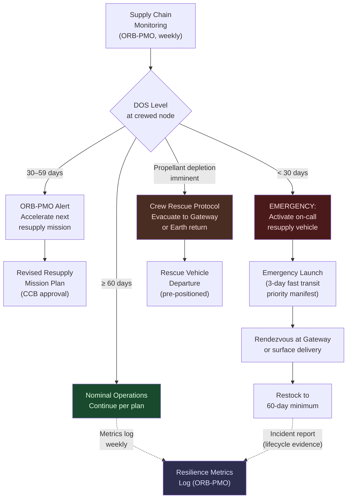

# STA 180-189 · Section 08 · Subsection 181 · Subsubject 008 — Supply Chain Resilience and Contingency Operations

## 1. Purpose

Defines the supply chain risk assessment framework, minimum reserve requirements, emergency resupply mission architecture, and contingency escalation procedures for cis-lunar logistics operations within the Q+ATLANTIDE programme[^baseline][^n001]. Establishes the failure modes and effects framework for logistics shortfalls, crew rescue logistics protocol, and the supply chain resilience metrics used for ongoing mission assurance. This subsubject is the primary reference for contingency logistics planning and must be read together with the DOS margin requirements in [`005`](./005_Propellant-Water-Power-and-Consumables-Logistics.md) and the rendezvous scheduling framework in [`007`](./007_Traffic-Coordination-Rendezvous-and-Schedule-Control.md).

This subsubject is designated **cis-lunar logistics critical**. All contingency plans, escalation thresholds, and minimum reserve requirements defined herein are non-waivable without explicit ORB-PMO approval and CCB change authority.

## 2. Scope

- **Supply chain risk assessment**: identification of single-point failures in the logistics chain (launch vehicle failure, transfer vehicle anomaly, depot node failure, docking failure, surface delivery failure), risk severity and likelihood classification
- **Minimum days-of-supply reserves**: 30-day nominal contingency stock at each crewed node; 60-day extended contingency; 90-day emergency baseline (non-waivable per [`005`](./005_Propellant-Water-Power-and-Consumables-Logistics.md))
- **Emergency resupply missions**: fast-transit trajectory options (direct ascent to NRHO, 3-day transit), priority manifest structure (life-critical items only), launch readiness requirements for on-call emergency vehicle
- **Failure mode effects for logistics shortfalls**: propellant depletion (mission abort, crew rescue trigger), food/water shortage (immediate ration enforcement, accelerated resupply), medical emergency (emergency return or forward supply)
- **Crew rescue logistics**: crew rescue vehicle readiness requirements, evacuation from surface to Gateway trajectory, emergency return to Earth timeline, rescue vehicle manifest (crew consumables only, minimal mass)
- **Abort supply scenarios**: abort from TLI coast (consumables for 3-day return), abort from NRHO (consumables for 30-day hold), abort from lunar surface (ascent vehicle propellant pre-positioned)
- **Supply chain resilience metrics**: on-time delivery rate (target ≥ 95%), manifest accuracy rate (target 100%), DOS utilisation rate (actual consumed / planned ratio, target 0.7–0.9), schedule margin consumption rate
- **Contingency stock governance**: contingency stock levels reported to ORB-PMO weekly; depletion below 60-day threshold triggers ORB-PMO alert; depletion below 30-day threshold triggers mandatory emergency resupply activation
- **Logistics failure mode catalogue**: maintained as a controlled lifecycle evidence artefact, reviewed at each mission phase gate
- **No-AAA rule**: all contingency mission identifiers, failure mode IDs, and escalation case labels shall not use "AAA" as a designator

## 3. Contingency Logistics Decision Tree

## 4. Logistics Failure Mode Summary

| Failure Mode | Severity | Trigger Condition | Contingency Response |
|---|---|---|---|
| Launch vehicle failure | Critical | Launch failure, no delivery | Activate emergency resupply; assess DOS margin |
| Transfer vehicle anomaly (en route) | Critical | Mid-course failure, cargo lost | Emergency resupply; crew abort if crewed vehicle |
| Depot node docking failure | High | Docking failure, cargo inaccessible | HAM withdrawal; retry with backup docking port |
| Propellant depletion at depot | Critical | < 30-day descent propellant at LLO | Halt descent operations; crew rescue protocol |
| Food/water shortage at Gateway | Critical | < 30-day DOS | Ration enforcement; immediate emergency resupply |
| ECLSS failure (water recovery) | High | Recovery efficiency < 80% | Increase water delivery frequency; activate 90-day reserve |
| Surface delivery failure (landing failure) | Critical | Descent vehicle lost | Crew rescue to Gateway; abort surface mission |

## 5. Footprint

| Metric | Value |
|---|---|
| Architecture | `STA` — Space Technology Architecture |
| Master range | `100–199` |
| Code range | `180-189` |
| Section | `08` — Infraestructura y Logística Espacial |
| Subsection | `181` — Logística Cis-Lunar |
| Subsubject | `008` — Supply Chain Resilience and Contingency Operations |
| Primary Q-Division | Q-SPACE[^qdiv] |
| Support Q-Divisions | Q-DATAGOV, Q-HPC, Q-HORIZON, Q-GREENTECH, Q-INDUSTRY |
| ORB support | ORB-PMO, ORB-LEG |
| Governance class | `baseline`[^gov] |
| Folder path | `Q+ATLANTIDE/100-199_STA/180-189_Infraestructura-y-Logistica-Espacial/181_Logistica-Cis-Lunar/` |
| Document | `008_Supply-Chain-Resilience-and-Contingency-Operations.md` (this file) |
| Parent subsection | [`README.md`](./README.md) · [`000_Overview.md`](./000_Overview.md) |
| Parent section | [`../README.md`](../README.md) |
| Parent architecture | [`../../README.md`](../../README.md) |
| Parent baseline | [`organization/Q+ATLANTIDE.md`](../../../../organization/Q+ATLANTIDE.md) |

## 6. References & Citations

[^baseline]: **Q+ATLANTIDE controlled baseline (v1.0.0)** — [`organization/Q+ATLANTIDE.md`](../../../../organization/Q+ATLANTIDE.md). Defines the controlled `000-999` architecture-band taxonomy and the ATLAS-1000 register subpart.

[^archtable]: **STA §3 Architecture Table** — [`../../README.md` §3](../../README.md#3-architecture-table). Authoritative source for the `180-189` row.

[^qdiv]: **Q-Division authority** — Q-Divisions provide technical authority over an architecture row (Q+ATLANTIDE Note N-002). See [`organization/Q+ATLANTIDE.md` §4](../../../../organization/Q+ATLANTIDE.md#4-notes).

[^gov]: **Governance class** — `baseline` denotes documents under controlled change management within the Q+ATLANTIDE baseline.

[^n001]: **Note N-001** — Q+ATLANTIDE (with its ATLAS-1000 register subpart) is a taxonomy and traceability ecosystem, not an organization chart. See [`organization/Q+ATLANTIDE.md` §4](../../../../organization/Q+ATLANTIDE.md#4-notes).

### Applicable Industry Standards

| Standard | Issuing Body | Edition | Scope | Applicability to STA-181.008 |
|---|---|---|---|---|
| ECSS-Q-ST-30C | ESA/ECSS | 2008 | Dependability (FMEA) | Logistics failure mode catalogue |
| NASA-STD-3001 Vol.1 & 2 | NASA | 2015 | Human integration | DOS minimum requirements |
| ECSS-M-ST-10C Rev.1 | ESA/ECSS | 2009 | Project planning | Contingency plan structure |
| NASA SP-2016-6105 Rev2 | NASA | 2016 | SE Handbook | Risk classification methodology |
| ISO 31000:2018 | ISO | 2018 | Risk management | Supply chain risk framework |
