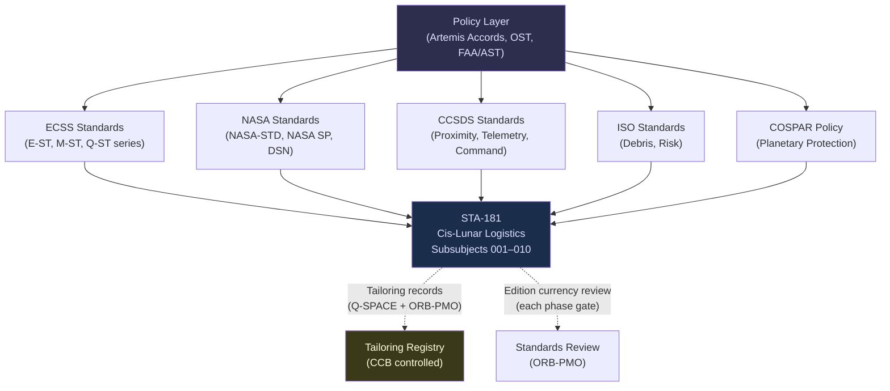

# STA 180-189 · Section 08 · Subsection 181 · Subsubject 009 — ECSS / NASA / CCSDS Cis-Lunar Standards Mapping

## 1. Purpose

Provides the authoritative standards mapping for all ECSS, NASA, CCSDS, ISO, and policy standards applicable to cis-lunar logistics operations within the Q+ATLANTIDE programme[^baseline][^n001]. Each entry maps a standard to its issuing body, edition, scope, and specific applicability within subsection `181`. This subsubject is the reference baseline for standards compliance evidence and shall be consulted during all phase gate reviews for the logistics chain. It is maintained as a controlled lifecycle evidence artefact under ORB-PMO authority.

This subsubject is designated **cis-lunar logistics critical**. Standards mapping changes require CCB approval; no standard shall be removed or replaced without an approved BCR and documented rationale.

## 2. Scope

- **ECSS standards coverage**: engineering (E-ST series), management (M-ST series), quality (Q-ST series) — all applicable sub-disciplines of cis-lunar logistics
- **NASA standards and handbooks**: human integration, fracture control, systems engineering, cryogenic fluid management, flammability, toxicity
- **CCSDS standards**: proximity operations, telemetry/command, deep space communication scheduling
- **ISO standards**: risk management, debris mitigation, planetary protection
- **Policy frameworks**: Artemis Accords, Outer Space Treaty, FAA/AST commercial launch licensing, COSPAR planetary protection
- **Mapping dimensions**: issuing body, edition/year, scope summary, specific applicability to STA-181 subsubjects
- **Standards governance**: standards edition currency review at each phase gate; superseded editions require BCR before substitution
- **Tailoring records**: any standard applied with tailoring shall have a tailoring record approved by Q-SPACE and ORB-PMO
- **New standard capture process**: newly published standards identified as applicable shall be assessed within 90 days and added to this mapping by BCR
- **Exclusions**: standards applicable only to launch vehicles (not transfer vehicles) are out of scope; standards applicable only to interplanetary missions beyond lunar SOI are out of scope

## 3. Standards Mapping Table

| Standard | Issuing Body | Edition | Scope | Applicability to STA-181 |
|---|---|---|---|---|
| ECSS-E-ST-60C | ESA/ECSS | 2013 | GNC — Guidance Navigation and Control | Transfer orbit design (STA-181.003), rendezvous phases (STA-181.007) |
| ECSS-E-ST-35C | ESA/ECSS | 2011 | Space engineering — Propulsion | Propellant system logistics (STA-181.005), propellant transfer protocols (STA-181.004) |
| ECSS-E-ST-20C | ESA/ECSS | 2008 | Space engineering — Electrical power | Depot node power sizing (STA-181.005) |
| ECSS-E-ST-34C | ESA/ECSS | 2008 | Environmental control and life support | ECLSS water recovery logistics (STA-181.005) |
| ECSS-E-ST-33-01C | ESA/ECSS | 2011 | Mechanisms | Docking mechanism interface (STA-181.006) |
| ECSS-E-ST-10-04C | ESA/ECSS | 2011 | Space environment | Radiation on transfer trajectories (STA-181.003) |
| ECSS-M-ST-10C Rev.1 | ESA/ECSS | 2009 | Project planning | Mission role assignment governance (STA-181.002), contingency plans (STA-181.008) |
| ECSS-M-ST-40C | ESA/ECSS | 2009 | Configuration management | Cargo manifest configuration control (STA-181.004) |
| ECSS-Q-ST-20C | ESA/ECSS | 2009 | Dependability | Logistics reliability definitions (STA-181.001) |
| ECSS-Q-ST-30C | ESA/ECSS | 2008 | Risk management (FMEA) | Logistics failure mode catalogue (STA-181.008) |
| CCSDS 910.11-B-1 | CCSDS | 2012 | Rendezvous and Proximity Operations | Gateway/depot rendezvous phases (STA-181.007) |
| NASA DSN 810-005 | NASA/JPL | 2022 | Deep Space Network | Ground contact scheduling (STA-181.007) |
| Artemis Accords | NASA/Partner Agencies | 2020 | Cis-lunar operations policy | Operational framework across all STA-181 |
| NASA SP-2016-6105 Rev2 | NASA | 2016 | SE Handbook | Architecture methodology across all STA-181 |
| NASA-STD-3001 Vol.1 & 2 | NASA | 2015 | Human factors integration | Crew consumable rates (STA-181.005), DOS minimums (STA-181.008) |
| NASA-STD-5019 | NASA | 2019 | Fracture control | Transfer vehicle structural integrity (STA-181.003, STA-181.007) |
| NASA-STD-6001B | NASA | 2016 | Flammability and toxicity | Surface/pressurised cargo handling (STA-181.006) |
| NASA/TP-2014-216648 | NASA | 2014 | Cryogenic fluid management | ZBO vs MLI trade (STA-181.005) |
| ISO 24113:2019 | ISO | 2019 | Space debris mitigation | Depot node and transfer vehicle disposal (STA-181.004) |
| ISO 31000:2018 | ISO | 2018 | Risk management | Supply chain risk framework (STA-181.008) |
| COSPAR PP Policy | COSPAR | 2020 | Planetary protection | Lunar surface payload classification (STA-181.001, STA-181.006) |
| Outer Space Treaty | UN | 1967 | International space law | Regulatory anchor (STA-181.001) |
| FAA/AST 14 CFR Part 460 | FAA | 2006 | Commercial human space flight | Launch vehicle licensing (STA-181.002 launch nodes) |
| IATA DGR | IATA | 2024 | Dangerous goods | Class F (propellant) manifest requirements (STA-181.004) |
| IDSS Rev.F | NASA/ISS Partners | 2016 | International Docking System Standard | All docking interfaces (STA-181.006) |

## 4. Standards Governance Hierarchy Diagram

## 5. Footprint

| Metric | Value |
|---|---|
| Architecture | `STA` — Space Technology Architecture |
| Master range | `100–199` |
| Code range | `180-189` |
| Section | `08` — Infraestructura y Logística Espacial |
| Subsection | `181` — Logística Cis-Lunar |
| Subsubject | `009` — ECSS / NASA / CCSDS Cis-Lunar Standards Mapping |
| Primary Q-Division | Q-SPACE[^qdiv] |
| Support Q-Divisions | Q-DATAGOV, Q-HPC, Q-HORIZON, Q-GREENTECH, Q-INDUSTRY |
| ORB support | ORB-PMO, ORB-LEG |
| Governance class | `baseline`[^gov] |
| Folder path | `Q+ATLANTIDE/100-199_STA/180-189_Infraestructura-y-Logistica-Espacial/181_Logistica-Cis-Lunar/` |
| Document | `009_ECSS-NASA-CCSDS-Cis-Lunar-Standards-Mapping.md` (this file) |
| Parent subsection | [`README.md`](./README.md) · [`000_Overview.md`](./000_Overview.md) |
| Parent section | [`../README.md`](../README.md) |
| Parent architecture | [`../../README.md`](../../README.md) |
| Parent baseline | [`organization/Q+ATLANTIDE.md`](../../../../organization/Q+ATLANTIDE.md) |

## 6. References & Citations

[^baseline]: **Q+ATLANTIDE controlled baseline (v1.0.0)** — [`organization/Q+ATLANTIDE.md`](../../../../organization/Q+ATLANTIDE.md). Defines the controlled `000-999` architecture-band taxonomy and the ATLAS-1000 register subpart.

[^archtable]: **STA §3 Architecture Table** — [`../../README.md` §3](../../README.md#3-architecture-table). Authoritative source for the `180-189` row.

[^qdiv]: **Q-Division authority** — Q-Divisions provide technical authority over an architecture row (Q+ATLANTIDE Note N-002). See [`organization/Q+ATLANTIDE.md` §4](../../../../organization/Q+ATLANTIDE.md#4-notes).

[^gov]: **Governance class** — `baseline` denotes documents under controlled change management within the Q+ATLANTIDE baseline.

[^n001]: **Note N-001** — Q+ATLANTIDE (with its ATLAS-1000 register subpart) is a taxonomy and traceability ecosystem, not an organization chart. See [`organization/Q+ATLANTIDE.md` §4](../../../../organization/Q+ATLANTIDE.md#4-notes).
