# STA 180-189 · Section 08 · Subsection 181 · Subsubject 010 — Traceability, Evidence and Lifecycle Governance

## 1. Purpose

Defines the requirements traceability framework, evidence package types, lifecycle phase structure, phase gate criteria, change authority hierarchy, and logistics performance metrics governing all cis-lunar logistics activities within the Q+ATLANTIDE programme[^baseline][^n001]. This subsubject is the capstone governance document for subsection `181` — it provides the traceability architecture linking all `181.000`–`181.009` subsubjects to the controlled Q+ATLANTIDE baseline and to mission lifecycle events.

All cis-lunar logistics elements shall maintain a complete and auditable requirements traceability matrix (RTM) from the top-level mission architecture through to individual logistics element specifications. Evidence packages are mandatory lifecycle artefacts; no phase gate shall be passed without the prescribed evidence closure. The `no_aaa_rule` applies to all requirements identifiers, evidence package IDs, and lifecycle artefact designators.

## 2. Scope

- **Requirements traceability**: RTM structure from mission-level logistics requirements → system-level logistics architecture → element-level design specifications → verification evidence
- **Traceability coverage**: every subsubject `001`–`009` shall be traceable to at least one mission-level logistics requirement and one applicable standard from [`009`](./009_ECSS-NASA-CCSDS-Cis-Lunar-Standards-Mapping.md)
- **Evidence package types**: mission design analyses, trajectory simulation reports, propellant budget analyses, cargo manifest audits, schedule compliance reports, FMEA/FMECA closure records, ICD approval records, CCB meeting minutes
- **Lifecycle phases**: Phase 0 (Mission Concept) → Phase A (Feasibility) → Phase B (Preliminary Design) → Phase C (Detailed Design) → Phase D (Manufacture and Integration) → Phase E (Operations) → Phase F (Disposal)
- **Phase gate criteria**: System Requirements Review (SRR), Mission Definition Review (MDR), Preliminary Design Review (PDR), Critical Design Review (CDR), Launch Readiness Review (LRR), Mission Operations Review (MOR), End-of-Mission Review (EMR)
- **Change authority hierarchy**: Class 1 (mission-critical) changes require CCB + Q-SPACE + ORB-PMO; Class 2 (significant) changes require CCB + Q-SPACE; Class 3 (minor) changes require Q-SPACE authority only
- **BCR process**: Baseline Change Request (BCR) shall document: change description, affected STA-181 subsubjects, impact assessment (mass, cost, schedule, safety), disposition, and approval record
- **Logistics performance metrics**: on-time delivery rate (target ≥ 95%), manifest accuracy rate (target 100%), DOS utilisation rate (target 0.7–0.9), schedule margin consumption rate (< 50% at CDR), traceability closure rate (100% at each gate)
- **Lifecycle evidence repository**: all evidence artefacts are stored in the ORB-PMO-controlled baseline document system; artefacts shall not be deleted; superseded versions are archived with supersession records
- **No-AAA rule**: all requirements IDs, evidence package identifiers, BCR numbers, and artefact designators shall not use "AAA" as a designator

## 3. Lifecycle Phase Gate Diagram

```mermaid
flowchart LR
    PH0["Phase 0\nMission Concept\n(SRR)"] -->|"RTM seed\nConcept-level manifest"| PHA["Phase A\nFeasibility\n(MDR)"]
    PHA -->|"Transfer arch. analysis\nDOS model v1"| PHB["Phase B\nPreliminary Design\n(PDR)"]
    PHB -->|"Propellant budget v1\nICD drafts\nFMEA initiation"| PHC["Phase C\nDetailed Design\n(CDR)"]
    PHC -->|"ICD approvals\nFMEA closure\nManifest baseline"| PHD["Phase D\nManufacture & Integration\n(LRR)"]
    PHD -->|"Cargo manifest final\nDOS stock confirmed\nTraffic plan approved"| PHE["Phase E\nOperations\n(MOR)"]
    PHE -->|"Mission ops evidence\nDOS utilisation log\nTraffic log"| PHF["Phase F\nDisposal\n(EMR)"]

    PH0 -.->|"BCR register\nopened"| BCR["BCR Register\n(CCB controlled)"]
    PHC -.->|"CDR evidence\npackage closed"| EVID["Evidence Repository\n(ORB-PMO)"]
    PHE -.->|"Performance metrics\nweekly report"| METRICS["Logistics Metrics\nDashboard (ORB-PMO)"]
    PHF -.->|"Archive record\n(permanent)"| EVID

    style PH0 fill:#2d4a22,color:#e0ffe0
    style PHF fill:#4a2d22,color:#ffe0e0
    style EVID fill:#2d2d4e,color:#e0e0ff
    style BCR fill:#3a3a1a,color:#ffffe0
```

## 4. Phase Gate Evidence Requirements

| Phase Gate | Required Evidence Artefacts |
|---|---|
| SRR (Phase 0→A) | Mission concept logistics study, initial RTM seed, top-level DOS requirements |
| MDR (Phase A→B) | Feasibility trade study, transfer trajectory options analysis, initial manifest estimates |
| PDR (Phase B→C) | Propellant budget v1, ICD drafts for all node interfaces, FMEA initiation, DOS model validated |
| CDR (Phase C→D) | ICD approvals (all interfaces), FMEA/FMECA closure, manifest baseline, trajectory simulation report, standards compliance matrix |
| LRR (Phase D→E) | Cargo manifest final (CCB approved), DOS stock verification at all crewed nodes, traffic plan approved, launch window analysis confirmed |
| MOR (Phase E ongoing) | DOS utilisation weekly logs, traffic log, manifest accuracy audit, performance metrics dashboard current |
| EMR (Phase F) | End-of-mission evidence package, disposal trajectory verification, archive completion record |

## 5. Logistics Performance Metrics

| Metric | Target | Alert Threshold | Authority |
|---|---|---|---|
| On-time delivery rate | ≥ 95% | < 90% | ORB-PMO |
| Manifest accuracy rate | 100% | Any discrepancy | ORB-PMO |
| DOS utilisation rate | 0.7–0.9 | < 0.7 or > 0.95 | ORB-PMO |
| Schedule margin consumption rate | < 50% at CDR | > 65% at CDR | Q-SPACE + CCB |
| Traceability closure rate | 100% at each gate | < 100% at gate | Q-SPACE |
| FMEA closure rate | 100% at CDR | < 100% at CDR | Q-SPACE + CCB |

## 6. Footprint

| Metric | Value |
|---|---|
| Architecture | `STA` — Space Technology Architecture |
| Master range | `100–199` |
| Code range | `180-189` |
| Section | `08` — Infraestructura y Logística Espacial |
| Subsection | `181` — Logística Cis-Lunar |
| Subsubject | `010` — Traceability, Evidence and Lifecycle Governance |
| Primary Q-Division | Q-SPACE[^qdiv] |
| Support Q-Divisions | Q-DATAGOV, Q-HPC, Q-HORIZON, Q-GREENTECH, Q-INDUSTRY |
| ORB support | ORB-PMO, ORB-LEG |
| Governance class | `baseline`[^gov] |
| Folder path | `Q+ATLANTIDE/100-199_STA/180-189_Infraestructura-y-Logistica-Espacial/181_Logistica-Cis-Lunar/` |
| Document | `010_Traceability-Evidence-and-Lifecycle-Governance.md` (this file) |
| Parent subsection | [`README.md`](./README.md) · [`000_Overview.md`](./000_Overview.md) |
| Parent section | [`../README.md`](../README.md) |
| Parent architecture | [`../../README.md`](../../README.md) |
| Parent baseline | [`organization/Q+ATLANTIDE.md`](../../../../organization/Q+ATLANTIDE.md) |

## 7. References & Citations

[^baseline]: **Q+ATLANTIDE controlled baseline (v1.0.0)** — [`organization/Q+ATLANTIDE.md`](../../../../organization/Q+ATLANTIDE.md). Defines the controlled `000-999` architecture-band taxonomy and the ATLAS-1000 register subpart.

[^archtable]: **STA §3 Architecture Table** — [`../../README.md` §3](../../README.md#3-architecture-table). Authoritative source for the `180-189` row.

[^qdiv]: **Q-Division authority** — Q-Divisions provide technical authority over an architecture row (Q+ATLANTIDE Note N-002). See [`organization/Q+ATLANTIDE.md` §4](../../../../organization/Q+ATLANTIDE.md#4-notes).

[^gov]: **Governance class** — `baseline` denotes documents under controlled change management within the Q+ATLANTIDE baseline.

[^n001]: **Note N-001** — Q+ATLANTIDE (with its ATLAS-1000 register subpart) is a taxonomy and traceability ecosystem, not an organization chart. See [`organization/Q+ATLANTIDE.md` §4](../../../../organization/Q+ATLANTIDE.md#4-notes).

### Applicable Industry Standards

| Standard | Issuing Body | Edition | Scope | Applicability to STA-181.010 |
|---|---|---|---|---|
| ECSS-M-ST-10C Rev.1 | ESA/ECSS | 2009 | Project planning | Lifecycle phase structure, gate criteria |
| ECSS-M-ST-40C | ESA/ECSS | 2009 | Configuration management | BCR process, change authority |
| ECSS-Q-ST-30C | ESA/ECSS | 2008 | Dependability (FMEA) | FMEA evidence closure requirements |
| ECSS-E-ST-10C | ESA/ECSS | 2009 | Systems engineering | RTM structure and traceability |
| NASA SP-2016-6105 Rev2 | NASA | 2016 | SE Handbook | Phase gate criteria and evidence types |
