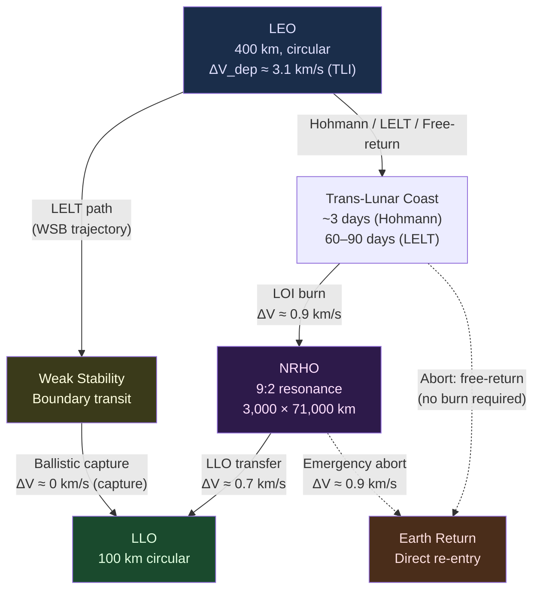

# STA 180-189 · 181-030 — Earth Orbit Lunar Orbit Transfer Architecture

## 1. Purpose

Defines the transfer trajectory architecture for logistics missions between Earth orbit and lunar orbit within the Q+ATLANTIDE cis-lunar programme[^baseline][^n001]. Covers trajectory type selection, transit time versus delta-V trade space, staging orbit selection criteria, trans-lunar injection (TLI) burn performance requirements, lunar orbit insertion (LOI) options, NRHO station-keeping budget, abort trajectory windows, and aerobraking applicability for return missions. This subsubject provides the technical basis for propellant budget sizing in [`005`](./181-050-Propellant-Water-Power-and-Consumables-Logistics.md) and traffic scheduling in [`007`](./181-070-Traffic-Coordination-Rendezvous-and-Schedule-Control.md).

This subsubject is designated **cis-lunar logistics critical**. All transfer trajectory designs shall carry explicit delta-V budgets with margin, abort window documentation, and CCB-controlled trajectory baseline records.

## 2. Scope

- **Hohmann transfer**: minimum-energy two-burn transfer from LEO to LLO, transit time ≈ 3 days, total ΔV ≈ 3.9 km/s
- **Bi-elliptic transfer**: three-burn sequence via high apoapsis, applicable when LEO–LLO Δi > 15°, total ΔV < Hohmann for large plane changes
- **Low-energy lunar transfer (LELT)**: exploits lunar weak stability boundary (WSB), transit time 60–90 days, ΔV saving up to 25% vs Hohmann at cost of transit duration
- **Free-return trajectory**: figure-eight trajectory ensuring passive lunar flyby and return to Earth without propulsion, used for crew safety abort baseline
- **NRHO insertion and maintenance**: LOI to NRHO delta-V ≈ 0.9 km/s; NRHO station-keeping budget ≈ 10 m/s per year (9:2 resonance orbit)
- **Staging orbit selection trade**: LEO (400 km circular) vs high-Earth orbit (HEO) staging — propellant boil-off duration vs launch window frequency vs radiation exposure
- **TLI burn performance**: required C3 energy, injection accuracy requirements (3σ), launch window duration per synodic period
- **LOI options**: direct insertion to LLO; two-burn via LLO → NRHO; aerobraking on return (Earth) — not applicable for lunar orbit insertion (no atmosphere)
- **Abort trajectory windows**: time-critical abort corridors defined for each trajectory type; free-return corridor maintained for crewed missions
- **Aerobraking applicability**: applicable for Earth return of transfer vehicles; not applicable for lunar orbit insertion

## 3. Transfer Trajectory Diagram

## 4. Delta-V Budget Summary

| Transfer Leg | Trajectory Type | ΔV (km/s) | Transit Time | Abort Option |
|---|---|---|---|---|
| LEO → TLI | All | 3.10 | — | Launch abort |
| TLI coast | Hohmann | — | ~3 days | Free-return |
| TLI coast | LELT (WSB) | — | 60–90 days | Limited |
| LOI → NRHO | Direct LOI | 0.90 | — | Abort to LLO |
| NRHO → LLO | Transfer burn | 0.70 | ~1 day | NRHO return |
| LLO → Descent | Powered descent | 1.90 | — | Abort to LLO |
| **Total (crewed, Hohmann)** | — | **~6.6** | ~3 days | Free-return baseline |

## 5. Footprint

| Metric | Value |
|---|---|
| Architecture | `STA` — Space Technology Architecture |
| Master range | `100–199` |
| Code range | `180-189` |
| Section | `08` — Infraestructura y Logística Espacial |
| Subsection | `181` — Logística Cis-Lunar |
| Subsubject | `003` — Earth-Orbit to Lunar-Orbit Transfer Architecture |
| Primary Q-Division | Q-SPACE[^qdiv] |
| Support Q-Divisions | Q-DATAGOV, Q-HPC, Q-HORIZON, Q-GREENTECH, Q-INDUSTRY |
| ORB support | ORB-PMO, ORB-LEG |
| Governance class | `baseline`[^gov] |
| Folder path | `Q+ATLANTIDE/100-199_STA/180-189_Infraestructura-y-Logistica-Espacial/181_Logistica-Cis-Lunar/` |
| Document | `181-030-Earth-Orbit-Lunar-Orbit-Transfer-Architecture.md` (this file) |
| Parent subsection | [`README.md`](./README.md) · [`181-000-General.md`](./181-000-General.md) |
| Parent section | [`../README.md`](../README.md) |
| Parent architecture | [`../../README.md`](../../README.md) |
| Parent baseline | [`organization/Q+ATLANTIDE.md`](../../../../organization/Q+ATLANTIDE.md) |

## 6. References & Citations

[^baseline]: **Q+ATLANTIDE controlled baseline (v1.0.0)** — [`organization/Q+ATLANTIDE.md`](../../../../organization/Q+ATLANTIDE.md). Defines the controlled `000-999` architecture-band taxonomy and the ATLAS-1000 register subpart.

[^archtable]: **STA §3 Architecture Table** — [`../../README.md` §3](../../README.md#3-architecture-table). Authoritative source for the `180-189` row.

[^qdiv]: **Q-Division authority** — Q-Divisions provide technical authority over an architecture row (Q+ATLANTIDE Note N-002). See [`organization/Q+ATLANTIDE.md` §4](../../../../organization/Q+ATLANTIDE.md#4-notes).

[^gov]: **Governance class** — `baseline` denotes documents under controlled change management within the Q+ATLANTIDE baseline.

[^n001]: **Note N-001** — Q+ATLANTIDE (with its ATLAS-1000 register subpart) is a taxonomy and traceability ecosystem, not an organization chart. See [`organization/Q+ATLANTIDE.md` §4](../../../../organization/Q+ATLANTIDE.md#4-notes).

### Applicable Industry Standards

| Standard | Issuing Body | Edition | Scope | Applicability to STA-181.003 |
|---|---|---|---|---|
| ECSS-E-ST-60C | ESA/ECSS | 2013 | GNC | Transfer orbit design, rendezvous sequencing |
| NASA-STD-5019 | NASA | 2019 | Fracture control | Structural margins for transfer vehicles |
| Farquhar/Howell NRHO Research | NASA/Purdue | 2001–2018 | NRHO orbit dynamics | NRHO insertion and maintenance budget |
| NASA ESAS Report | NASA | 2005 | Exploration Systems Architecture | Transfer trajectory trade space |
| ECSS-E-ST-10-04C | ESA/ECSS | 2011 | Space environment | Radiation environment on transfer trajectories |
