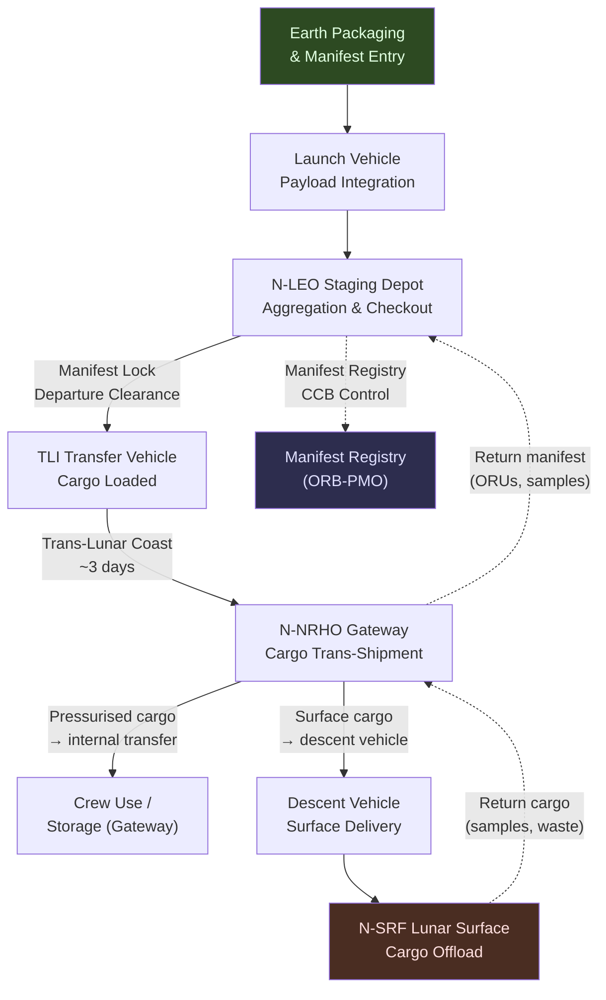

# STA 180-189 · 181-040 — Cargo Transport Staging and Depot Nodes

## 1. Purpose

Defines the cargo transport architecture, container standards, staging sequence, and depot node operations for cis-lunar logistics missions within the Q+ATLANTIDE programme[^baseline][^n001]. Establishes the manifest planning process, cargo accountability procedures, delivery schedule metrics, and propellant transfer protocols at depot nodes. This subsubject is the primary reference for cargo manifest governance and must be read together with the consumables logistics coverage in [`005`](./181-050-Propellant-Water-Power-and-Consumables-Logistics.md) and the interface control requirements in [`006`](./181-060-Lunar-Surface-Orbit-and-Gateway-Interfaces.md).

This subsubject is designated **cis-lunar logistics critical**. All cargo manifests require CCB-controlled baseline records; no cargo shall be launched without a completed, approved manifest. The `no_aaa_rule` applies: no cargo item, container, or manifest identifier shall use "AAA".

## 2. Scope

- **Cargo manifest planning**: mission manifest structure, mass budget allocation, priority ranking (critical/essential/desirable), manifest freeze timeline relative to launch readiness review
- **Container standards**: standard cargo unit (SCU, 0.5 × 0.5 × 0.5 m, max 15 kg), ISS-compatible cargo bag, pressurised cargo transfer bag (CTB), standard launch enclosure (SLE) for unpressurised cargo
- **Cargo classes**: crew provisions (Class P), propellant (Class F), orbital replacement units/ORUs (Class M), scientific payloads (Class S), surface assets (Class T)
- **Pressurised vs unpressurised cargo**: pressurised cargo handled within habitable volume; unpressurised cargo requires EVA or robotic transfer at destination node
- **Staging sequence at LEO depot**: manifest aggregation → checkout scan → mass/CG verification → transfer vehicle load → manifest lock → departure clearance
- **Propellant transfer protocols at depot nodes**: approach and docking, soft capture, seal verification, flow rate control, mass accounting, post-transfer leak check
- **Manifest tracking and cargo accountability**: unique item-level tracking from Earth packaging through destination delivery; manifest discrepancies require immediate ORB-PMO notification
- **Delivery schedule adherence metrics**: on-time delivery rate (target ≥ 95%), manifest accuracy rate (target 100%), cargo accountability closure time (≤ 48 h post-arrival)
- **Return cargo handling**: sample containers, failed ORUs, waste streams — each requiring reverse manifest and hazard classification
- **No-manifest launch prohibition**: no cargo transfer vehicle shall be cleared for launch without a complete, CCB-approved manifest; this rule is not waivable

## 3. Cargo Flow Staging Diagram

## 4. Cargo Container Standards

| Container Type | Dimensions | Max Mass | Cargo Class | Pressurised | Notes |
|---|---|---|---|---|---|
| Standard Cargo Unit (SCU) | 0.5 × 0.5 × 0.5 m | 15 kg | P, M, S | Yes | ISS heritage |
| Cargo Transfer Bag (CTB) | Variable (ISS std.) | 25 kg | P | Yes | Soft-sided |
| Standard Launch Enclosure (SLE) | 0.6 × 0.6 × 1.2 m | 50 kg | M, T | No | Robotic/EVA transfer |
| Propellant Tank Module (PTM) | Mission-specific | Up to 1,000 kg | F | No | Requires propellant transfer protocol |

## 5. Footprint

| Metric | Value |
|---|---|
| Architecture | `STA` — Space Technology Architecture |
| Master range | `100–199` |
| Code range | `180-189` |
| Section | `08` — Infraestructura y Logística Espacial |
| Subsection | `181` — Logística Cis-Lunar |
| Subsubject | `004` — Cargo Transport, Staging and Depot Nodes |
| Primary Q-Division | Q-SPACE[^qdiv] |
| Support Q-Divisions | Q-DATAGOV, Q-HPC, Q-HORIZON, Q-GREENTECH, Q-INDUSTRY |
| ORB support | ORB-PMO, ORB-LEG |
| Governance class | `baseline`[^gov] |
| Folder path | `Q+ATLANTIDE/100-199_STA/180-189_Infraestructura-y-Logistica-Espacial/181_Logistica-Cis-Lunar/` |
| Document | `181-040-Cargo-Transport-Staging-and-Depot-Nodes.md` (this file) |
| Parent subsection | [`README.md`](./README.md) · [`181-000-General.md`](./181-000-General.md) |
| Parent section | [`../README.md`](../README.md) |
| Parent architecture | [`../../README.md`](../../README.md) |
| Parent baseline | [`organization/Q+ATLANTIDE.md`](../../../../organization/Q+ATLANTIDE.md) |

## 6. References & Citations

[^baseline]: **Q+ATLANTIDE controlled baseline (v1.0.0)** — [`organization/Q+ATLANTIDE.md`](../../../../organization/Q+ATLANTIDE.md). Defines the controlled `000-999` architecture-band taxonomy and the ATLAS-1000 register subpart.

[^archtable]: **STA §3 Architecture Table** — [`../../README.md` §3](../../README.md#3-architecture-table). Authoritative source for the `180-189` row.

[^qdiv]: **Q-Division authority** — Q-Divisions provide technical authority over an architecture row (Q+ATLANTIDE Note N-002). See [`organization/Q+ATLANTIDE.md` §4](../../../../organization/Q+ATLANTIDE.md#4-notes).

[^gov]: **Governance class** — `baseline` denotes documents under controlled change management within the Q+ATLANTIDE baseline.

[^n001]: **Note N-001** — Q+ATLANTIDE (with its ATLAS-1000 register subpart) is a taxonomy and traceability ecosystem, not an organization chart. See [`organization/Q+ATLANTIDE.md` §4](../../../../organization/Q+ATLANTIDE.md#4-notes).

### Applicable Industry Standards

| Standard | Issuing Body | Edition | Scope | Applicability to STA-181.004 |
|---|---|---|---|---|
| NASA-STD-3001 Vol.1 | NASA | 2015 | Human integration | Cargo class definitions for crew provisions |
| ECSS-M-ST-40C | ESA/ECSS | 2009 | Configuration management | Cargo manifest configuration control |
| IATA Dangerous Goods Regulations | IATA | 2024 | Hazardous materials | Class F (propellant) manifest requirements |
| NASA SP-2016-6105 Rev2 | NASA | 2016 | SE Handbook | Logistics manifest architecture |
| ECSS-E-ST-35C | ESA/ECSS | 2011 | Propulsion | Propellant transfer protocol standards |
