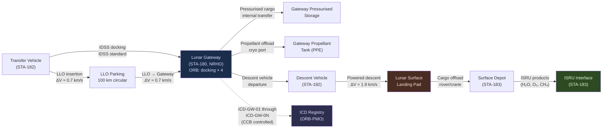

# STA 180-189 · 181-060 — Lunar Surface Orbit and Gateway Interfaces

## 1. Purpose

Defines the interface requirements and control framework between the cis-lunar logistics chain and its three principal termination nodes: the lunar surface, lunar orbit staging, and the Lunar Gateway (STA-180)[^baseline][^n001]. Establishes the interface control document (ICD) requirements, handover protocols, physical and functional interface specifications, and the authority for interface change management. This subsubject is the primary reference for cross-node interface governance and shall be read together with the Gateway architecture in STA-180 [`180_Bases-Orbitales`](../180_Bases-Orbitales/) and the surface resource architecture in STA-183 [`183_Recursos-Espaciales`](../183_Recursos-Espaciales/).

This subsubject is designated **cis-lunar logistics critical**. Interface failures between logistics nodes are a primary failure mode for mission abort and crew safety; all interfaces require validated ICDs before flight operations commence.

## 2. Scope

- **Lunar surface interfaces**: landing pad infrastructure requirements, surface cargo offload sequence (crane/rover interface), surface depot storage constraints, EVA/robotic handling envelope
- **STA-183 ISRU interface**: propellant pre-positioning from ISRU-produced LCH₄/LOX or water electrolysis H₂/O₂, ISRU product quality acceptance criteria, handover protocol to logistics chain
- **LLO parking interface**: LLO parking orbit selection (100 km circular, 90° inclination for polar access), transfer vehicle docking/proximity constraints, orbit maintenance budget, residency time limits
- **Descent/ascent staging orbit**: powered descent initiation altitude (10–15 km), abort-to-orbit manoeuvre constraints, ascent insertion orbit targeting
- **NRHO Gateway docking interfaces**: Gateway docking port assignments (STA-180), soft-capture system compatibility (IDSS standard), pressurised tunnel dimensions, power transfer at docking interface
- **Cargo trans-shipment at Gateway**: pressurised cargo internal transfer crew procedures, unpressurised cargo ERA/Canadarm robotic handling, cargo accountability handover protocol
- **Propellant offload at Gateway**: cryogenic offload through dedicated Gateway propellant transfer port, flow rate and mass accounting, post-offload seal and leak check
- **ICD requirements**: each interface pair shall have an approved ICD covering physical, functional, electrical, thermal, data, and contamination interfaces; ICD approval requires CCB sign-off
- **Handover protocol elements**: cargo manifest transfer, mass accountability confirmation, interface seal verification, communication link confirmation, authority-to-proceed (ATP) handover
- **Interface change management**: interface change requests (ICRs) require dual-node concurrence and ORB-PMO approval; no unilateral interface changes permitted

## 3. Interface Diagram

## 4. Interface Control Summary

| Interface Pair | ICD Identifier | Standard | Approval Authority |
|---|---|---|---|
| Transfer vehicle ↔ Gateway docking port | ICD-GW-DOCK-01 | IDSS Rev.F | ORB-PMO + CCB |
| Gateway ↔ descent vehicle | ICD-GW-DV-01 | IDSS Rev.F | ORB-PMO + CCB |
| Descent vehicle ↔ lunar surface landing pad | ICD-SRF-LP-01 | Mission-specific | ORB-PMO + CCB |
| Surface depot ↔ ISRU product handover | ICD-SRF-ISRU-01 | STA-183 ICD | Q-SPACE + CCB |
| LLO fuel depot ↔ descent vehicle prop port | ICD-LLO-PROP-01 | ECSS-E-ST-35C | ORB-PMO + CCB |

## 5. Footprint

| Metric | Value |
|---|---|
| Architecture | `STA` — Space Technology Architecture |
| Master range | `100–199` |
| Code range | `180-189` |
| Section | `08` — Infraestructura y Logística Espacial |
| Subsection | `181` — Logística Cis-Lunar |
| Subsubject | `006` — Lunar Surface, Orbit and Gateway Interfaces |
| Primary Q-Division | Q-SPACE[^qdiv] |
| Support Q-Divisions | Q-DATAGOV, Q-HPC, Q-HORIZON, Q-GREENTECH, Q-INDUSTRY |
| ORB support | ORB-PMO, ORB-LEG |
| Governance class | `baseline`[^gov] |
| Folder path | `Q+ATLANTIDE/100-199_STA/180-189_Infraestructura-y-Logistica-Espacial/181_Logistica-Cis-Lunar/` |
| Document | `181-060-Lunar-Surface-Orbit-and-Gateway-Interfaces.md` (this file) |
| Parent subsection | [`README.md`](./README.md) · [`181-000-General.md`](./181-000-General.md) |
| Parent section | [`../README.md`](../README.md) |
| Parent architecture | [`../../README.md`](../../README.md) |
| Parent baseline | [`organization/Q+ATLANTIDE.md`](../../../../organization/Q+ATLANTIDE.md) |

## 6. References & Citations

[^baseline]: **Q+ATLANTIDE controlled baseline (v1.0.0)** — [`organization/Q+ATLANTIDE.md`](../../../../organization/Q+ATLANTIDE.md). Defines the controlled `000-999` architecture-band taxonomy and the ATLAS-1000 register subpart.

[^archtable]: **STA §3 Architecture Table** — [`../../README.md` §3](../../README.md#3-architecture-table). Authoritative source for the `180-189` row.

[^qdiv]: **Q-Division authority** — Q-Divisions provide technical authority over an architecture row (Q+ATLANTIDE Note N-002). See [`organization/Q+ATLANTIDE.md` §4](../../../../organization/Q+ATLANTIDE.md#4-notes).

[^gov]: **Governance class** — `baseline` denotes documents under controlled change management within the Q+ATLANTIDE baseline.

[^n001]: **Note N-001** — Q+ATLANTIDE (with its ATLAS-1000 register subpart) is a taxonomy and traceability ecosystem, not an organization chart. See [`organization/Q+ATLANTIDE.md` §4](../../../../organization/Q+ATLANTIDE.md#4-notes).

### Applicable Industry Standards

| Standard | Issuing Body | Edition | Scope | Applicability to STA-181.006 |
|---|---|---|---|---|
| IDSS Rev.F | NASA/ISS Partners | 2016 | Docking system interface | Gateway and descent vehicle docking |
| ECSS-E-ST-35C | ESA/ECSS | 2011 | Propulsion | Propellant transfer port interface |
| ECSS-E-ST-33-01C | ESA/ECSS | 2011 | Mechanisms | Docking mechanism structural interface |
| NASA-STD-6001B | NASA | 2016 | Flammability/toxicity | Surface and pressurised cargo handling |
| Artemis Accords | NASA/Partner Agencies | 2020 | Cis-lunar policy | Surface and orbital operations framework |
