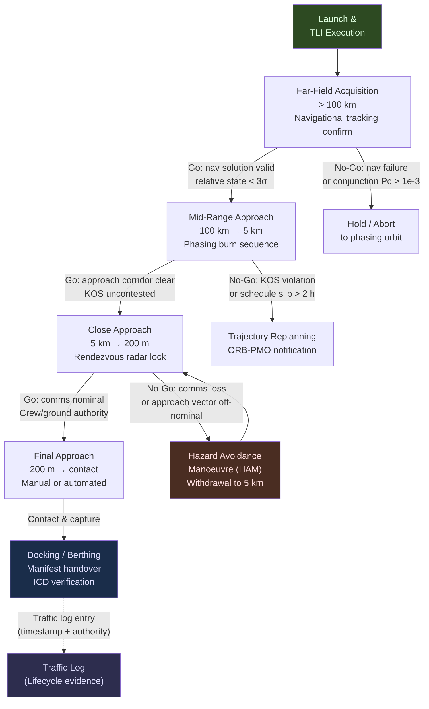

# STA 180-189 · 181-070 — Traffic Coordination Rendezvous and Schedule Control

## 1. Purpose

Defines the cis-lunar traffic management framework, rendezvous phase sequence, and schedule control procedures governing all logistics vehicle operations within cis-lunar space[^baseline][^n001]. Covers launch window planning, phasing orbit management, far-field to final approach rendezvous phases, schedule slip margins, collision avoidance (CARA authority), conjunction assessment procedures, and ground station contact scheduling. This subsubject is the operational complement to the transfer architecture defined in [`003`](./181-030-Earth-Orbit-Lunar-Orbit-Transfer-Architecture.md) and informs the contingency escalation paths in [`008`](./181-080-Supply-Chain-Resilience-and-Contingency-Operations.md).

This subsubject is designated **cis-lunar logistics critical**. The `no_aaa_rule` applies to all traffic identifiers, vehicle designators, rendezvous event labels, and schedule control records — no safety-critical identifier shall use "AAA".

## 2. Scope

- **Launch window planning**: synodic period constraints for cis-lunar transfers, monthly window frequency (~28-day lunar synodic month), window duration (typically 1–5 days per synodic cycle), backup window planning
- **Phasing orbit management**: phasing orbit altitude selection to achieve target rendezvous phasing angle, drift rate calculation, station-keeping during phasing hold
- **Rendezvous sequence phases**: far-field acquisition (> 100 km), mid-range approach (100 km → 5 km), close approach (5 km → 200 m), final approach (200 m → contact), with defined go/no-go criteria at each phase boundary
- **Approach corridor definitions**: permitted approach vectors for each docking port, keep-out sphere (KOS) definitions, hazard avoidance manoeuvre (HAM) authority
- **Schedule slip margin requirements**: TLI window slip tolerance ≤ 24 h without trajectory redesign; LOI slip tolerance ≤ 6 h; rendezvous slip tolerance ≤ 2 h; exceedance requires trajectory replanning
- **Collision avoidance (CARA)**: CARA authority for conjunction assessment in cis-lunar space, probability of collision (Pc) threshold (Pc > 1×10⁻⁴ triggers warning; Pc > 1×10⁻³ triggers mandatory avoidance manoeuvre)
- **Conjunction assessment in cis-lunar space**: NRHO and LLO resident objects, planned and unplanned visitors, tracking data latency constraints (deep space network contact scheduling)
- **Ground station contact scheduling**: DSN station allocation for cis-lunar vehicles, uplink/downlink windows for traffic plan updates, contact frequency requirements during rendezvous phases (minimum: continuous or ≤ 15-min gap)
- **Traffic log requirements**: all manoeuvres, approach phases, and schedule events shall be logged with timestamp and authority sign-off; logs are lifecycle evidence artefacts
- **No-AAA rule application**: vehicle call signs, manoeuvre event IDs, approach phase labels, CARA case IDs shall not use "AAA" as a designator

## 3. Rendezvous Phase Sequence and Go/No-Go Decision Tree

## 4. Footprint

| Metric | Value |
|---|---|
| Architecture | `STA` — Space Technology Architecture |
| Master range | `100–199` |
| Code range | `180-189` |
| Section | `08` — Infraestructura y Logística Espacial |
| Subsection | `181` — Logística Cis-Lunar |
| Subsubject | `007` — Traffic Coordination, Rendezvous and Schedule Control |
| Primary Q-Division | Q-SPACE[^qdiv] |
| Support Q-Divisions | Q-DATAGOV, Q-HPC, Q-HORIZON, Q-GREENTECH, Q-INDUSTRY |
| ORB support | ORB-PMO, ORB-LEG |
| Governance class | `baseline`[^gov] |
| Folder path | `Q+ATLANTIDE/100-199_STA/180-189_Infraestructura-y-Logistica-Espacial/181_Logistica-Cis-Lunar/` |
| Document | `181-070-Traffic-Coordination-Rendezvous-and-Schedule-Control.md` (this file) |
| Parent subsection | [`README.md`](./README.md) · [`181-000-General.md`](./181-000-General.md) |
| Parent section | [`../README.md`](../README.md) |
| Parent architecture | [`../../README.md`](../../README.md) |
| Parent baseline | [`organization/Q+ATLANTIDE.md`](../../../../organization/Q+ATLANTIDE.md) |

## 5. References & Citations

[^baseline]: **Q+ATLANTIDE controlled baseline (v1.0.0)** — [`organization/Q+ATLANTIDE.md`](../../../../organization/Q+ATLANTIDE.md). Defines the controlled `000-999` architecture-band taxonomy and the ATLAS-1000 register subpart.

[^archtable]: **STA §3 Architecture Table** — [`../../README.md` §3](../../README.md#3-architecture-table). Authoritative source for the `180-189` row.

[^qdiv]: **Q-Division authority** — Q-Divisions provide technical authority over an architecture row (Q+ATLANTIDE Note N-002). See [`organization/Q+ATLANTIDE.md` §4](../../../../organization/Q+ATLANTIDE.md#4-notes).

[^gov]: **Governance class** — `baseline` denotes documents under controlled change management within the Q+ATLANTIDE baseline.

[^n001]: **Note N-001** — Q+ATLANTIDE (with its ATLAS-1000 register subpart) is a taxonomy and traceability ecosystem, not an organization chart. See [`organization/Q+ATLANTIDE.md` §4](../../../../organization/Q+ATLANTIDE.md#4-notes).

### Applicable Industry Standards

| Standard | Issuing Body | Edition | Scope | Applicability to STA-181.007 |
|---|---|---|---|---|
| CCSDS 910.11-B-1 | CCSDS | 2012 | Rendezvous and Proximity Operations | Gateway/depot rendezvous phases |
| NASA-STD-5019 | NASA | 2019 | Fracture control | Vehicle structural integrity during approach |
| ECSS-E-ST-60C | ESA/ECSS | 2013 | GNC | Rendezvous GNC design requirements |
| CARA Methodology | NASA/18th Space Control Squadron | 2020 | Conjunction assessment | Cis-lunar conjunction Pc thresholds |
| NASA DSN 810-005 | NASA/JPL | 2022 | Deep Space Network | Ground contact scheduling for cis-lunar ops |
