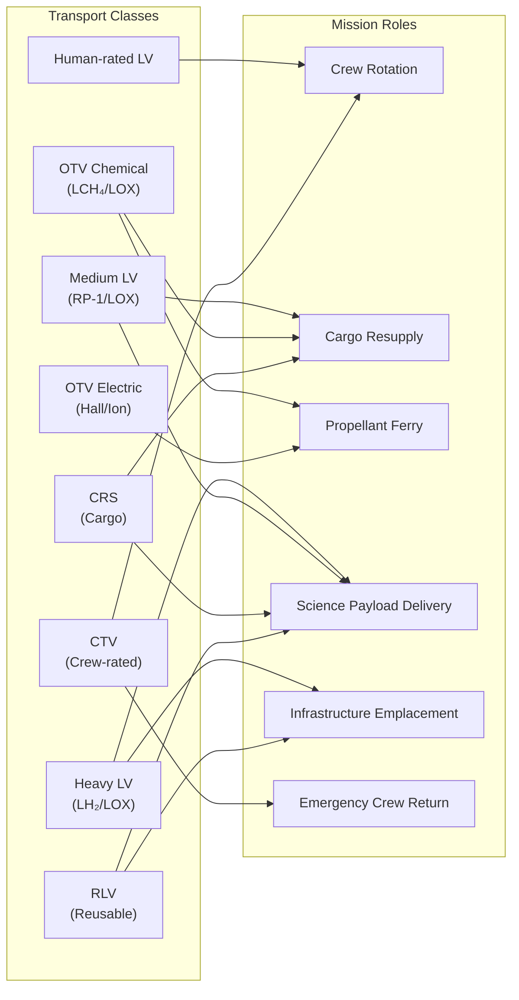

# STA 180-189 · Section 08 · Subsection 182.002 — Space Transport Classes and Mission Roles

## 1. Purpose

This document classifies all space transport vehicles referenced within subsection `182` by technical class and defines the mission roles each class is authorised to fulfil. The classification is normative within the **ATLAS-1000** register[^baseline][^archtable] and drives the selection logic for transport architectures across the Q+ATLANTIDE cis-lunar and deep-space infrastructure.

Classification criteria include crew-rating status, propulsion type, applicable orbit regime, primary and secondary mission roles, and reuse architecture. The `no_aaa_rule` applies: the identifier "AAA" must not be used for any transport class or role identifier.

## 2. Scope

- **Classification axes**: crew-rated (Yes/No), propulsion type (chemical sub-class, electric sub-class), orbit regime (LEO, GTO, NRHO, LLO, DRO, cis-lunar, heliocentric), and primary mission role.
- **Heavy LV** (non-crewed, LH₂/LOX): primary role — high-mass payload delivery to LEO or beyond; representative systems: SLS Block 1/2, Falcon Heavy, Ariane 6 A64.
- **Medium LV** (non-crewed, RP-1/LOX or RP-2/LOX): primary role — satellite delivery to LEO/GTO; representative systems: Falcon 9, Atlas V, Vega-C.
- **Human-rated LV** (crew-rated, chemical): primary role — crew launch to LEO; subject to full NASA-STD-8729.1 compliance, includes abort system authority review.
- **OTV chemical** (non-crewed, LCH₄/LOX): primary role — cargo ferry LEO to NRHO or LLO; delta-V capability ≥ 900 m/s for cis-lunar injection.
- **OTV electric** (non-crewed, Hall thruster or ion engine): primary role — slow-cargo and propellant ferry LEO to GEO or cis-lunar; transit time weeks to months; power requirement ≥ 10 kW continuous.
- **CTV** (crew-rated, chemical): primary role — crew rotation LEO to Gateway or orbital base; must carry full life support and crew escape provisions.
- **CRS** (non-crewed, chemical): primary role — cargo resupply to LEO station or Gateway; pressurised and/or unpressurised cargo variants; automated docking/berthing capability required.
- **RLV** (non-crewed, chemical, CH₄/LOX or RP-2/LOX): primary role — reusable payload delivery LEO; first-stage or full-stack reuse; turnaround time is a key performance parameter.
- **Mission roles**: crew rotation, cargo resupply, propellant ferry, science payload delivery, infrastructure emplacement (module delivery), emergency crew return, debris remediation transport (future capability).
- **Role assignment rules**: a transport class may cover multiple roles only if each role's trajectory, propellant, and interface requirements are simultaneously satisfiable; cross-role manifesting requires explicit CCB approval.
- **Role exclusions**: CTV may not be used as primary cargo ferry without human-rating waiver; OTV electric may not carry time-critical cargo (72 h delivery requirement or tighter).
- **Governance**: all class-to-role assignments are traceable via the transport RTM in `010_Traceability-Evidence-and-Lifecycle-Governance.md`.

## 3. Diagram — Transport Class Mission Role Matrix

## 4. Footprint

| Metric | Value |
|---|---|
| Architecture | `STA` — Space Technology Architecture |
| Master range | `100–199` |
| Code range | `180-189` |
| Section | `08` — Infraestructura y Logística Espacial |
| Subsection | `182` — Transporte Espacial |
| Subsubject | `002` — Space Transport Classes and Mission Roles |
| Primary Q-Division | Q-SPACE[^qdiv] |
| Support Q-Divisions | Q-DATAGOV, Q-HPC, Q-HORIZON, Q-GREENTECH, Q-STRUCTURES, Q-INDUSTRY |
| ORB support | ORB-PMO, ORB-LEG |
| Governance class | `baseline`[^gov] |
| Document | `002_Space-Transport-Classes-and-Mission-Roles.md` (this file) |
| Parent subsection | [`README.md`](./README.md) · [`000_Overview.md`](./000_Overview.md) |
| Parent section | [`../README.md`](../README.md) |
| Parent architecture | [`../../README.md`](../../README.md) |
| Parent baseline | [`organization/Q+ATLANTIDE.md`](../../../../organization/Q+ATLANTIDE.md) |

## 5. References & Citations

| Standard | Body | Edition | Scope |
|---|---|---|---|
| NASA-STD-8729.1 | NASA | 2022 | Human-rating requirements |
| ECSS-E-ST-35C | ESA/ECSS | 2011 | Propulsion systems |
| ECSS-E-ST-60C | ESA/ECSS | 2013 | GNC — rendezvous trajectory |
| FAA 14 CFR Part 415 | FAA AST | 2006 | Commercial launch licensing |
| ISO 24113:2019 | ISO | 2019 | Space debris mitigation |

[^baseline]: **Q+ATLANTIDE controlled baseline (v1.0.0)** — [`organization/Q+ATLANTIDE.md`](../../../../organization/Q+ATLANTIDE.md). Defines the controlled `000-999` architecture-band taxonomy and the ATLAS-1000 register subpart.

[^archtable]: **STA §3 Architecture Table** — [`../../README.md` §3](../../README.md#3-architecture-table). Authoritative source for the `180-189` row.

[^qdiv]: **Q-Division authority** — Q-Divisions provide technical authority over an architecture row (Q+ATLANTIDE Note N-002). See [`organization/Q+ATLANTIDE.md` §4](../../../../organization/Q+ATLANTIDE.md#4-notes).

[^gov]: **Governance class** — `baseline` denotes documents under controlled change management within the Q+ATLANTIDE baseline.
