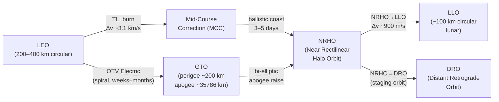

# STA 180-189 · Section 08 · Subsection 182.004 — Orbital Transfer and In-Space Transport

## 1. Purpose

This document defines the requirements, design drivers, and operational parameters for orbital transfer vehicles (OTVs) and all in-space transport operations within the **ATLAS-1000** register[^baseline][^archtable]. It covers delta-V budgets, propellant margin standards, multi-burn trajectory profiles, and the cis-lunar transport corridor definitions spanning LEO, NRHO, LLO, and DRO orbit regimes.

In-space transport operations are designated **space-transport critical**; all trajectory products must be validated against Monte Carlo dispersions and cleared by the trajectory authority prior to manoeuvre execution. The `no_aaa_rule` applies: the identifier "AAA" must not be used for any OTV, manoeuvre, or corridor identifier.

## 2. Scope

- **OTV delta-V budget structure**: allocation breakdown — orbit insertion burn, phasing manoeuvres, rendezvous burns, station-keeping reserve, disposal manoeuvre; total delta-V ≥ 900 m/s for LEO-to-NRHO reference mission.
- **Propellant margin standard**: minimum propellant margin of 5 % of nominal loaded propellant for all in-space transfer missions; crewed missions require 10 % margin.
- **Hohmann and bi-elliptic transfers**: baseline transfer profile for co-planar transfers; bi-elliptic preferred when orbital radius ratio > 11.94; plane-change delta-V penalty must be included in budget.
- **Multi-burn trajectory profiles**: for cis-lunar missions, typically 3–5 manoeuvre sequence (TLI equivalent burn, mid-course correction × 1–2, NRHO insertion); each burn characterised by Δv vector, burn duration, and coast arc.
- **Cis-lunar transport corridor definitions**: Earth-Moon L1/L2 transfer corridors, direct NRHO insertion vs. three-body weak-stability-boundary (WSB) transfers, transit time trade (direct: 3–5 days, WSB: 60–90 days).
- **LLO insertion manoeuvres**: low lunar orbit (≈100 km circular) insertion delta-V ≈ 900 m/s from NRHO; orbit determination accuracy requirement ≤ 10 m position, ≤ 0.01 m/s velocity (3σ) before descent orbit insertion.
- **DRO operations**: distant retrograde orbit characteristics (stability, period 2 weeks–2 months), DRO insertion from NRHO delta-V budget, propellant-depot staging rationale.
- **OTV electric (Hall/ion) trajectory**: continuous low-thrust spiral trajectories; trajectory optimisation tool requirement; minimum specific impulse Isp ≥ 1500 s (Hall), ≥ 3000 s (gridded ion); power requirement maintained throughout transfer arc.
- **Abort trajectory provisions**: in-space abort manifests for each mission phase (free-return trajectory from translunar coast, NRHO departure abort to low-energy return); abort delta-V budget carved from margin reserve.
- **Conjunction screening during transfer**: all OTV trajectories screened against Space Situational Awareness (SSA) catalogue from LEO departure through cis-lunar approach; CDM threshold: P(c) > 1×10⁻⁴ triggers manoeuvre planning.
- **Trajectory authority hand-off**: trajectory authority transitions from launch range (ascent) → mission control (orbital) → deep-space network (DSN/ESOC) at lunar SOI entry; formal hand-off documented in mission operations plan.
- **Traceability**: delta-V budget, propellant margin, and trajectory products are traceable via the transport RTM in `010_Traceability-Evidence-and-Lifecycle-Governance.md`.

## 3. Diagram — Orbital Transfer Trajectory Profiles

## 4. Footprint

| Metric | Value |
|---|---|
| Architecture | `STA` — Space Technology Architecture |
| Master range | `100–199` |
| Code range | `180-189` |
| Section | `08` — Infraestructura y Logística Espacial |
| Subsection | `182` — Transporte Espacial |
| Subsubject | `004` — Orbital Transfer and In-Space Transport |
| Primary Q-Division | Q-SPACE[^qdiv] |
| Support Q-Divisions | Q-DATAGOV, Q-HPC, Q-HORIZON, Q-GREENTECH, Q-STRUCTURES, Q-INDUSTRY |
| ORB support | ORB-PMO, ORB-LEG |
| Governance class | `baseline`[^gov] |
| Document | `004_Orbital-Transfer-and-In-Space-Transport.md` (this file) |
| Parent subsection | [`README.md`](./README.md) · [`000_Overview.md`](./000_Overview.md) |
| Parent section | [`../README.md`](../README.md) |
| Parent architecture | [`../../README.md`](../../README.md) |
| Parent baseline | [`organization/Q+ATLANTIDE.md`](../../../../organization/Q+ATLANTIDE.md) |

## 5. References & Citations

| Standard | Body | Edition | Scope |
|---|---|---|---|
| ECSS-E-ST-60C | ESA/ECSS | 2013 | GNC — trajectory design and rendezvous |
| ECSS-E-ST-35C | ESA/ECSS | 2011 | Propulsion — OTV propulsion systems |
| CCSDS 508.0-B-1 | CCSDS | 2012 | Conjunction Data Message (CDM) format |
| NASA-STD-5019 | NASA | 2016 | Fracture control — OTV structure |
| ISO 24113:2019 | ISO | 2019 | Space debris mitigation — OTV disposal |

[^baseline]: **Q+ATLANTIDE controlled baseline (v1.0.0)** — [`organization/Q+ATLANTIDE.md`](../../../../organization/Q+ATLANTIDE.md). Defines the controlled `000-999` architecture-band taxonomy and the ATLAS-1000 register subpart.

[^archtable]: **STA §3 Architecture Table** — [`../../README.md` §3](../../README.md#3-architecture-table). Authoritative source for the `180-189` row.

[^qdiv]: **Q-Division authority** — Q-Divisions provide technical authority over an architecture row (Q+ATLANTIDE Note N-002). See [`organization/Q+ATLANTIDE.md` §4](../../../../organization/Q+ATLANTIDE.md#4-notes).

[^gov]: **Governance class** — `baseline` denotes documents under controlled change management within the Q+ATLANTIDE baseline.
