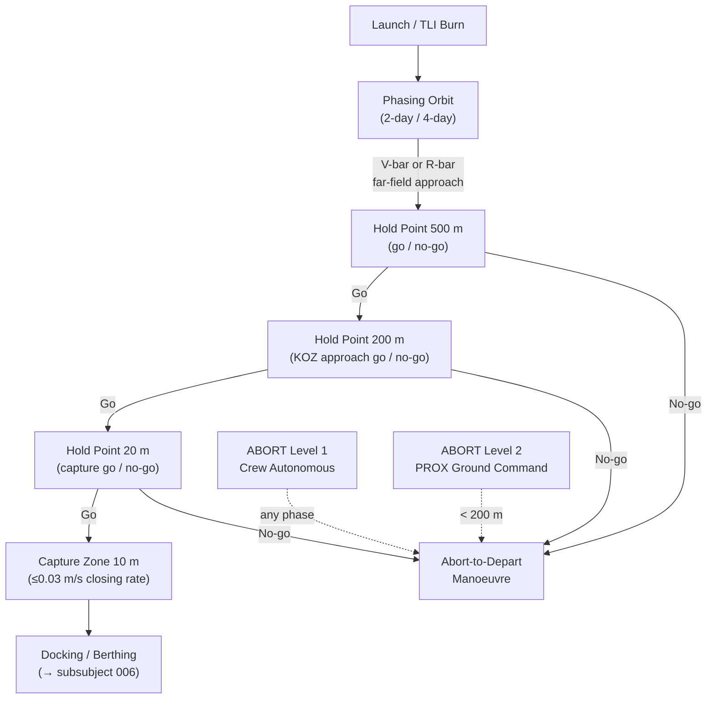

# STA 180-189 · Section 08 · Subsection 182.008 — Trajectory Operations, Rendezvous and Traffic Control

## 1. Purpose

This document defines the trajectory operations, rendezvous and proximity operations (RPO) protocols, and space traffic management requirements for all transport vehicles within the **ATLAS-1000** register[^baseline][^archtable]. It establishes the abort authority hierarchy, approach corridor geometry, far-field and near-field rendezvous sequences, and the traffic coordination framework for cis-lunar operations.

All trajectory and traffic identifiers are subject to the **no_aaa_rule**: the identifier "AAA" must not be used for any trajectory phase, traffic slot, or rendezvous corridor identifier. Trajectory operations are designated **space-transport critical**; all products require validation via Monte Carlo dispersions and trajectory authority approval.

## 2. Scope

- **Nominal ascent trajectory management**: launch window defined by orbital mechanics (RAAN alignment) and range safety requirements; launch window duration typically 2–10 min; direct ascent (2 burns) vs. phasing orbit (2-day or 4-day rendezvous) trade driven by station altitude, phasing angle, and propellant availability.
- **Far-field approach — R-bar**: radial-bar (R-bar) approach descends from above target in local vertical; gravity gradient braking effect; approach rate ≤ 0.3 m/s at hold point 500 m; used primarily for CRS berthing vehicles.
- **Far-field approach — V-bar**: velocity-bar (V-bar) approach from behind target along orbit velocity direction; forced motion required; approach rate ≤ 0.3 m/s at hold point 200 m; preferred for IDSS docking vehicles.
- **Final approach corridor**: hold points — 200 m (go/no-go for KOZ entry), 20 m (go/no-go for capture); capture zone: 10 m sphere; closing rate at 10 m ≤ 0.03 m/s; lateral deviation ≤ 0.3 m at 10 m.
- **Abort authority hierarchy**: Level 1 — crew autonomous abort (any time, no override); Level 2 — PROX officer ground command abort (< 200 m, overrides onboard software hold); Level 3 — range safety autonomous destruct (launch phase only, if applicable for crewed mission).
- **Orbit determination accuracy**: position knowledge ≤ 5 m (3σ) and velocity knowledge ≤ 0.01 m/s (3σ) required at initiation of final approach; derived from GPS/GNSS, inter-vehicle ranging, and onboard star tracker/IMU fusion.
- **Launch window management**: launch window coupling with target station orbital plane (RAAN rate 0.985 °/day for ISS-type LEO); launch commit criteria (LCC) include weather, range clearance, vehicle state, and TM coverage.
- **Range safety requirements**: transport vehicles operating in national airspace or through range must comply with AFSCN/ESA ground coverage requirements; flight termination system (FTS) armed for ascent through orbital insertion; FTS safed post-SECO.
- **Space Situational Awareness (SSA) hand-off**: conjunction screening handed from US Space Command (USSPACECOM) 18th Space Defense Squadron for LEO/GTO to ESA SSA for cis-lunar; formal hand-off documented in mission operations plan at lunar SOI entry.
- **Conjunction assessment data standard**: Conjunction Data Message (CDM) per CCSDS 508.0-B-1; probability of collision (Pc) screening threshold 1×10⁻⁴ for manoeuvre planning initiation; 1×10⁻³ for mandatory manoeuvre execution; all CDMs archived in trajectory authority database.
- **Traffic coordination for cis-lunar**: no more than two transport vehicles in NRHO proximity (< 5 km from Gateway) simultaneously without explicit traffic deconfliction plan filed and approved by combined trajectory authority; departure windows spaced ≥ 12 h apart.
- **Post-mission disposal**: transport vehicle disposal orbit(s) documented in mission operations plan; re-entry within 25 years per ISO 24113:2019; perigee lowering manoeuvre delta-V budget included in propellant margin (ref. `004`).

## 3. Diagram — Rendezvous Sequence with Abort Decision Nodes

## 4. Footprint

| Metric | Value |
|---|---|
| Architecture | `STA` — Space Technology Architecture |
| Master range | `100–199` |
| Code range | `180-189` |
| Section | `08` — Infraestructura y Logística Espacial |
| Subsection | `182` — Transporte Espacial |
| Subsubject | `008` — Trajectory Operations, Rendezvous and Traffic Control |
| Primary Q-Division | Q-SPACE[^qdiv] |
| Support Q-Divisions | Q-DATAGOV, Q-HPC, Q-HORIZON, Q-GREENTECH, Q-STRUCTURES, Q-INDUSTRY |
| ORB support | ORB-PMO, ORB-LEG |
| Governance class | `baseline`[^gov] |
| Document | `008_Trajectory-Operations-Rendezvous-and-Traffic-Control.md` (this file) |
| Parent subsection | [`README.md`](./README.md) · [`000_Overview.md`](./000_Overview.md) |
| Parent section | [`../README.md`](../README.md) |
| Parent architecture | [`../../README.md`](../../README.md) |
| Parent baseline | [`organization/Q+ATLANTIDE.md`](../../../../organization/Q+ATLANTIDE.md) |

## 5. References & Citations

| Standard | Body | Edition | Scope |
|---|---|---|---|
| ECSS-E-ST-60C | ESA/ECSS | 2013 | GNC — rendezvous and proximity operations |
| CCSDS 910.11-B-1 | CCSDS | 2012 | Rendezvous / proximity operations protocols |
| CCSDS 508.0-B-1 | CCSDS | 2012 | Conjunction Data Message (CDM) format |
| FAA 14 CFR Part 415 | FAA AST | 2006 | Commercial launch licensing / range safety |
| ISO 24113:2019 | ISO | 2019 | Space debris mitigation — disposal planning |

[^baseline]: **Q+ATLANTIDE controlled baseline (v1.0.0)** — [`organization/Q+ATLANTIDE.md`](../../../../organization/Q+ATLANTIDE.md). Defines the controlled `000-999` architecture-band taxonomy and the ATLAS-1000 register subpart.

[^archtable]: **STA §3 Architecture Table** — [`../../README.md` §3](../../README.md#3-architecture-table). Authoritative source for the `180-189` row.

[^qdiv]: **Q-Division authority** — Q-Divisions provide technical authority over an architecture row (Q+ATLANTIDE Note N-002). See [`organization/Q+ATLANTIDE.md` §4](../../../../organization/Q+ATLANTIDE.md#4-notes).

[^gov]: **Governance class** — `baseline` denotes documents under controlled change management within the Q+ATLANTIDE baseline.
