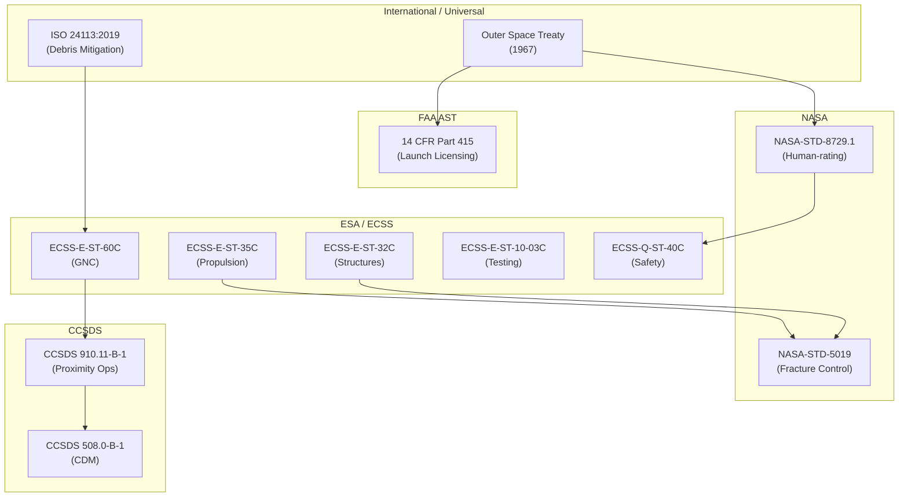

# STA 180-189 · Section 08 · Subsection 182.009 — ECSS / NASA / CCSDS Space Transport Standards Mapping

## 1. Purpose

This document provides the normative mapping of external standards bodies' documents to the subsubjects of subsection `182` *Transporte Espacial* within the **ATLAS-1000** register[^baseline][^archtable]. It establishes which standard governs which aspect of space transport design, operations, and verification, and identifies the authority hierarchy when standards conflict.

This mapping is designated **space-transport critical**: all transport vehicle projects must maintain a live standards compliance matrix referencing this document as the baseline map. The `no_aaa_rule` applies to all standards references and compliance matrix identifiers.

## 2. Scope

- **Authority hierarchy**: ECSS (European Cooperation for Space Standardisation) applies to ESA-led or European-prime transport vehicles; NASA standards apply to NASA-led or human-rated vehicles; CCSDS applies to all data and communication interfaces regardless of prime agency; FAA AST regulations are mandatory for all US commercial launch operations; ISO standards apply universally.
- **Conflict resolution**: where ECSS and NASA standards conflict on a quantitative requirement, the more stringent value applies unless a project-specific waiver is approved by both agency representatives and documented in the compliance matrix.
- **ECSS-E-ST-60C (GNC)**: covers rendezvous trajectory design, proximity operations GNC algorithms, guidance law validation; maps to subsubjects `004` (orbital transfer), `006` (docking), `008` (trajectory operations).
- **ECSS-E-ST-35C (Propulsion)**: covers propulsion system design, Isp verification, contamination, propellant compatibility; maps to subsubjects `001` (definitions), `003` (launch interfaces), `007` (propulsion constraints).
- **ECSS-E-ST-32C (Structures)**: covers structural analysis, mechanical interface design, LVA qualification; maps to subsubject `003` (launch interfaces), `006` (docking interface loads).
- **ECSS-E-ST-10-03C (Testing)**: covers environmental test campaigns, acoustic, vibration, shock, thermal; maps to subsubject `003` (launch interfaces), `007` (thermal constraints).
- **NASA-STD-8729.1 (Human-rating)**: covers crew transport vehicle human-rating criteria, abort system authority, crew compartment environment; maps to subsubjects `002` (CTV class), `005` (crew boundary), `007` (power/thermal crew environment), `008` (abort authority).
- **NASA-STD-5019 (Fracture control)**: covers fracture mechanics for pressure vessels and structural elements; maps to subsubjects `003` (LV interface), `005` (cargo containers), `007` (TPS attachments).
- **CCSDS 910.11-B-1 (Proximity ops)**: covers proximity operations communication and data protocols for rendezvous; maps to subsubjects `006` (docking), `008` (rendezvous).
- **CCSDS 508.0-B-1 (CDM)**: covers Conjunction Data Message format and screening thresholds; maps to subsubject `008` (traffic control).
- **FAA 14 CFR Part 415 (Launch licensing)**: covers commercial launch operator licensing, range safety, flight termination; maps to subsubjects `001` (definitions), `003` (launch interfaces), `008` (range safety).
- **ISO 24113:2019 (Debris mitigation)**: covers space debris mitigation requirements including 25-year deorbit rule, passivation, and controlled re-entry; maps to subsubjects `002` (vehicle class lifecycle), `004` (disposal manoeuvre), `008` (post-mission disposal).
- **ECSS-Q-ST-40C (Safety)**: covers system safety and hazard analysis including crew-cargo separation and hazmat classification; maps to subsubjects `005` (cargo/crew boundary), `007` (propellant contamination).

## 3. Diagram — Standards Authority Hierarchy

## 4. Footprint

| Metric | Value |
|---|---|
| Architecture | `STA` — Space Technology Architecture |
| Master range | `100–199` |
| Code range | `180-189` |
| Section | `08` — Infraestructura y Logística Espacial |
| Subsection | `182` — Transporte Espacial |
| Subsubject | `009` — ECSS / NASA / CCSDS Space Transport Standards Mapping |
| Primary Q-Division | Q-SPACE[^qdiv] |
| Support Q-Divisions | Q-DATAGOV, Q-HPC, Q-HORIZON, Q-GREENTECH, Q-STRUCTURES, Q-INDUSTRY |
| ORB support | ORB-PMO, ORB-LEG |
| Governance class | `baseline`[^gov] |
| Document | `009_ECSS-NASA-CCSDS-Space-Transport-Standards-Mapping.md` (this file) |
| Parent subsection | [`README.md`](./README.md) · [`000_Overview.md`](./000_Overview.md) |
| Parent section | [`../README.md`](../README.md) |
| Parent architecture | [`../../README.md`](../../README.md) |
| Parent baseline | [`organization/Q+ATLANTIDE.md`](../../../../organization/Q+ATLANTIDE.md) |

## 5. References & Citations

| Standard | Body | Edition | Scope | Applicability to STA-182 |
|---|---|---|---|---|
| ECSS-E-ST-60C | ESA/ECSS | 2013 | GNC | Rendezvous trajectory design (`004`, `006`, `008`) |
| ECSS-E-ST-35C | ESA/ECSS | 2011 | Propulsion | Transport propulsion systems (`001`, `003`, `007`) |
| ECSS-E-ST-32C | ESA/ECSS | 2008 | Structures | LVA and structural interfaces (`003`, `006`) |
| ECSS-E-ST-10-03C | ESA/ECSS | 2012 | Testing | Environmental test campaigns (`003`, `007`) |
| NASA-STD-8729.1 | NASA | 2022 | Human-rating | CTV crew-rating criteria (`002`, `005`, `007`, `008`) |
| NASA-STD-5019 | NASA | 2016 | Fracture control | Transport vehicle fracture (`003`, `005`, `007`) |
| CCSDS 910.11-B-1 | CCSDS | 2012 | Proximity ops | Rendezvous protocols (`006`, `008`) |
| CCSDS 508.0-B-1 | CCSDS | 2012 | Conjunction | CDM data format (`008`) |
| FAA 14 CFR Part 415 | FAA AST | 2006 | Launch licensing | Commercial transport (`001`, `003`, `008`) |
| ISO 24113:2019 | ISO | 2019 | Debris | Transport vehicle disposal (`002`, `004`, `008`) |
| ECSS-Q-ST-40C | ESA/ECSS | 2011 | Safety | Hazard analysis for transport (`005`, `007`) |

[^baseline]: **Q+ATLANTIDE controlled baseline (v1.0.0)** — [`organization/Q+ATLANTIDE.md`](../../../../organization/Q+ATLANTIDE.md). Defines the controlled `000-999` architecture-band taxonomy and the ATLAS-1000 register subpart.

[^archtable]: **STA §3 Architecture Table** — [`../../README.md` §3](../../README.md#3-architecture-table). Authoritative source for the `180-189` row.

[^qdiv]: **Q-Division authority** — Q-Divisions provide technical authority over an architecture row (Q+ATLANTIDE Note N-002). See [`organization/Q+ATLANTIDE.md` §4](../../../../organization/Q+ATLANTIDE.md#4-notes).

[^gov]: **Governance class** — `baseline` denotes documents under controlled change management within the Q+ATLANTIDE baseline.
