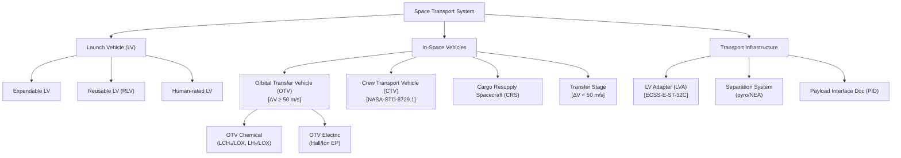

# STA 180-189 · 182-010 — Space Transport Controlled Definition

## 1. Purpose

This document establishes the normative, controlled definitions for all space transport elements referenced within subsection `182` *Transporte Espacial* and the broader STA `180-189` architecture. These definitions are authoritative within the **ATLAS-1000** register and the **Q+ATLANTIDE** baseline[^baseline]; any deviation or extension must follow the CCB process defined in `182-090-Traceability-Evidence-and-Lifecycle-Governance.md`.

Definitions are aligned with FAA AST 14 CFR Part 415 (commercial launch licensing), NASA-STD-8729.1 (human-rating requirements), ECSS-E-ST-35C (propulsion), and the Outer Space Treaty (1967). The `no_aaa_rule` applies: the identifier "AAA" must not be used for any safety-critical element.

## 2. Scope

- **Space transport system**: the integrated set of vehicles, infrastructure, operations, and interfaces required to move crew, cargo, or service assets between two or more space nodes.
- **Launch vehicle (LV)**: a ground-launched propulsion system that delivers a payload from Earth surface to an initial parking orbit; includes all propulsive stages, fairings, and payload adapters up to separation.
- **Orbital transfer vehicle (OTV)**: an in-space propulsion stage designed to move payloads between two distinct orbital nodes; minimum qualifying delta-V threshold is 50 m/s.
- **Crew transport vehicle (CTV)**: a human-rated spacecraft carrying crew from LEO to an upper-stack node (Gateway, orbital base, or lunar surface staging orbit); must satisfy all NASA-STD-8729.1 human-rating criteria.
- **Cargo resupply spacecraft (CRS)**: an automated or semi-automated spacecraft delivering pressurised and/or unpressurised cargo to an orbital base; may also perform propellant-ferry functions if manifested.
- **Reusable launch vehicle (RLV)**: a launch system with at least one recoverable and refurbishable stage intended for multiple flight cycles; flight rate and turnaround time are defining operational parameters.
- **Transfer stage**: a propulsion module attached to a payload for orbit-raising or trajectory-change manoeuvres; may be expended at end-of-mission or recovered depending on architecture; classified separately from OTV when delta-V < 50 m/s.
- **Payload interface**: the mechanical, electrical, data, and propellant interfaces between the transport vehicle and its cargo or upper stage; defined by the payload interface document (PID) and governed by the applicable LV user's guide.
- **Launch vehicle adapter (LVA)**: the structural element connecting the payload to the launch vehicle upper stage; must comply with ECSS-E-ST-32C mechanical interface requirements.
- **Separation system**: the pyrotechnic or non-explosive mechanism that physically separates the payload from the LV at the commanded separation event; characterised by shock response spectrum (SRS).
- **Applicability boundary**: all Q+ATLANTIDE transport elements from launch commit criteria (LCC) to final destination arrival and mission termination; ground transport and manufacturing logistics are excluded.
- **Regulatory anchors**: FAA AST 14 CFR Part 415 (US commercial launch licensing), NASA-STD-8729.1 (human-rating), ECSS-E-ST-35C (propulsion systems), Outer Space Treaty Art. VI (state authorisation and supervision of national activities).

## 3. Diagram — Space Transport System Taxonomy

## 4. Footprint

| Metric | Value |
|---|---|
| Architecture | `STA` — Space Technology Architecture |
| Master range | `100–199` |
| Code range | `180-189` |
| Section | `08` — Infraestructura y Logística Espacial |
| Subsection | `182` — Transporte Espacial |
| Subsubject | `001` — Space Transport Controlled Definition |
| Primary Q-Division | Q-SPACE[^qdiv] |
| Support Q-Divisions | Q-DATAGOV, Q-HPC, Q-HORIZON, Q-GREENTECH, Q-STRUCTURES, Q-INDUSTRY |
| ORB support | ORB-PMO, ORB-LEG |
| Governance class | `baseline`[^gov] |
| Document | `182-010-Space-Transport-Controlled-Definition.md` (this file) |
| Parent subsection | [`README.md`](./README.md) · [`182-000-General.md`](./182-000-General.md) |
| Parent section | [`../README.md`](../README.md) |
| Parent architecture | [`../../README.md`](../../README.md) |
| Parent baseline | [`organization/Q+ATLANTIDE.md`](../../../../organization/Q+ATLANTIDE.md) |

## 5. References & Citations

| Standard | Body | Edition | Scope |
|---|---|---|---|
| FAA 14 CFR Part 415 | FAA AST | 2006 | Commercial launch operator licensing |
| NASA-STD-8729.1 | NASA | 2022 | Human-rating requirements |
| ECSS-E-ST-35C | ESA/ECSS | 2011 | Space engineering — propulsion |
| ECSS-E-ST-32C | ESA/ECSS | 2008 | Space engineering — structural analysis |
| Outer Space Treaty | UN | 1967 | Art. VI — state authorisation |

[^baseline]: **Q+ATLANTIDE controlled baseline (v1.0.0)** — [`organization/Q+ATLANTIDE.md`](../../../../organization/Q+ATLANTIDE.md). Defines the controlled `000-999` architecture-band taxonomy and the ATLAS-1000 register subpart.

[^archtable]: **STA §3 Architecture Table** — [`../../README.md` §3](../../README.md#3-architecture-table). Authoritative source for the `180-189` row.

[^qdiv]: **Q-Division authority** — Q-Divisions provide technical authority over an architecture row (Q+ATLANTIDE Note N-002). See [`organization/Q+ATLANTIDE.md` §4](../../../../organization/Q+ATLANTIDE.md#4-notes).

[^gov]: **Governance class** — `baseline` denotes documents under controlled change management within the Q+ATLANTIDE baseline.
