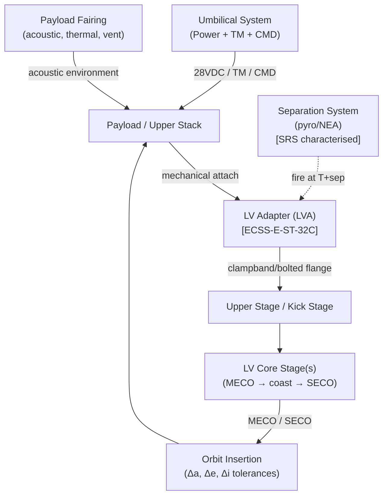

# STA 180-189 · 182-030 — Launch to Orbit Transport Interfaces

## 1. Purpose

This document defines all mechanical, electrical, data, propellant, and environmental interfaces between the launch vehicle and its payload for the launch-to-orbit phase. Interface requirements are normative within the **ATLAS-1000** register[^baseline] and are traceable to individual launch vehicle user's guides, ECSS-E-ST-32C (structures), NASA-STD-5019 (fracture control), and ECSS-E-ST-10-03C (testing).

All interface parameters defined herein govern the payload-to-LV integration activity from mechanical fit-check through orbit insertion accuracy verification. The `no_aaa_rule` applies: the identifier "AAA" must not be used for any interface identifier or separation event designation.

## 2. Scope

- **Mechanical interface — LVA**: launch vehicle adapter (LVA) bolt-circle diameter, clampband (or bolted-flange) design, axial and lateral load-path certification per ECSS-E-ST-32C; adapter natural frequency requirements (min 35 Hz axial, 15 Hz lateral for standard LVs).
- **Mechanical interface — fairing**: payload fairing acoustic environment (SPL spectrum 135–142 dB OASPL typical), venting rate, thermal gradient during ascent; static envelope clearance and dynamic clearance allocation.
- **Separation system**: pyrotechnic or non-explosive actuator (NEA) separation; shock response spectrum (SRS) characterisation required at payload interface; separation spring tip-off rate ≤ 0.5 °/s unless compensated by attitude control.
- **MECO/SECO conditions**: Main Engine Cut-Off (MECO) defines transition to coast phase; Second Engine Cut-Off (SECO) defines end of powered ascent; both events trigger payload internal power transition.
- **Orbit insertion accuracy**: target parking orbit tolerances — Δa ≤ ±5 km, Δe ≤ ±0.002, Δi ≤ ±0.05°; values are mission-class dependent and shall be documented in the payload interface document (PID).
- **Upper-stage / kick-stage separation**: interface for secondary propulsion stage attach/separate; if chemical kick stage is used, propellant umbilical connector and isolation valve sequencing must be defined prior to CDR.
- **Electrical interface — umbilical**: multi-point ground support equipment (GSE) umbilical connector standards; payload pre-launch power (typically 28 VDC regulated); umbilical disconnect sequencing relative to liftoff T-0.
- **Data interface — telemetry/command**: payload telemetry stream routing through LV TM system during ascent; command uplink path, encryption requirements (if applicable), and data rates (typical 256 kbps to 2 Mbps).
- **Propellant interface (kick stage)**: fuelling umbilical fluid connectors; propellant loading accuracy ±0.5 % of nominal load; leak-check protocol before encapsulation.
- **Launch escape provisions** (crewed LV only): launch abort system (LAS) interface with crew module; abort initiation authority: autonomous vehicle abort system has priority over ground command during ascent.
- **Environmental loads summary**: qualification sine sweep (5–100 Hz), random vibration spectrum (20–2000 Hz), acoustic test (diffuse-field or progressive wave tube), shock test (SRS per ECSS-E-ST-10-03C Table 5).
- **Payload interface document (PID)**: master interface control document maintained jointly by payload and LV prime; governed by CCB; all interface parameters herein are baselined at PID-CDR.

## 3. Diagram — Launch-to-Orbit Interface Architecture

## 4. Footprint

| Metric | Value |
|---|---|
| Architecture | `STA` — Space Technology Architecture |
| Master range | `100–199` |
| Code range | `180-189` |
| Section | `08` — Infraestructura y Logística Espacial |
| Subsection | `182` — Transporte Espacial |
| Subsubject | `003` — Launch-to-Orbit Transport Interfaces |
| Primary Q-Division | Q-SPACE[^qdiv] |
| Support Q-Divisions | Q-DATAGOV, Q-HPC, Q-HORIZON, Q-GREENTECH, Q-STRUCTURES, Q-INDUSTRY |
| ORB support | ORB-PMO, ORB-LEG |
| Governance class | `baseline`[^gov] |
| Document | `182-030-Launch-to-Orbit-Transport-Interfaces.md` (this file) |
| Parent subsection | [`README.md`](./README.md) · [`182-000-General.md`](./182-000-General.md) |
| Parent section | [`../README.md`](../README.md) |
| Parent architecture | [`../../README.md`](../../README.md) |
| Parent baseline | [`organization/Q+ATLANTIDE.md`](../../../../organization/Q+ATLANTIDE.md) |

## 5. References & Citations

| Standard | Body | Edition | Scope |
|---|---|---|---|
| ECSS-E-ST-32C | ESA/ECSS | 2008 | Structural engineering — mechanical interfaces |
| ECSS-E-ST-10-03C | ESA/ECSS | 2012 | Space engineering — testing |
| NASA-STD-5019 | NASA | 2016 | Fracture control requirements |
| NASA-STD-8729.1 | NASA | 2022 | Human-rating — LAS authority |
| LV User's Guides | Various | Current | Falcon 9, Ariane 6, SLS, Atlas V |

[^baseline]: **Q+ATLANTIDE controlled baseline (v1.0.0)** — [`organization/Q+ATLANTIDE.md`](../../../../organization/Q+ATLANTIDE.md). Defines the controlled `000-999` architecture-band taxonomy and the ATLAS-1000 register subpart.

[^archtable]: **STA §3 Architecture Table** — [`../../README.md` §3](../../README.md#3-architecture-table). Authoritative source for the `180-189` row.

[^qdiv]: **Q-Division authority** — Q-Divisions provide technical authority over an architecture row (Q+ATLANTIDE Note N-002). See [`organization/Q+ATLANTIDE.md` §4](../../../../organization/Q+ATLANTIDE.md#4-notes).

[^gov]: **Governance class** — `baseline` denotes documents under controlled change management within the Q+ATLANTIDE baseline.
